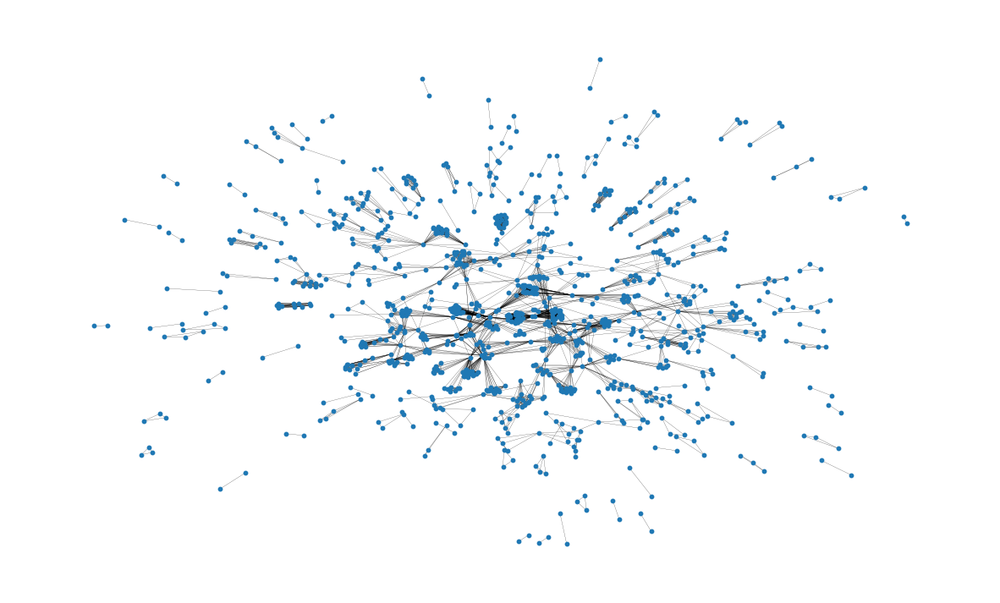
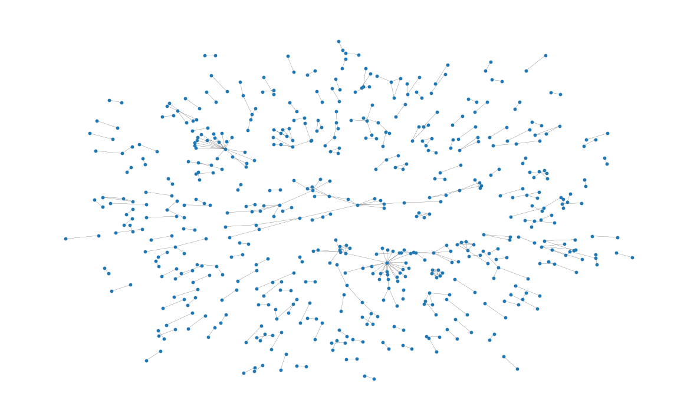

# InstaSynth项目探讨了利用ChatGPT技术生成合成Instagram数据以支持赞助内容检测的可能性与面临的难题。

发布时间：2024年03月22日

`LLM应用` `社交媒体` `法规遵从` `广告检测`

> InstaSynth: Opportunities and Challenges in Generating Synthetic Instagram Data with ChatGPT for Sponsored Content Detection

> 随着LLMs可能降低生成可用于不良目的文本的成本，尤其在社交平台引人担忧，本文探究这些模型在协助落实网络赞助内容公示相关法规上的可能性。我们研究如何利用LLMs生成合成的Instagram配文，设定两大目标：首先，追求保真度，即构建足够真实的合成数据集，为此设计了内容层级和网络层级的评估指标；其次，关注效用性，即生成有利于检测赞助内容的合成数据，为此测试了利用生成数据训练分类器识别Instagram隐性广告的效果。研究揭示保真度和效用性之间可能存在矛盾，虽然提示工程技术具有一定实用性，但并不足够解决所有问题。同时，尽管单条合成内容看似真实，但整体上却表现出多样性的缺失、主题关联不足以及用户交互模式不够真实的问题。

> Large Language Models (LLMs) raise concerns about lowering the cost of generating texts that could be used for unethical or illegal purposes, especially on social media. This paper investigates the promise of such models to help enforce legal requirements related to the disclosure of sponsored content online. We investigate the use of LLMs for generating synthetic Instagram captions with two objectives: The first objective (fidelity) is to produce realistic synthetic datasets. For this, we implement content-level and network-level metrics to assess whether synthetic captions are realistic. The second objective (utility) is to create synthetic data that is useful for sponsored content detection. For this, we evaluate the effectiveness of the generated synthetic data for training classifiers to identify undisclosed advertisements on Instagram. Our investigations show that the objectives of fidelity and utility may conflict and that prompt engineering is a useful but insufficient strategy. Additionally, we find that while individual synthetic posts may appear realistic, collectively they lack diversity, topic connectivity, and realistic user interaction patterns.

[Arxiv](https://arxiv.org/abs/2403.15214)