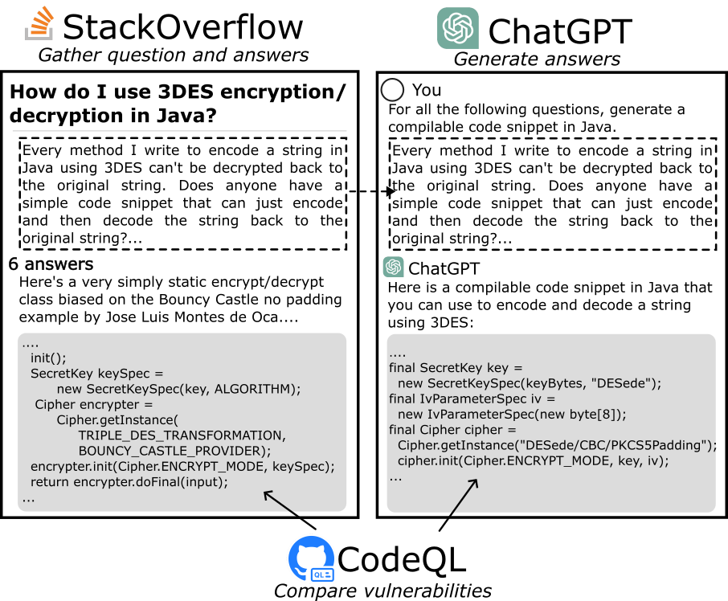
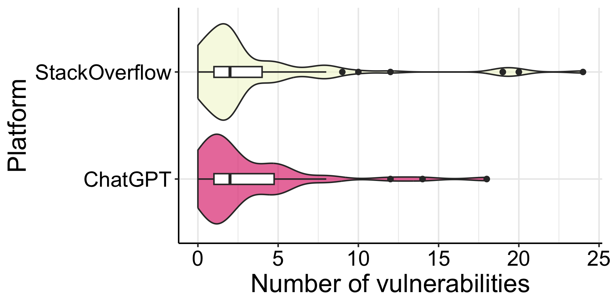

# ChatGPT生成的代码与StackOverflow上的答案，是否同样存在安全漏洞问题呢？本文将对此进行对比探究。

发布时间：2024年03月22日

`LLM应用` `软件开发` `安全工程`

> Just another copy and paste? Comparing the security vulnerabilities of ChatGPT generated code and StackOverflow answers

> 根据 Sonatype 2023 年报告显示，高达 97% 的开发者及安全团队已将生成式人工智能，尤其是大型语言模型（LLMs），融入开发流程。然而，在这种趋势下，关于其安全隐忧的声音逐渐增多。开发者正审慎评估 LLMs 与其他信息来源如 StackOverflow（SO）的利弊，急需实证数据以支持决策。本次研究旨在通过实证对比 ChatGPT 和 SO 提供代码片段的安全漏洞，唤醒开发者在选用代码片段时对安全因素的重视。研究过程中，我们运用一个源于 SO、涵盖安全问题及答案的 Java 数据集，同时让 ChatGPT 回答相同的 SO 问题并收集生成的代码样本进行对比。经过精心筛选的数据集分析显示，ChatGPT 生成的 108 个代码片段共含 248 个 CWE 漏洞，比 SO 片段的 302 个漏洞减少了 20%，且这一差异具有统计显著性。此外，ChatGPT 输出了 19 种 CWE 类型漏洞，较 SO 的 22 种略少。这些发现揭示了开发者在识别和防范从两个平台传播的不安全代码上存在知识盲区，因为总计检测到 274 个独特的漏洞和 25 种 CWE 类型。无论代码出自 AI 还是人类之手，都不可盲目照搬，而应通过优秀的软件工程实践来减小风险。未来的研究将进一步助力减少从任意平台传播不安全代码的现象。

> Sonatype's 2023 report found that 97% of developers and security leads integrate generative Artificial Intelligence (AI), particularly Large Language Models (LLMs), into their development process. Concerns about the security implications of this trend have been raised. Developers are now weighing the benefits and risks of LLMs against other relied-upon information sources, such as StackOverflow (SO), requiring empirical data to inform their choice. In this work, our goal is to raise software developers awareness of the security implications when selecting code snippets by empirically comparing the vulnerabilities of ChatGPT and StackOverflow. To achieve this, we used an existing Java dataset from SO with security-related questions and answers. Then, we asked ChatGPT the same SO questions, gathering the generated code for comparison. After curating the dataset, we analyzed the number and types of Common Weakness Enumeration (CWE) vulnerabilities of 108 snippets from each platform using CodeQL. ChatGPT-generated code contained 248 vulnerabilities compared to the 302 vulnerabilities found in SO snippets, producing 20% fewer vulnerabilities with a statistically significant difference. Additionally, ChatGPT generated 19 types of CWE, fewer than the 22 found in SO. Our findings suggest developers are under-educated on insecure code propagation from both platforms, as we found 274 unique vulnerabilities and 25 types of CWE. Any code copied and pasted, created by AI or humans, cannot be trusted blindly, requiring good software engineering practices to reduce risk. Future work can help minimize insecure code propagation from any platform.

[Arxiv](https://arxiv.org/abs/2403.15600)