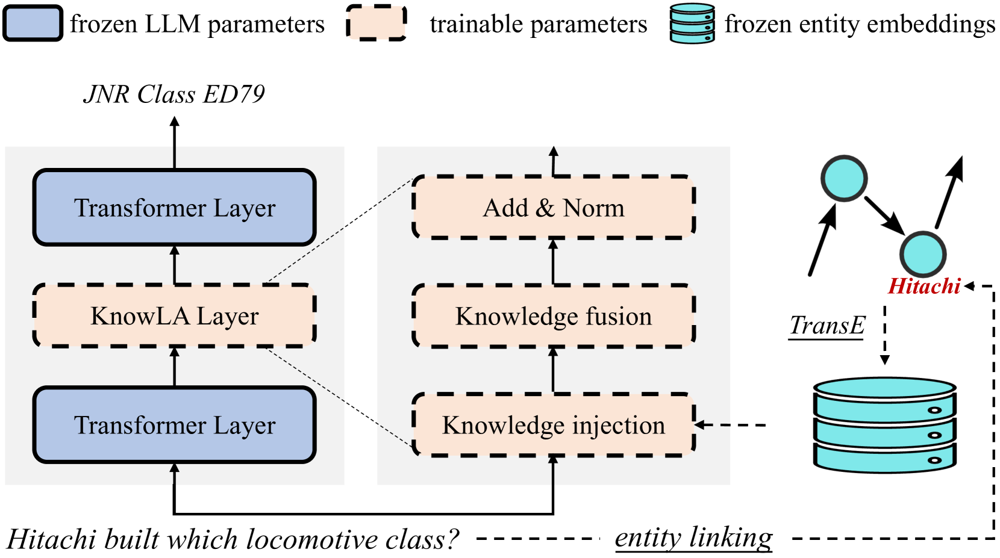
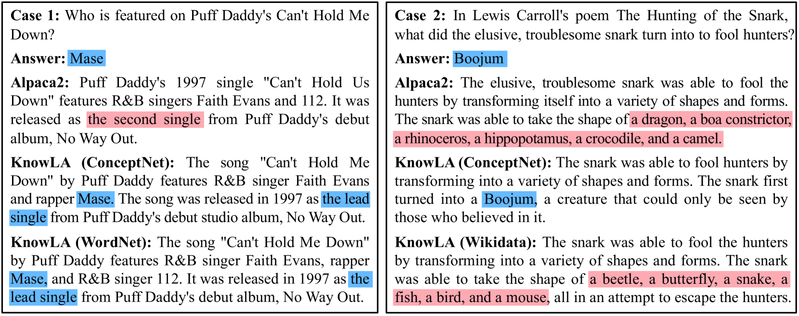
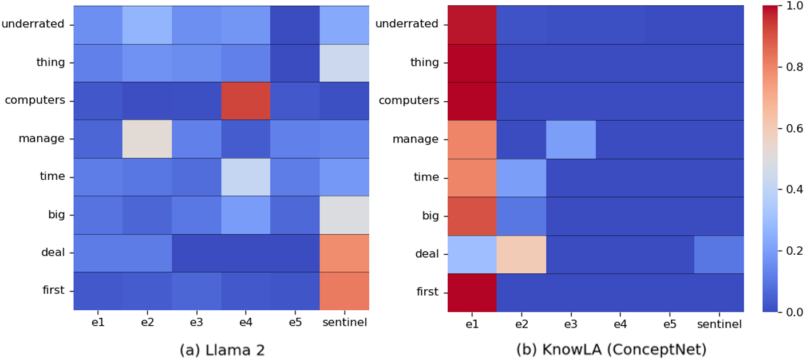
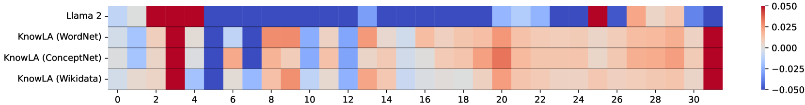

# KnowLA 是一项创新技术，它借助知识性适应提升参数高效微调的能力，旨在在减少参数调整的同时，更好地融入领域知识以优化模型性能。

发布时间：2024年03月22日

`LLM应用` `知识图谱`

> KnowLA: Enhancing Parameter-efficient Finetuning with Knowledgeable Adaptation

# 摘要

> PEFT作为关键手段，助力大型语言模型LLMs更好地应对下游任务。本文研究如何借助知识图谱嵌入提升其效果，进而提出了名为KnowLA的知识引导适应策略。这一策略通过在LLM中插入适应层，巧妙融合输入文本中的实体嵌入信息，并与LoRA共同在指令数据上进行训练优化。实验证明，在两大主流LLMs及三个知识图谱支撑下的六个基准测试中，KnowLA表现出显著的有效性和稳健性。我们揭示了\modelname能够在不修改LLM参数和输入提示的前提下，成功激活其中与问题紧密关联的参数化知识，从而准确作答。

> Parameter-efficient finetuning (PEFT) is a key technique for adapting large language models (LLMs) to downstream tasks. In this paper, we study leveraging knowledge graph embeddings to improve the effectiveness of PEFT. We propose a knowledgeable adaptation method called KnowLA. It inserts an adaptation layer into an LLM to integrate the embeddings of entities appearing in the input text. The adaptation layer is trained in combination with LoRA on instruction data. Experiments on six benchmarks with two popular LLMs and three knowledge graphs demonstrate the effectiveness and robustness of KnowLA. We show that \modelname can help activate the relevant parameterized knowledge in an LLM to answer a question without changing its parameters or input prompts.

[Arxiv](https://arxiv.org/abs/2403.14950)