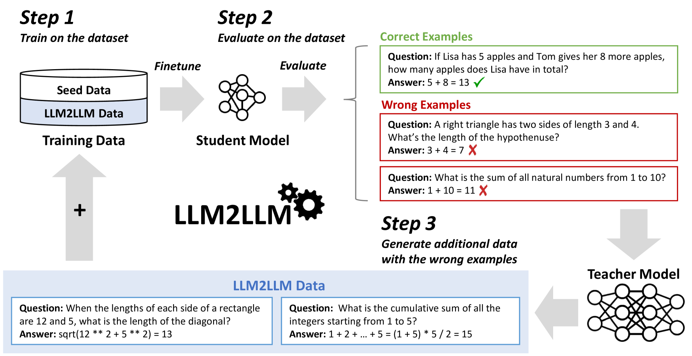
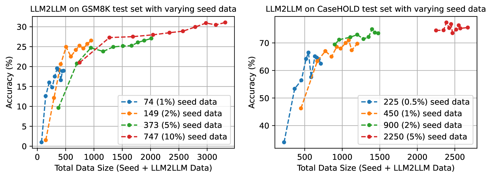

# LLM2LLM 方法通过创新的迭代式数据增强技术，有力地提升了大型语言模型的表现力。

发布时间：2024年03月22日

`LLM应用` `数据增强`

> LLM2LLM: Boosting LLMs with Novel Iterative Data Enhancement

# 摘要

> 当前，预训练大型语言模型（LLMs）在攻克绝大多数NLP任务时表现出色。然而，面对低数据量应用场景，即便很多任务依然需要微调才能达到满意效果，而这一过程往往充满挑战。因此，我们提出了一种名为LLM2LLM的定向迭代数据增强策略，它运用一个强大的教师LLM对小型种子数据集进行扩增，生成专用于特定任务的额外数据用以微调。具体来说，LLM2LLM会经历三个步骤：(1)首先在初始种子数据上微调一个基础的学生LLM模型；(2)识别并挑选出模型预测失误的数据实例；(3)随后借助教师LLM根据这些错误数据实例生成合成数据，再将其合并回训练数据中。这种技术强化了LLM在训练时对误判数据的反应，并让模型聚焦于更具挑战性的样本。实验证明，在低数据环境下，LLM2LLM能够大幅提升LLMs的性能，不仅优于传统微调方式，也超过了其他数据增强基准方法。此外，LLM2LLM有效降低了对耗时费力的手动数据整理的需求，为构建更高效、更易拓展的LLM解决方案开辟了新途径，让我们能够更好地应对数据资源受限的领域和任务。在采用LLaMA2-7B学生模型时，我们在多个数据集上取得了显著的进步：在GSM8K数据集上提高24.2%，在CaseHOLD上提升32.6%，在SNIPS上提升32.0%，在TREC上提升52.6%，在SST-2上提升39.8%，全面超越常规微调方法在低数据条件下的表现。

> Pretrained large language models (LLMs) are currently state-of-the-art for solving the vast majority of natural language processing tasks. While many real-world applications still require fine-tuning to reach satisfactory levels of performance, many of them are in the low-data regime, making fine-tuning challenging. To address this, we propose LLM2LLM, a targeted and iterative data augmentation strategy that uses a teacher LLM to enhance a small seed dataset by augmenting additional data that can be used for fine-tuning on a specific task. LLM2LLM (1) fine-tunes a baseline student LLM on the initial seed data, (2) evaluates and extracts data points that the model gets wrong, and (3) uses a teacher LLM to generate synthetic data based on these incorrect data points, which are then added back into the training data. This approach amplifies the signal from incorrectly predicted data points by the LLM during training and reintegrates them into the dataset to focus on more challenging examples for the LLM. Our results show that LLM2LLM significantly enhances the performance of LLMs in the low-data regime, outperforming both traditional fine-tuning and other data augmentation baselines. LLM2LLM reduces the dependence on labor-intensive data curation and paves the way for more scalable and performant LLM solutions, allowing us to tackle data-constrained domains and tasks. We achieve improvements up to 24.2% on the GSM8K dataset, 32.6% on CaseHOLD, 32.0% on SNIPS, 52.6% on TREC and 39.8% on SST-2 over regular fine-tuning in the low-data regime using a LLaMA2-7B student model.

[Arxiv](https://arxiv.org/abs/2403.15042)