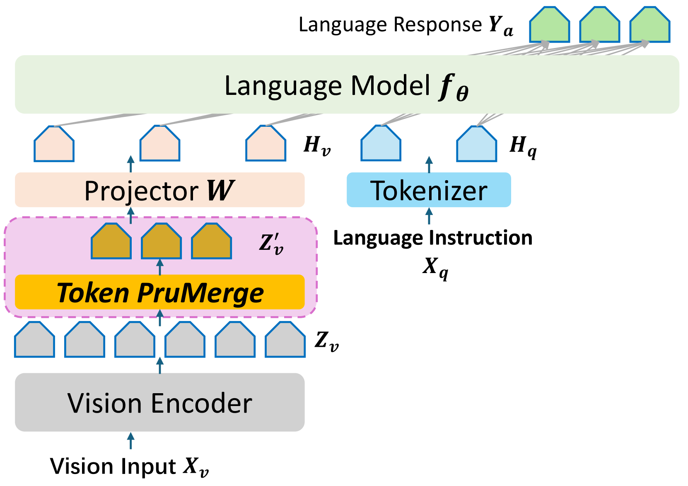
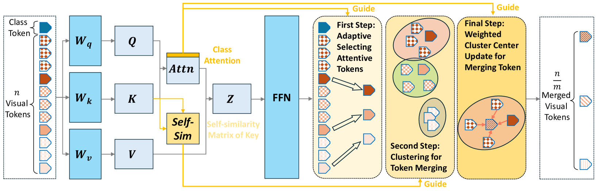
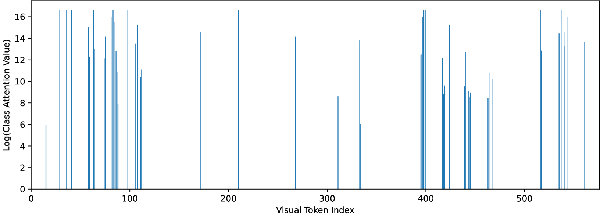
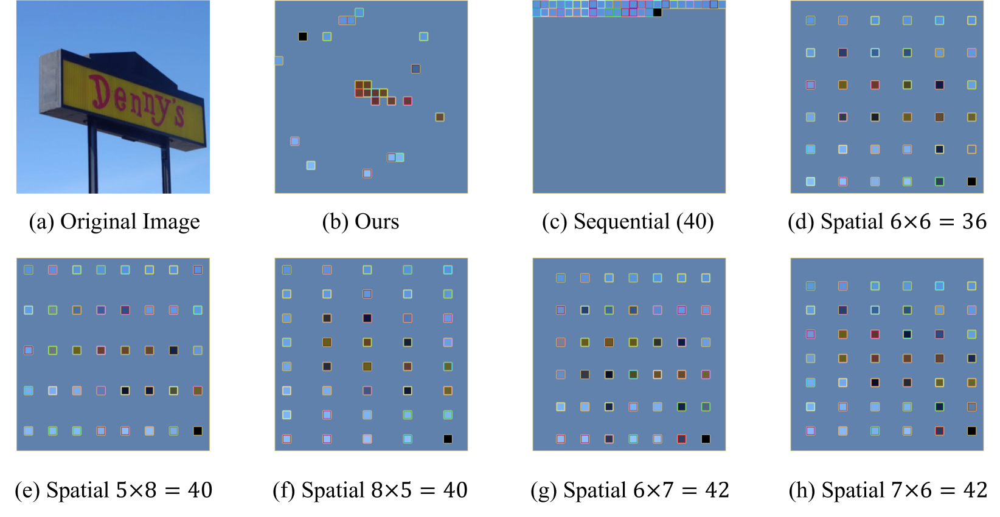

# LLaVA-PruMerge 是一种针对大型多模态模型的自适应令牌缩减方案，旨在提升模型运行效率。进一步优化后的

发布时间：2024年03月22日

`Agent` `计算机视觉` `多模态模型`

> LLaVA-PruMerge: Adaptive Token Reduction for Efficient Large Multimodal Models

# 摘要

> 大型多模态模型（LMMs）通过融合视觉编码器与大型语言模型，展现出强大的推理能力，它们通常采用固定数量（如CLIP视觉编码器的次顶层特征）的视觉令牌作为前缀内容。近期的LMMs进一步处理高清图像和视频等复杂视觉输入，导致视觉令牌数量大幅攀升。然而，受Transformer架构设计限制，这类模型的计算开销会随着输入令牌增多而呈现平方级增长。针对这一挑战，我们探寻了一种令牌精简机制，并发现与先前研究相仿，大量视觉令牌存在空间冗余现象。据此，我们创新性地提出了PruMerge，一种自适应视觉令牌精简方法，能够在大幅削减视觉令牌数量的同时保持模型性能不减。首先，我们根据视觉令牌与类别令牌和空间位置相关性的高低挑选出保留的令牌；接着，通过对裁剪后的令牌进行基于关键相似度的聚类，并将其与未裁剪令牌合并以补充信息。实际应用中，在LLaVA-1.5上，我们的方法平均可将视觉令牌压缩至原先的约1/14.4，且在各类视觉问答和推理任务上表现出色，性能相当。相关代码和预训练模型已发布于 <https://llava-prumerge.github.io/> 。

> Large Multimodal Models (LMMs) have shown significant reasoning capabilities by connecting a visual encoder and a large language model. LMMs typically use a fixed amount of visual tokens, such as the penultimate layer features in the CLIP visual encoder, as the prefix content. Recent LMMs incorporate more complex visual inputs, such as high-resolution images and videos, which increase the number of visual tokens significantly. However, due to the design of the Transformer architecture, computational costs associated with these models tend to increase quadratically with the number of input tokens. To tackle this problem, we explore a token reduction mechanism and find, similar to prior work, that many visual tokens are spatially redundant. Based on this, we propose PruMerge, a novel adaptive visual token reduction approach, which largely reduces the number of visual tokens while maintaining comparable model performance. We first select the unpruned visual tokens based on their similarity to class tokens and spatial tokens. We then cluster the pruned tokens based on key similarity and merge the clustered tokens with the unpruned tokens to supplement their information. Empirically, when applied to LLaVA-1.5, our approach can compress the visual tokens by 14.4 times on average, and achieve comparable performance across diverse visual question-answering and reasoning tasks. Code and checkpoints are at https://llava-prumerge.github.io/.

[Arxiv](https://arxiv.org/abs/2403.15388)