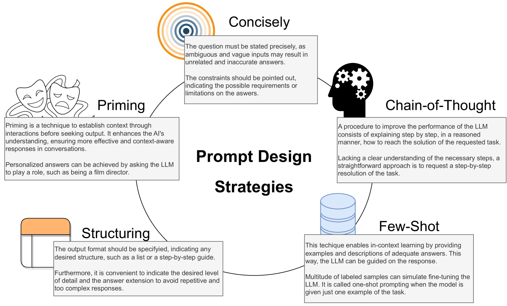
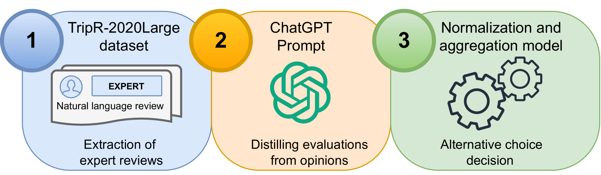
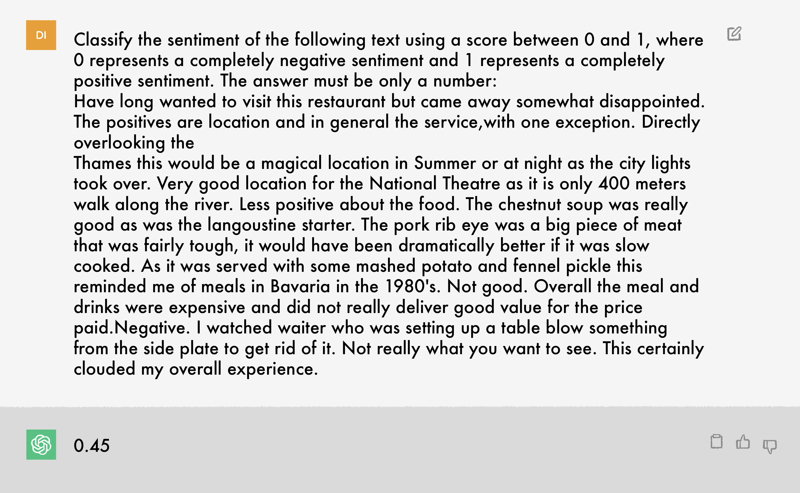
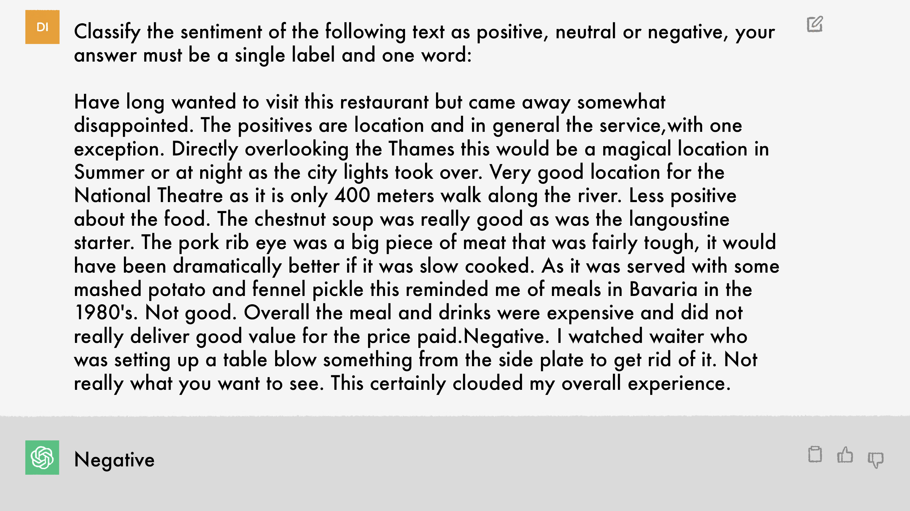
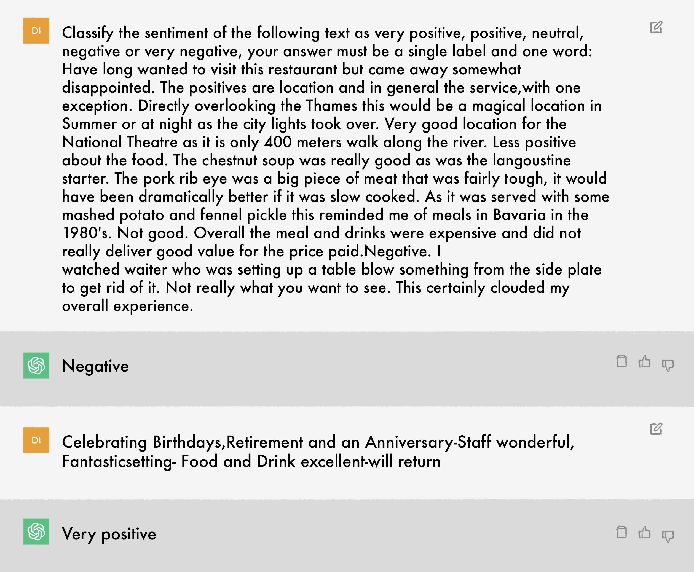
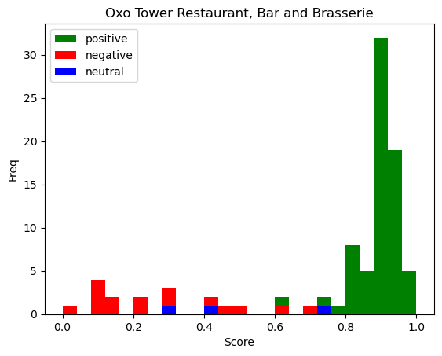
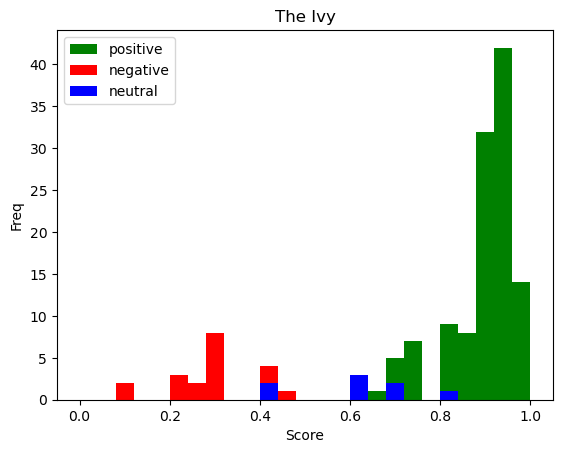
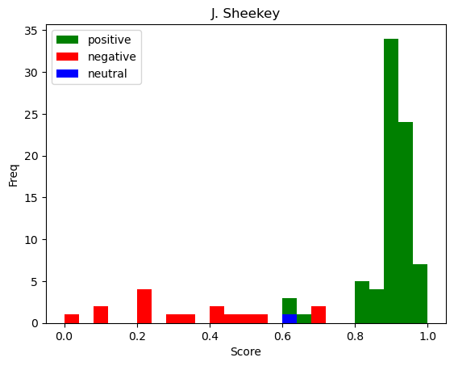
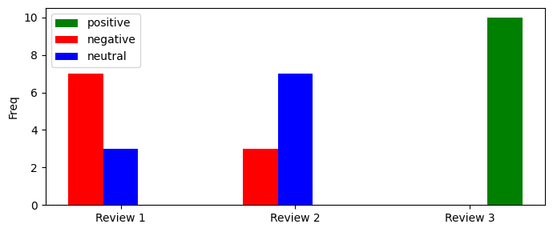

# 借助ChatGPT的提示设计策略，大规模语言模型应用于群体决策场景，涉及模型构建、效果分析以及面临的挑战。

发布时间：2024年03月22日

`LLM应用` `社交媒体` `决策支持系统`

> Large language models for crowd decision making based on prompt design strategies using ChatGPT: models, analysis and challenges

# 摘要

> 社交媒体和互联网是挖掘公众意见以丰富决策制定的有效资源，而群体决策制定（CDM）正是借助情感分析技术，从社交媒体上的普通文本（如评论）中解读出观点和决策的一种方法。随着大型语言模型（LLMs）的崭露头角，我们正积极探索运用自然语言处理技术自动化理解书面文本的新途径。本文研究如何通过精心设计的提示策略应用基于ChatGPT的辅助，在CDM过程中提取关键意见并做决策。我们将在CDM流程中融入ChatGPT，使其作为一个灵动工具，根据提示设计策略揭示文本中的观点，并为决策模型提供数值或语言形式的评价基础。此外，我们还构建了一个带有类别本体论的多准则决策制定场景，并视ChatGPT为一款能针对备选方案整体评价和打分的端到端CDM模型。我们利用来自真实数据集TripR-2020Large（源自TripAdvisor）进行实证试验，结果显示ChatGPT有望助力开发出高质量的决策制定模型。最后，我们探讨了在CDM中应用LLMs时所面临的连贯性、敏感度和可解释性挑战，并为此抛出了有待未来研究进一步解答的开放性问题。

> Social Media and Internet have the potential to be exploited as a source of opinion to enrich Decision Making solutions. Crowd Decision Making (CDM) is a methodology able to infer opinions and decisions from plain texts, such as reviews published in social media platforms, by means of Sentiment Analysis. Currently, the emergence and potential of Large Language Models (LLMs) lead us to explore new scenarios of automatically understand written texts, also known as natural language processing. This paper analyzes the use of ChatGPT based on prompt design strategies to assist in CDM processes to extract opinions and make decisions. We integrate ChatGPT in CDM processes as a flexible tool that infer the opinions expressed in texts, providing numerical or linguistic evaluations where the decision making models are based on the prompt design strategies. We include a multi-criteria decision making scenario with a category ontology for criteria. We also consider ChatGPT as an end-to-end CDM model able to provide a general opinion and score on the alternatives. We conduct empirical experiments on real data extracted from TripAdvisor, the TripR-2020Large dataset. The analysis of results show a promising branch for developing quality decision making models using ChatGPT. Finally, we discuss the challenges of consistency, sensitivity and explainability associated to the use of LLMs in CDM processes, raising open questions for future studies.

[Arxiv](https://arxiv.org/abs/2403.15587)