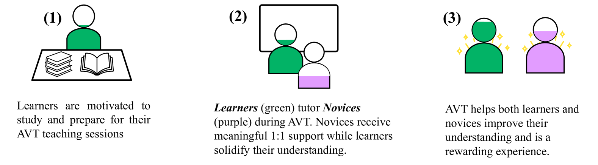
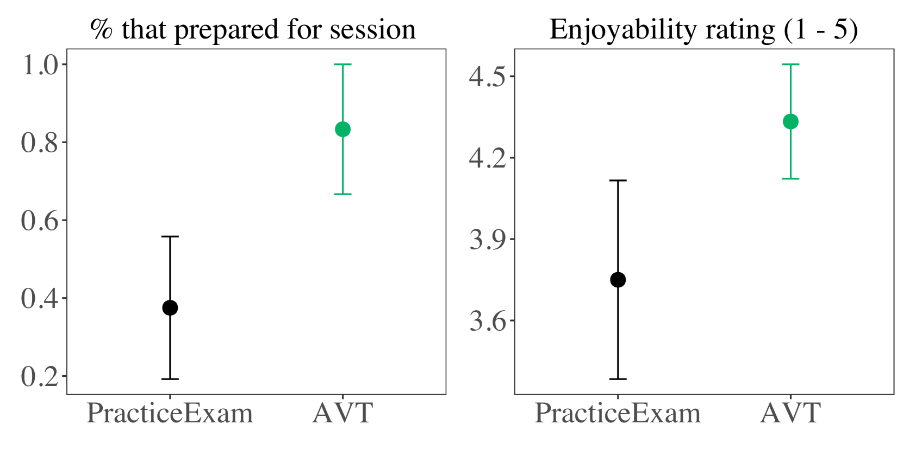

# 让学习者指导新手：一种激发潜力的新型替代评估策略

发布时间：2024年03月22日

`Agent` `计算机科学教育`

> Learners Teaching Novices: An Uplifting Alternative Assessment

> 我们创新提出并实施了“教学式评估”（AVT），让CS1课程学习者通过教导初学者来展现其对课程主题的掌握程度。相较于传统评估手段，AVT更注重服务于他人，对教学者极具成就感；同时，教学过程能显著加深教学者自身的理解，并对接受免费一对一辅导的初学者产生极大正面影响。尤为一提的是，AVT模式天然具备防作弊特性，这对当前大型语言模型时代的评估尤为重要。在一所顶级大学的CS1课程中，我们通过随机对照试验运用AVT方法，让学习者为参加滞后在线课程的初学者提供辅导。实验证明，在考试前参与AVT辅导环节的学习者在多项题目上得分较班级平均水平高出20%至30%。并且，与单纯做练习题的学生相比，AVT学习者不仅体验更佳，而且他们在准备教学阶段的积极性翻倍。我们坚信AVT作为一种有潜力的大规模推广和赋能型形成性评估方法，有望在未来取代传统的考试形式。

> We propose and carry-out a novel method of formative assessment called Assessment via Teaching (AVT), in which learners demonstrate their understanding of CS1 topics by tutoring more novice students. AVT has powerful benefits over traditional forms of assessment: it is centered around service to others and is highly rewarding for the learners who teach. Moreover, teaching greatly improves the learners' own understanding of the material and has a huge positive impact on novices, who receive free 1:1 tutoring. Lastly, this form of assessment is naturally difficult to cheat -- a critical property for assessments in the era of large-language models.
  We use AVT in a randomised control trial with learners in a CS1 course at an R1 university. The learners provide tutoring sessions to more novice students taking a lagged online version of the same course. We show that learners who do an AVT session before the course exam performed 20 to 30 percentage points better than the class average on several questions. Moreover, compared to students who did a practice exam, the AVT learners enjoyed their experience more and were twice as likely to study for their teaching session. We believe AVT is a scalable and uplifting method for formative assessment that could one day replace traditional exams.

[Arxiv](https://arxiv.org/abs/2403.14971)