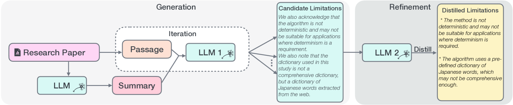

# LimGen 是一项研究，旨在探索 LLM 如何揭示并生成科研论文的潜在局限性提示。

发布时间：2024年03月22日

`LLM应用` `学术研究`

> LimGen: Probing the LLMs for Generating Suggestive Limitations of Research Papers

# 摘要

> 在学界，审阅研究时识别局限性至关重要，它揭示研究可能存在的不足之处以及提升空间，从而启迪读者进一步探究。本文介绍了一项新颖而颇具挑战性的任务——针对科研论文的“建议性局限性生成”（SLG）。我们创建了一个名为LimGen的数据集，囊括了ACL文集中4068篇研究论文及其附带的局限性描述。我们通过详尽探讨相关难题、实践洞见及潜在机遇，研究如何运用大型语言模型（LLMs）以生成有建设性的局限性建议。您可在https://github.com/armbf/LimGen平台上访问我们的LimGen数据集和代码资源。

> Examining limitations is a crucial step in the scholarly research reviewing process, revealing aspects where a study might lack decisiveness or require enhancement. This aids readers in considering broader implications for further research. In this article, we present a novel and challenging task of Suggestive Limitation Generation (SLG) for research papers. We compile a dataset called LimGen, encompassing 4068 research papers and their associated limitations from the ACL anthology. We investigate several approaches to harness large language models (LLMs) for producing suggestive limitations, by thoroughly examining the related challenges, practical insights, and potential opportunities. Our LimGen dataset and code can be accessed at https://github.com/armbf/LimGen.

[Arxiv](https://arxiv.org/abs/2403.15529)