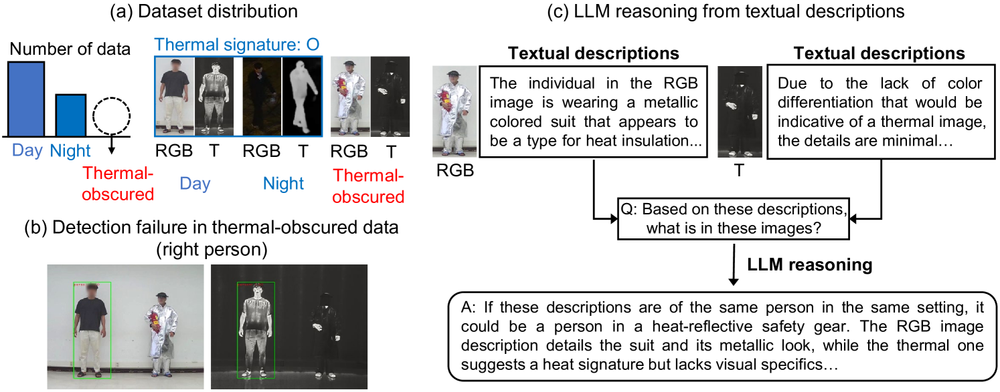
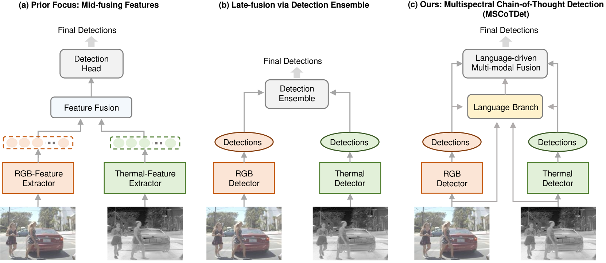
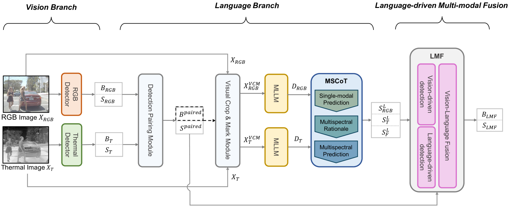
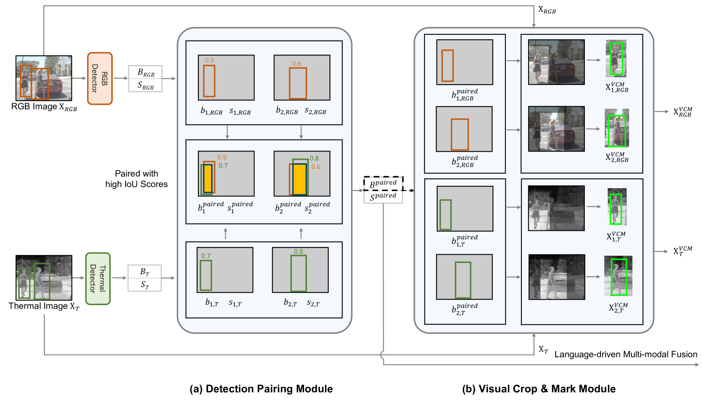
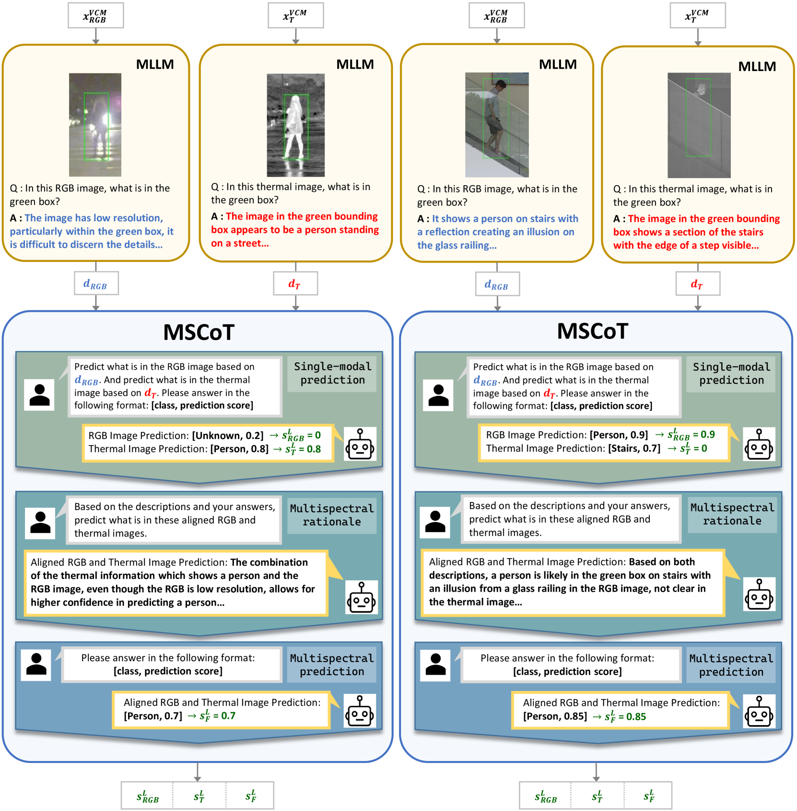
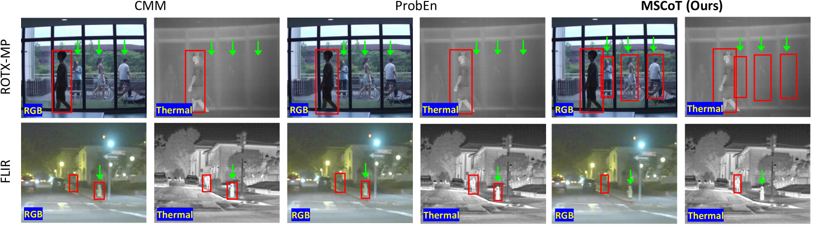

# MSCoTDet 是一种创新方法，通过运用语言驱动的多模态融合技术，优化并提升了在多光谱环境下行人检测的能力。

发布时间：2024年03月22日

`LLM应用` `计算机视觉` `行人检测`

> MSCoTDet: Language-driven Multi-modal Fusion for Improved Multispectral Pedestrian Detection

# 摘要

> 得益于RGB与热红外模态间的互补信息，多光谱行人检测技术在全天候场景下展现出广泛应用潜力。但现有模型常在直观明显的案例中失效，尤其是在学习过程中受到统计偏倚数据集影响而形成的模态偏好。为此，我们设想也许仅依赖视觉模型很难深入理解这种互补性本质。因此，我们创新性地提出了MSCoTDet框架，它引入大型语言模型（LLMs），在语义层面对互补信息进行深度理解和强化融合处理。我们通过生成行人RGB和热红外模态的文本描述，并精心设计一种多光谱思考链（MSCoT）提示方式，引导模型逐步进行跨模态语义推理，从而实现精准检测。同时，我们开发了一种基于语言驱动的多模态融合（LMF）策略，将视觉驱动与语言驱动的检测结果相结合。大量实验证明，MSCoTDet框架显著提升了多光谱行人检测性能。

> Multispectral pedestrian detection is attractive for around-the-clock applications due to the complementary information between RGB and thermal modalities. However, current models often fail to detect pedestrians in obvious cases, especially due to the modality bias learned from statistically biased datasets. From these problems, we anticipate that maybe understanding the complementary information itself is difficult to achieve from vision-only models. Accordingly, we propose a novel Multispectral Chain-of-Thought Detection (MSCoTDet) framework, which incorporates Large Language Models (LLMs) to understand the complementary information at the semantic level and further enhance the fusion process. Specifically, we generate text descriptions of the pedestrian in each RGB and thermal modality and design a Multispectral Chain-of-Thought (MSCoT) prompting, which models a step-by-step process to facilitate cross-modal reasoning at the semantic level and perform accurate detection. Moreover, we design a Language-driven Multi-modal Fusion (LMF) strategy that enables fusing vision-driven and language-driven detections. Extensive experiments validate that MSCoTDet improves multispectral pedestrian detection.

[Arxiv](https://arxiv.org/abs/2403.15209)