# 在深度神经网络量化时代下施展魔法注：由于原文“Magic for the Age of Quantized DNNs”是个标题性质的内容，且具有一定的抽象性和创意性，直译可能无法完全展现原文的意蕴和修辞效果。在此基础上进行简化和本地化时，尽可能保留其神秘感和技术感，因此给出了如上的“在深度神经网络量化时代下施展魔法”这一翻译建议。如果是在正式场合或需要更准确表述的情况下，也可以翻译为“面向量化深度神经网络时代的高效技术探索”。

发布时间：2024年03月22日

`LLM应用` `机器学习` `模型压缩`

> Magic for the Age of Quantized DNNs

> 近年来，随着LLM等模型参数量的爆炸性增长，小型设备上的模型推理面临挑战，故模型压缩技术显得尤为重要。本文提出了“MaQD”量化训练策略，其核心在于一种不受mini-batch大小影响且推理时无需额外计算开销的新型归一化方法——Layer-Batch Normalization。我们利用权重标准化结合尺度截断函数量化权重，并同样使用此函数量化激活函数，同时借助替代梯度训练含量化权重与量化激活函数的模型。实验证明，该量化方法能够在保持较高精度的前提下有效实施。

> Recently, the number of parameters in DNNs has explosively increased, as exemplified by LLMs (Large Language Models), making inference on small-scale computers more difficult. Model compression technology is, therefore, essential for integration into products. In this paper, we propose a method of quantization-aware training. We introduce a novel normalization (Layer-Batch Normalization) that is independent of the mini-batch size and does not require any additional computation cost during inference. Then, we quantize the weights by the scaled round-clip function with the weight standardization. We also quantize activation functions using the same function and apply surrogate gradients to train the model with both quantized weights and the quantized activation functions. We call this method Magic for the age of Quantised DNNs (MaQD). Experimental results show that our quantization method can be achieved with minimal accuracy degradation.

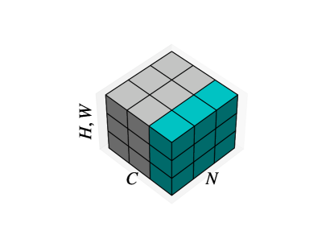

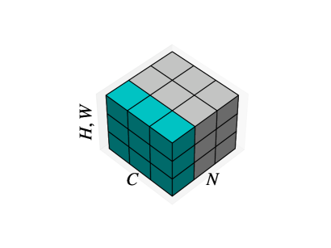

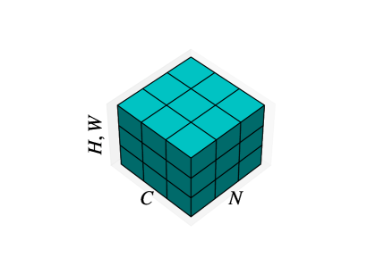

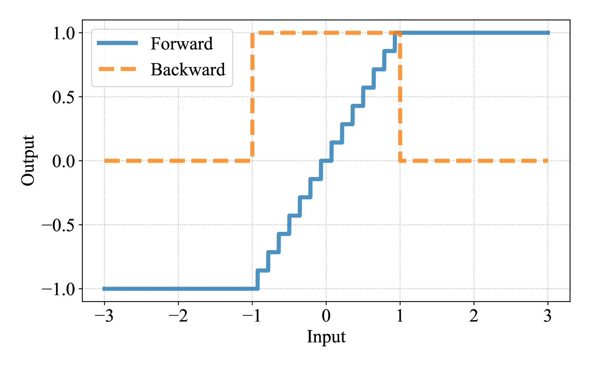

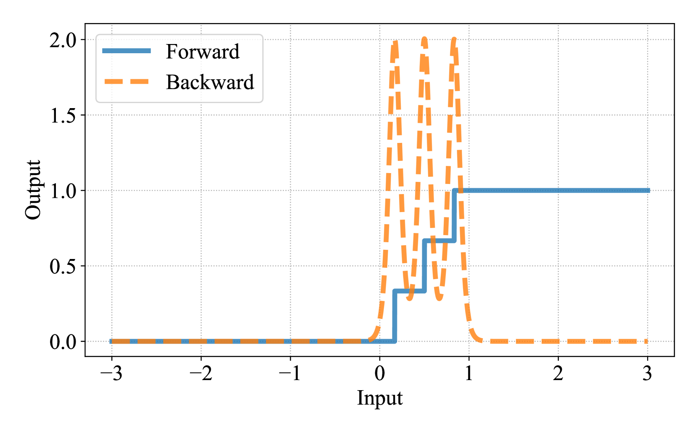

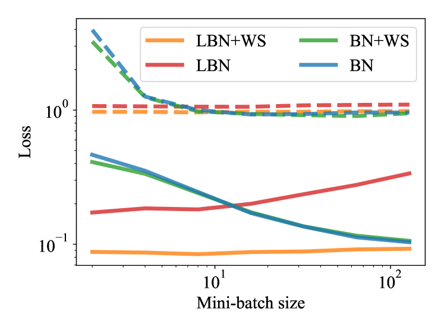

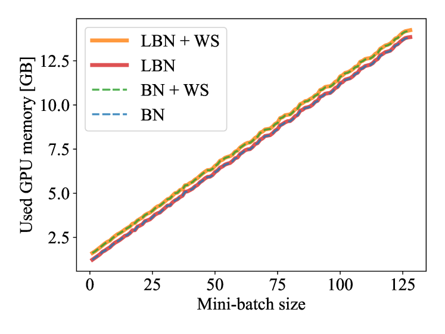

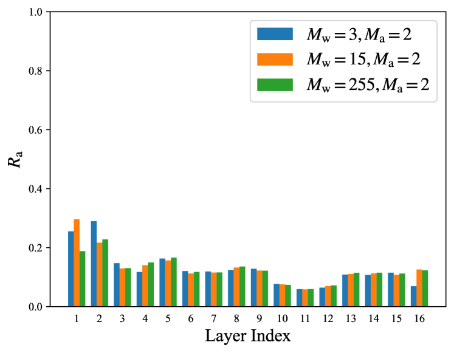

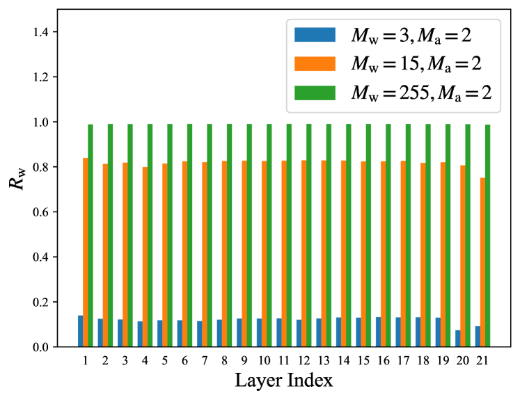

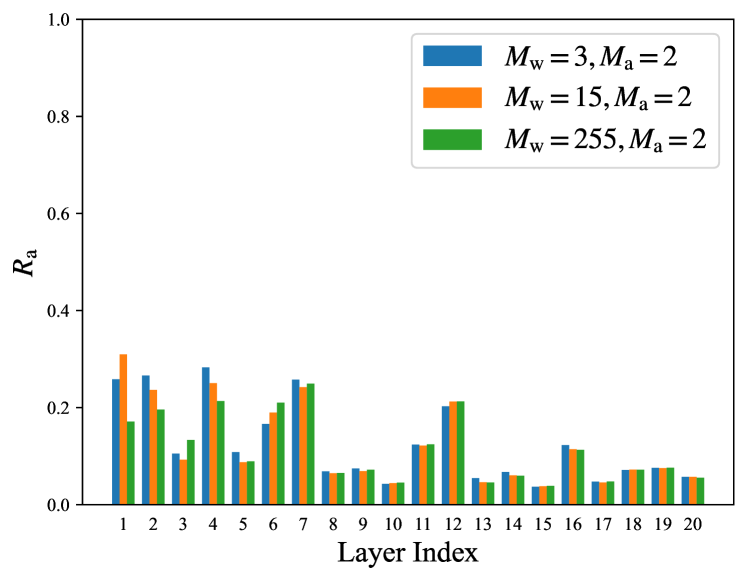

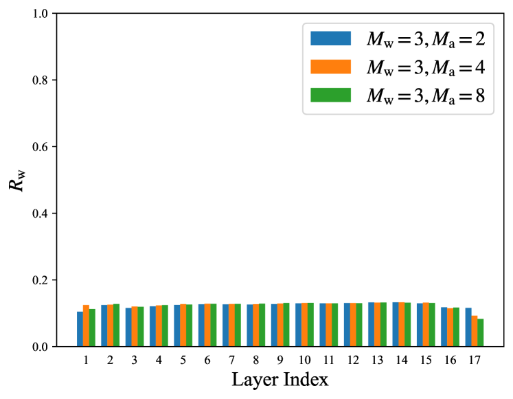

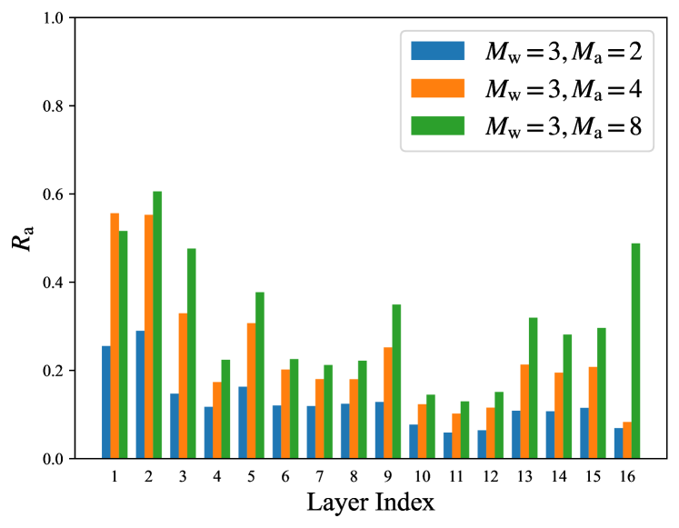

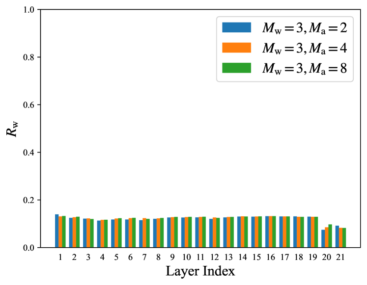

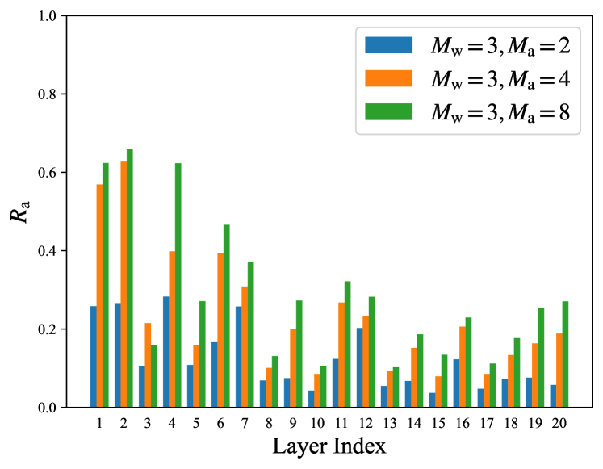

[Arxiv](https://arxiv.org/abs/2403.14999)