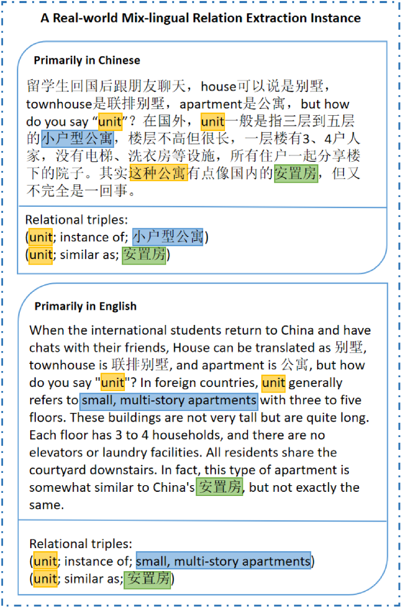
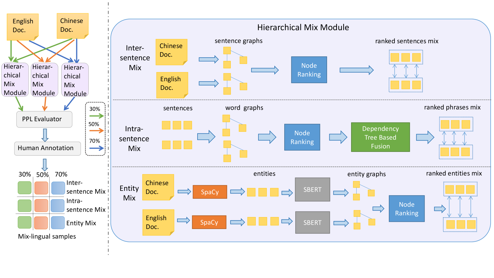
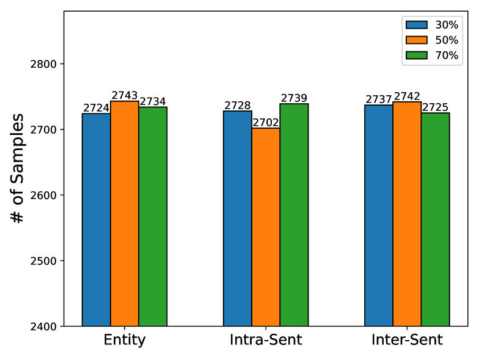
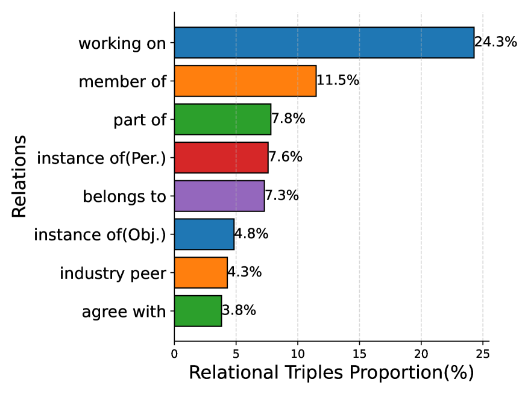
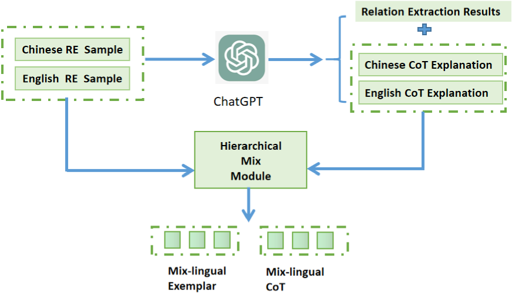
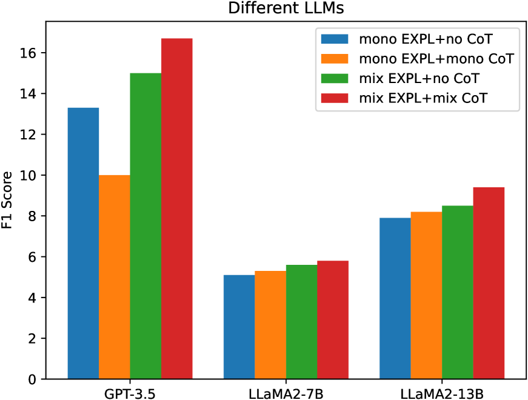

# MixRED 是一个创新的混合型跨语言关系抽取数据集，旨在提供丰富的跨语言环境下的实体关系抽取训练资源。

发布时间：2024年03月22日

`LLM应用` `数据挖掘`

> MixRED: A Mix-lingual Relation Extraction Dataset

# 摘要

> 关系抽取作为自然语言处理的关键任务，应用场景广泛，但目前研究主要集中在单语种或跨语言增强抽取上，而在混合语种（即代码切换）场景下的关系抽取研究尚存较大空白。鉴于缺乏针对性的数据集，现有模型在混合语种环境下的效果尚未得到充分验证。因此，我们提出了一个名为MixRE的新任务，旨在探讨混合语种场景下的关系抽取，并构建了首个人工标注数据集MixRED来支持此任务的研究。同时，我们在MixRED数据集上对最前沿的监督模型和大型语言模型（LLMs）进行了评测，揭示了它们在混合语种场景下的优劣势。此外，我们深入分析了影响MixRE任务中模型性能的各种因素，并找出了提升监督模型和LLMs在此新颖任务中性能的潜在途径。

> Relation extraction is a critical task in the field of natural language processing with numerous real-world applications. Existing research primarily focuses on monolingual relation extraction or cross-lingual enhancement for relation extraction. Yet, there remains a significant gap in understanding relation extraction in the mix-lingual (or code-switching) scenario, where individuals intermix contents from different languages within sentences, generating mix-lingual content. Due to the lack of a dedicated dataset, the effectiveness of existing relation extraction models in such a scenario is largely unexplored. To address this issue, we introduce a novel task of considering relation extraction in the mix-lingual scenario called MixRE and constructing the human-annotated dataset MixRED to support this task. In addition to constructing the MixRED dataset, we evaluate both state-of-the-art supervised models and large language models (LLMs) on MixRED, revealing their respective advantages and limitations in the mix-lingual scenario. Furthermore, we delve into factors influencing model performance within the MixRE task and uncover promising directions for enhancing the performance of both supervised models and LLMs in this novel task.

[Arxiv](https://arxiv.org/abs/2403.15696)