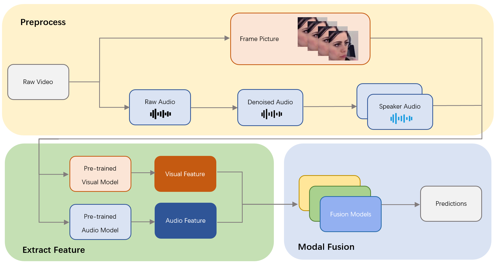

# 针对真实场景下的情感行为分析，本研究探索了预训练模型特征在多模态融合中的应用，以揭示和整合多种感官信息对情感识别的影响。

发布时间：2024年03月22日

`Agent` `表情识别` `情感分析`

> Multimodal Fusion with Pre-Trained Model Features in Affective Behaviour Analysis In-the-wild

# 摘要

> 在当前预训练模型激增的背景下，多模态融合技术作为多数多模态任务的关键策略，结合其与预训练模型特性，已在众多任务中展现出非凡效果。本文提出的方法巧妙结合两种优势，用于应对表情识别及情感唤醒值估值挑战。我们首先运用预训练模型对Aff-Wild2数据库进行评测，并提取模型的深层隐藏特征作为基础。经过精心预处理及特征对齐操作（如插值或卷积），再运用多种模型进行模态融合。您可访问GitHub仓库FulgenceWen/ABAW6th获取我们的代码资源。

> Multimodal fusion is a significant method for most multimodal tasks. With the recent surge in the number of large pre-trained models, combining both multimodal fusion methods and pre-trained model features can achieve outstanding performance in many multimodal tasks. In this paper, we present our approach, which leverages both advantages for addressing the task of Expression (Expr) Recognition and Valence-Arousal (VA) Estimation. We evaluate the Aff-Wild2 database using pre-trained models, then extract the final hidden layers of the models as features. Following preprocessing and interpolation or convolution to align the extracted features, different models are employed for modal fusion. Our code is available at GitHub - FulgenceWen/ABAW6th.

[Arxiv](https://arxiv.org/abs/2403.15044)