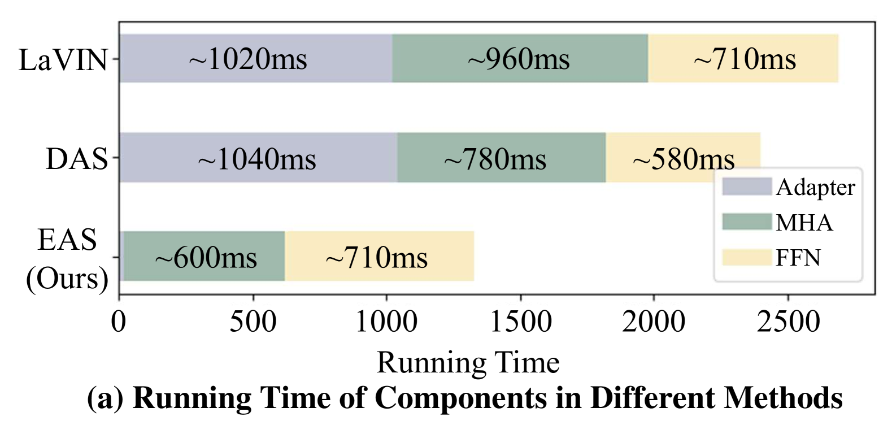
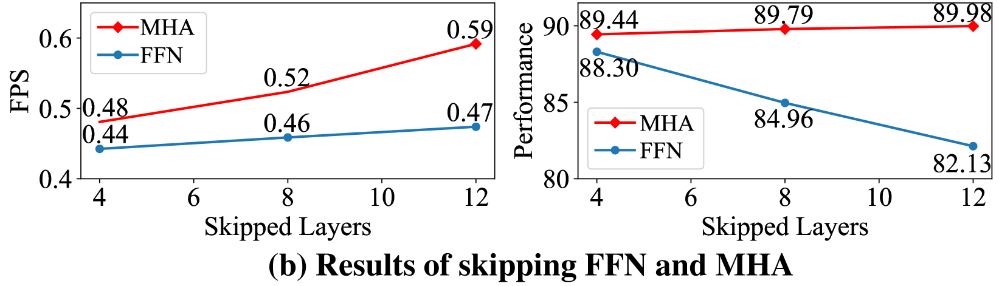
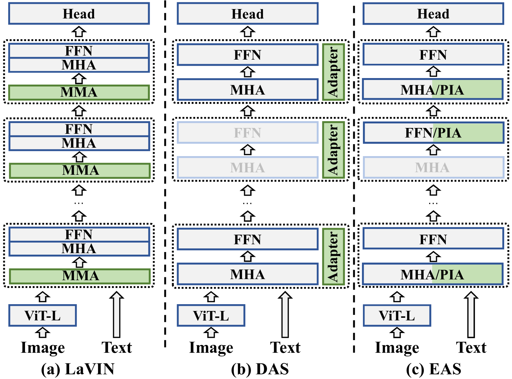
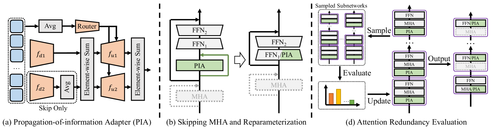

# 并非所有注意力都不可或缺，在多模态大型语言模型中，我们追求一种参数高效且计算经济的迁移学习方法。

发布时间：2024年03月22日

`Agent` `模型优化`

> Not All Attention is Needed: Parameter and Computation Efficient Transfer Learning for Multi-modal Large Language Models

> 本文创新提出一种针对多模态大型语言模型（MLLMs）的高效调优方案——高效注意力跳过（EAS），它既节省参数又提升计算效率。我们首先揭示了一个重要现象，即MLLMs的核心计算组件多头注意力（MHAs）在许多下游任务中往往存在冗余。基于此洞察，EAS通过评估并跳过不那么关键的MHAs，从而显著加速模型推理过程。另外，我们设计了一款创新的信息传播适配器（PIA），既能辅助EAS进行注意力跳过，又能保持模型参数效率，且可进一步重构为前馈网络（FFNs），确保零额外延迟。为了验证EAS的有效性，我们在一系列基准测试上，将EAS应用到新近提出的MLLM——LaVIN及经典VL预训练模型——METER上，并开展了大量实验。实验结果显示，采用EAS不仅能保持模型的高精度与参数效率，还能大幅度提高推理速度，如LaVIN-EAS在ScienceQA任务上实现了89.98%的准确率，推理速度更是提高了2.2倍。

> In this paper, we propose a novel parameter and computation efficient tuning method for Multi-modal Large Language Models (MLLMs), termed Efficient Attention Skipping (EAS). Concretely, we first reveal that multi-head attentions (MHAs), the main computational overhead of MLLMs, are often redundant to downstream tasks. Based on this observation, EAS evaluates the attention redundancy and skips the less important MHAs to speed up inference. Besides, we also propose a novel propagation-of-information adapter (PIA) to serve the attention skipping of EAS and keep parameter efficiency, which can be further re-parameterized into feed-forward networks (FFNs) for zero-extra latency. To validate EAS, we apply it to a recently proposed MLLM called LaVIN and a classic VL pre-trained model called METER, and conduct extensive experiments on a set of benchmarks. The experiments show that EAS not only retains high performance and parameter efficiency, but also greatly speeds up inference speed. For instance, LaVIN-EAS can obtain 89.98\% accuracy on ScineceQA while speeding up inference by 2.2 times to LaVIN

[Arxiv](https://arxiv.org/abs/2403.15226)