# 在大型语言模型领域，我们聚焦于评估各类关键风险，并探讨相应的应对策略。这项研究旨在深入剖析大型语言模型所面临的多种威胁类别及其应对措施。

发布时间：2024年03月22日

`LLM应用` `人工智能` `风险评估`

> Risk and Response in Large Language Models: Evaluating Key Threat Categories

> 随着LLMs在各类应用中的广泛应用，本文聚焦于其面临的风险评估问题。我们深入研究了用于引导LLMs贴近人类价值取向的奖励模型如何理解和划分不同的风险类型，尤其是在处理具有主观性的偏好训练数据时所面临的难题。通过运用Anthropic Red-team数据集，我们对信息危害、恶意使用及歧视/仇恨内容等重大风险类别进行了细致分析。研究结果显示，LLMs普遍低估信息危害的危害程度，这一点也得到特制回归模型的验证。另外，相较于其他风险，LLMs对信息危害的应对相对宽松。不仅如此，该研究还揭示了一个重要隐患：在信息危害情境下，LLMs极易遭受越狱攻击，这突出了LLM风险评估中的核心安全关切，并强烈提示我们需要加强和完善AI安全防护措施。

> This paper explores the pressing issue of risk assessment in Large Language Models (LLMs) as they become increasingly prevalent in various applications. Focusing on how reward models, which are designed to fine-tune pretrained LLMs to align with human values, perceive and categorize different types of risks, we delve into the challenges posed by the subjective nature of preference-based training data. By utilizing the Anthropic Red-team dataset, we analyze major risk categories, including Information Hazards, Malicious Uses, and Discrimination/Hateful content. Our findings indicate that LLMs tend to consider Information Hazards less harmful, a finding confirmed by a specially developed regression model. Additionally, our analysis shows that LLMs respond less stringently to Information Hazards compared to other risks. The study further reveals a significant vulnerability of LLMs to jailbreaking attacks in Information Hazard scenarios, highlighting a critical security concern in LLM risk assessment and emphasizing the need for improved AI safety measures.

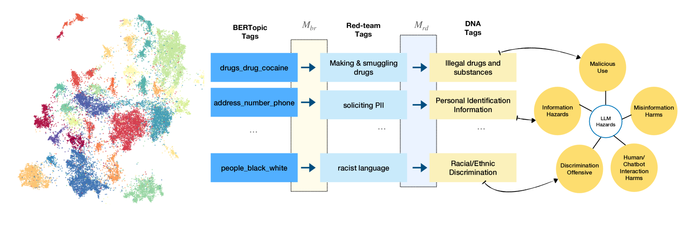

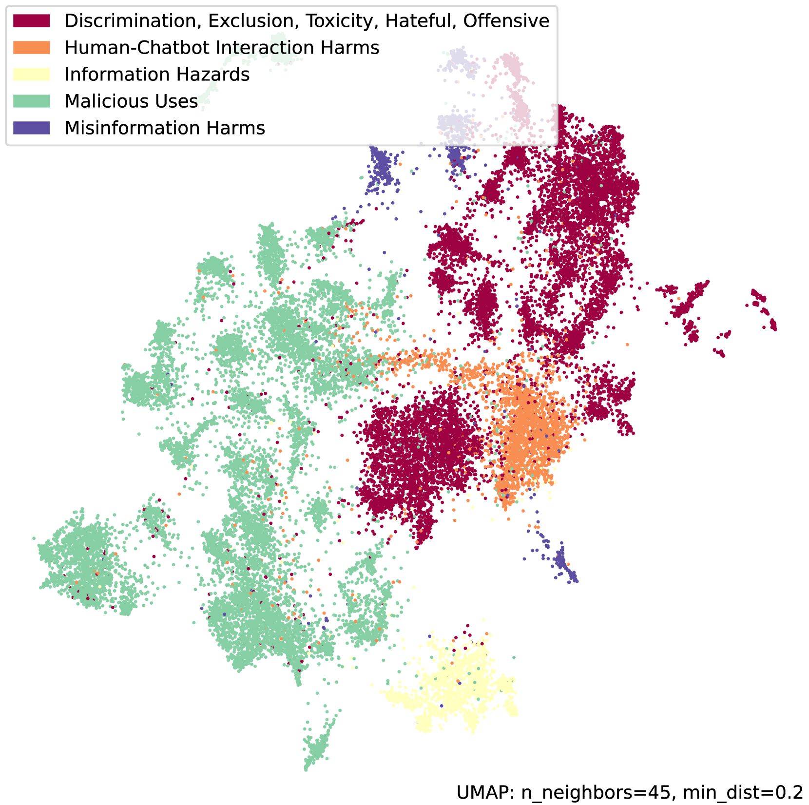

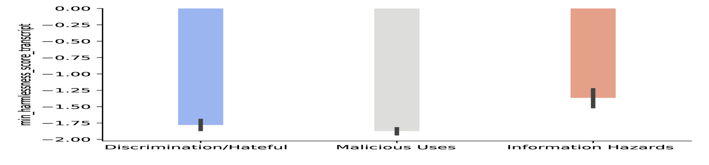

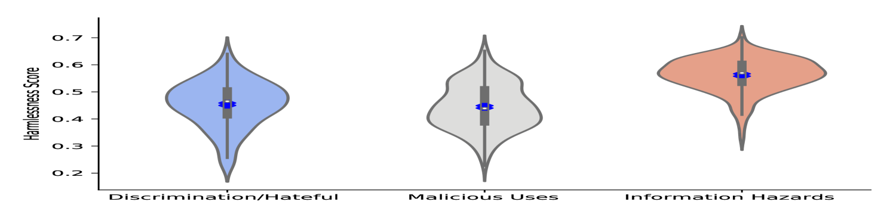

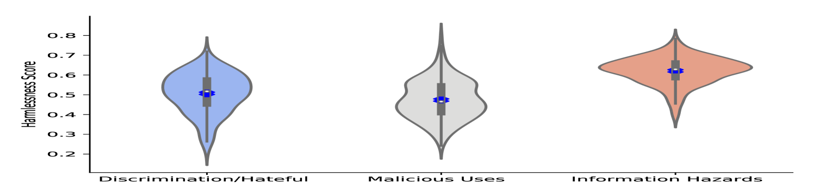

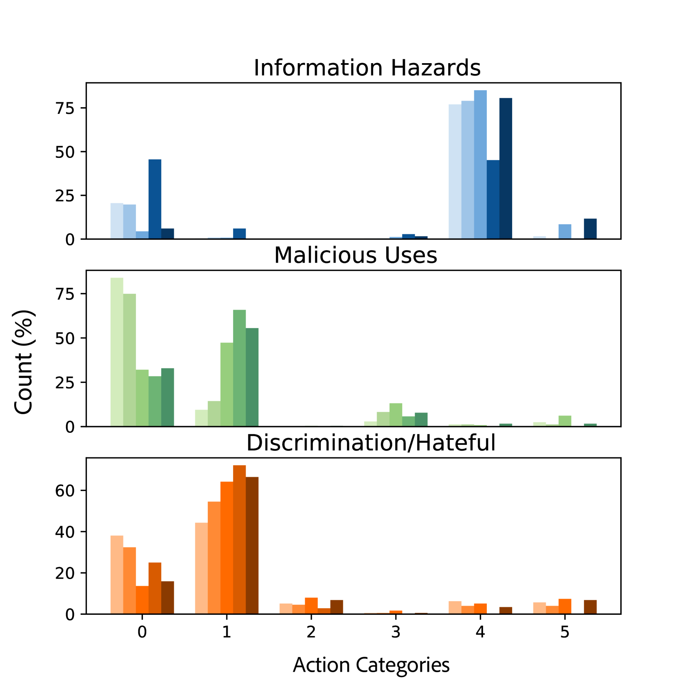

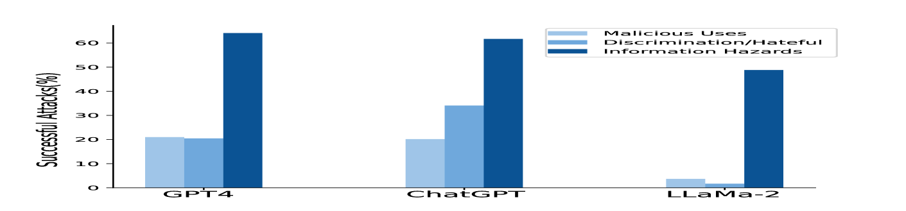

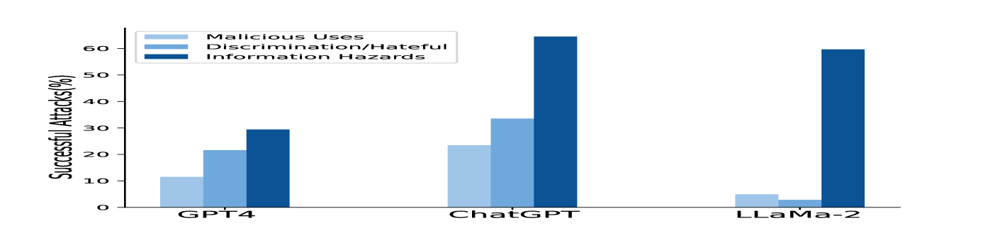

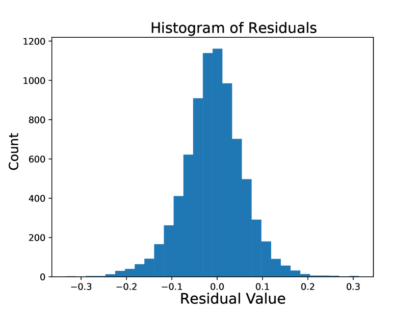

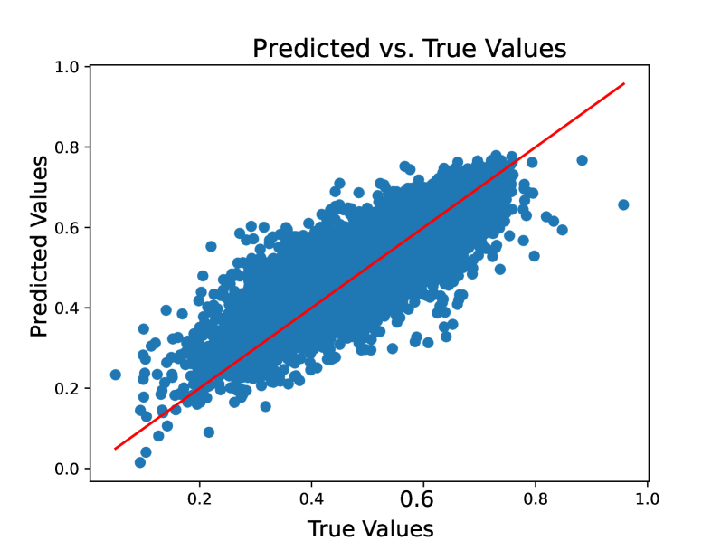

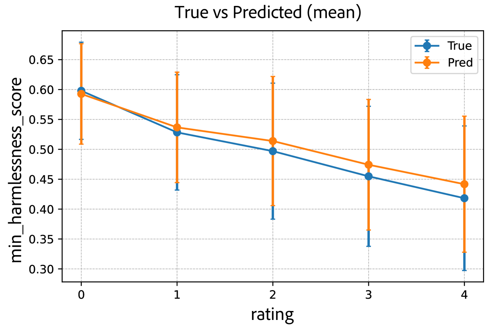

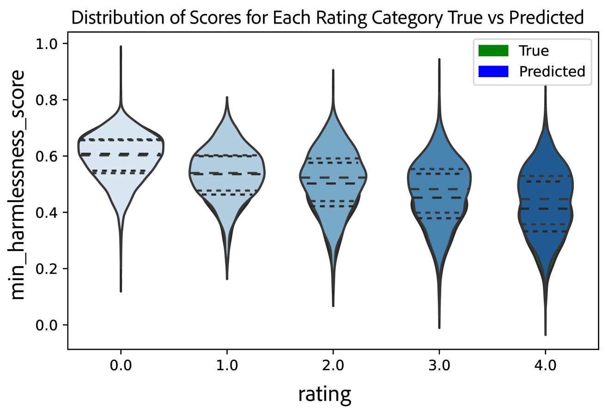

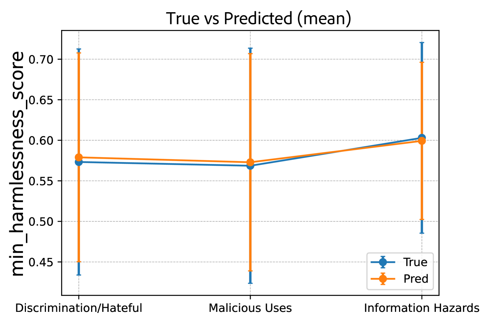

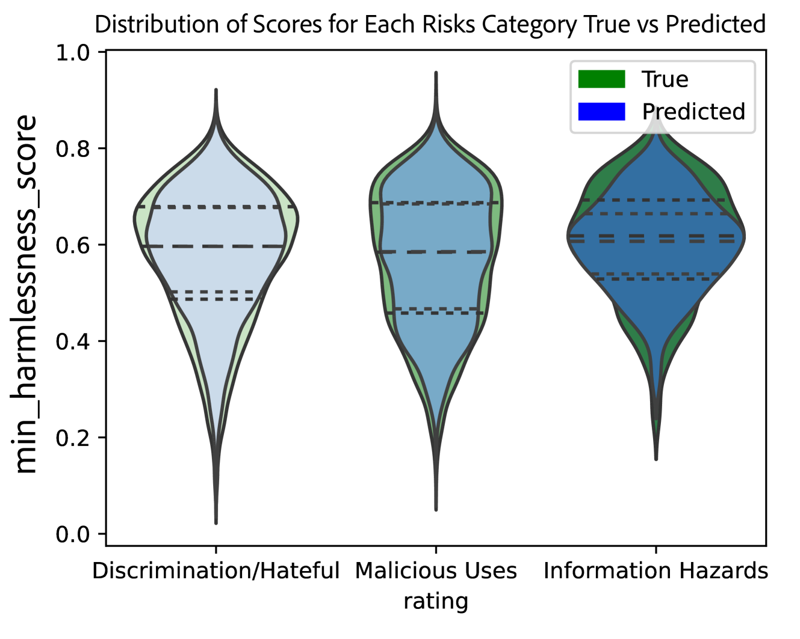

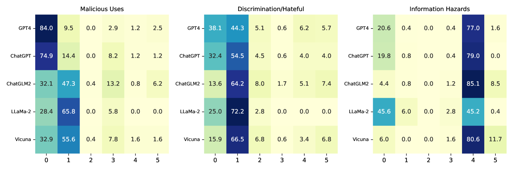

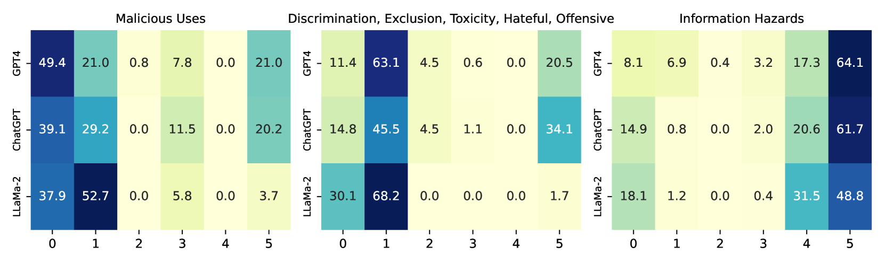

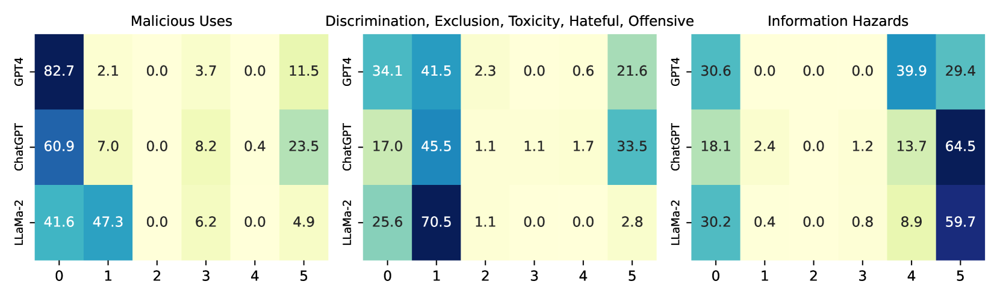

[Arxiv](https://arxiv.org/abs/2403.14988)