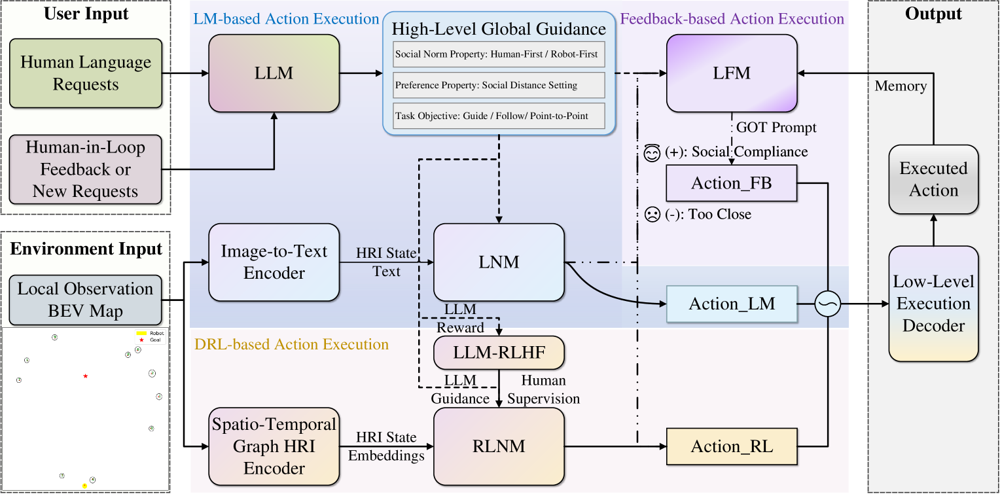
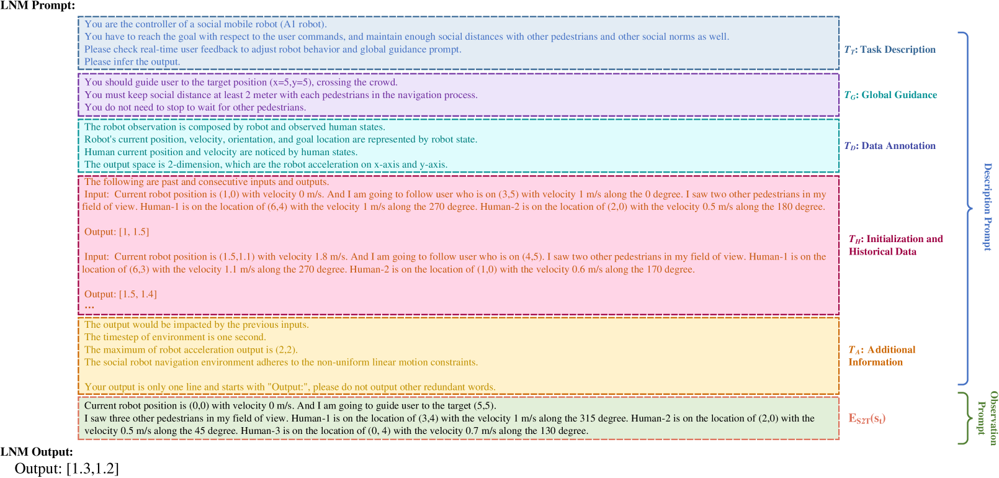
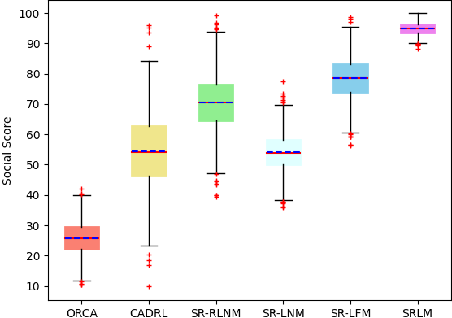
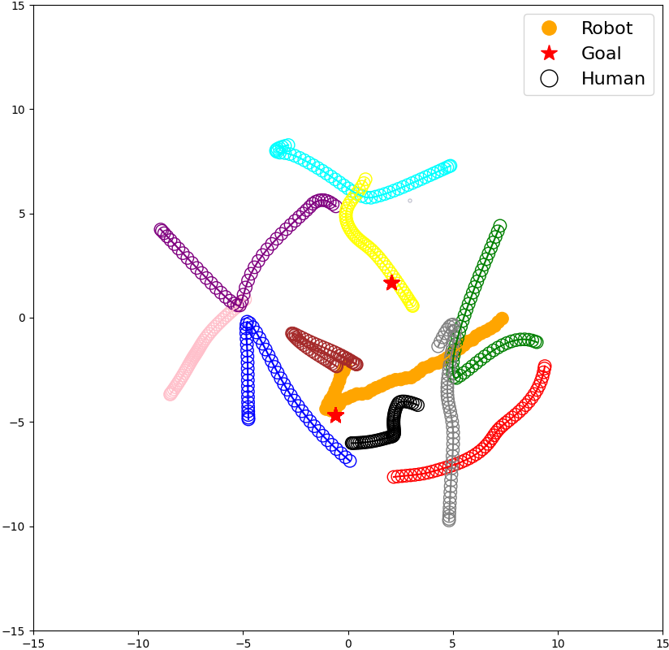
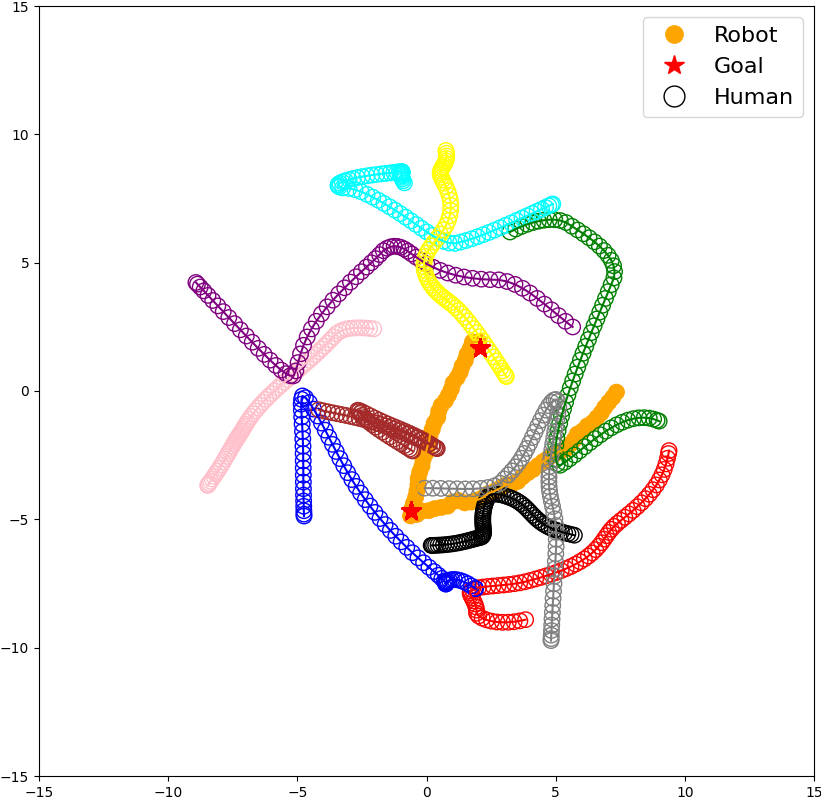
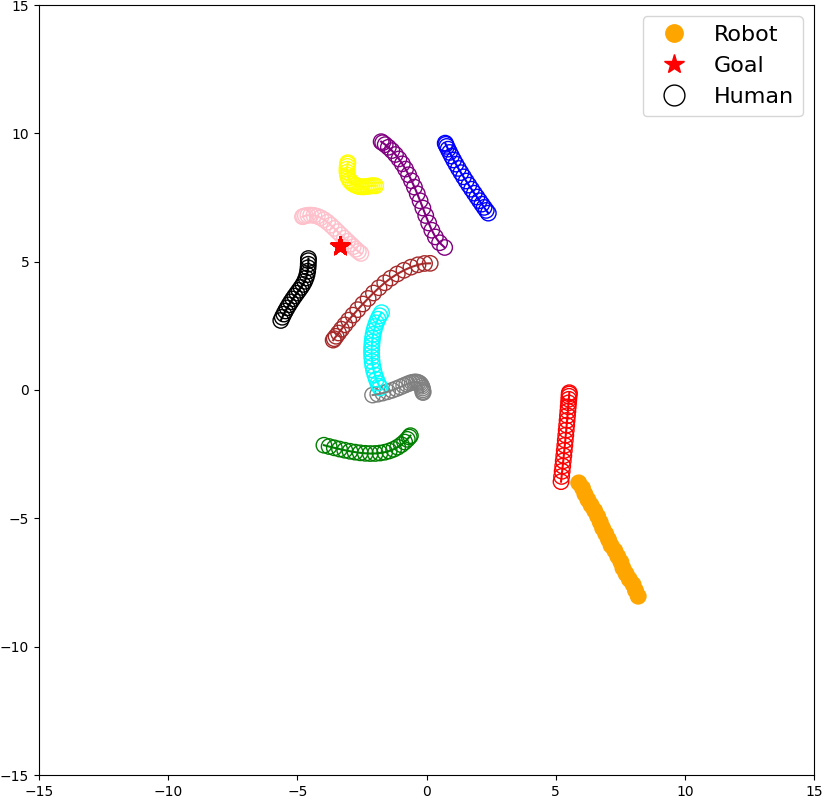
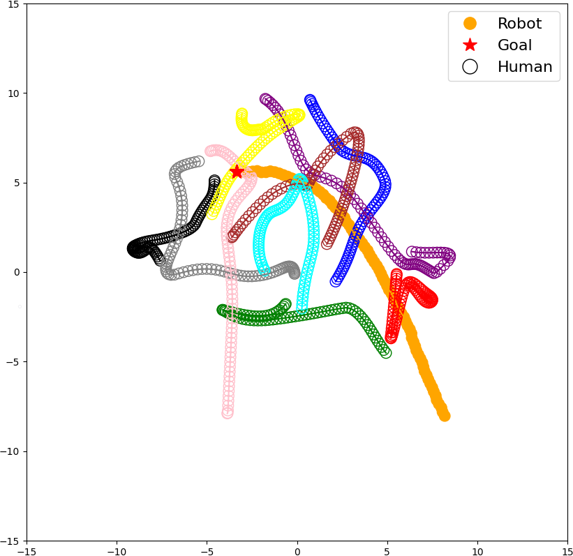
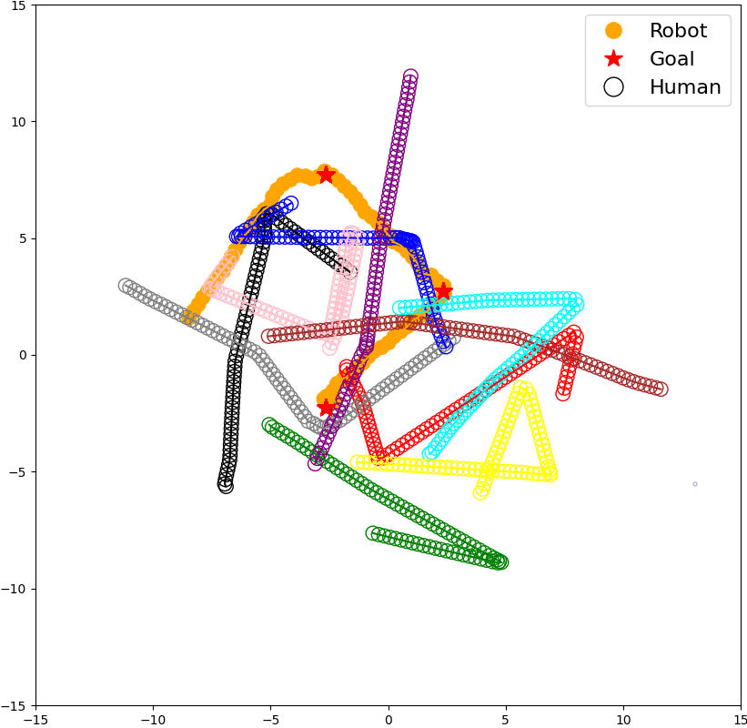

# SRLM 是一项创新技术，它运用大型语言模型与深度强化学习，实现人机交互式社交机器人导航，让机器人在人类引导下灵活适应复杂社交环境中的移动需求。

发布时间：2024年03月22日

`Agent` `社交机器人` `人工智能`

> SRLM: Human-in-Loop Interactive Social Robot Navigation with Large Language Model and Deep Reinforcement Learning

# 摘要

> 交互式社交机器人助手需在熙攘复杂的环境中灵活服务，并实时依据人类语言指令或反馈调整行为。本文创新性地提出了一种名为“社交机器人规划器”（SRLM）的混合策略，它巧妙融合了大型语言模型（LLM）与深度强化学习（DRL），使机器人能在人潮涌动的公共场所穿梭自如，同时提供多样化的社交服务。SRLM能够实时从人的实时指令中推演全局行动方案，并将社交元素融入基于LLM的大型导航模型（LNM），确保精确执行底层动作。此外，为了维持稳定的性能基准，设计了一款基于DRL的规划器，通过大型反馈模型（LFM）与LNM深度融合，有效应对当前由文本和LLM驱动的LNM存在的不稳定性问题。最终，SRLM在一系列广泛深入的实验中展现了非凡的效果，更多详情可访问：https://sites.google.com/view/navi-srlm。

> An interactive social robotic assistant must provide services in complex and crowded spaces while adapting its behavior based on real-time human language commands or feedback. In this paper, we propose a novel hybrid approach called Social Robot Planner (SRLM), which integrates Large Language Models (LLM) and Deep Reinforcement Learning (DRL) to navigate through human-filled public spaces and provide multiple social services. SRLM infers global planning from human-in-loop commands in real-time, and encodes social information into a LLM-based large navigation model (LNM) for low-level motion execution. Moreover, a DRL-based planner is designed to maintain benchmarking performance, which is blended with LNM by a large feedback model (LFM) to address the instability of current text and LLM-driven LNM. Finally, SRLM demonstrates outstanding performance in extensive experiments. More details about this work are available at: https://sites.google.com/view/navi-srlm

[Arxiv](https://arxiv.org/abs/2403.15648)