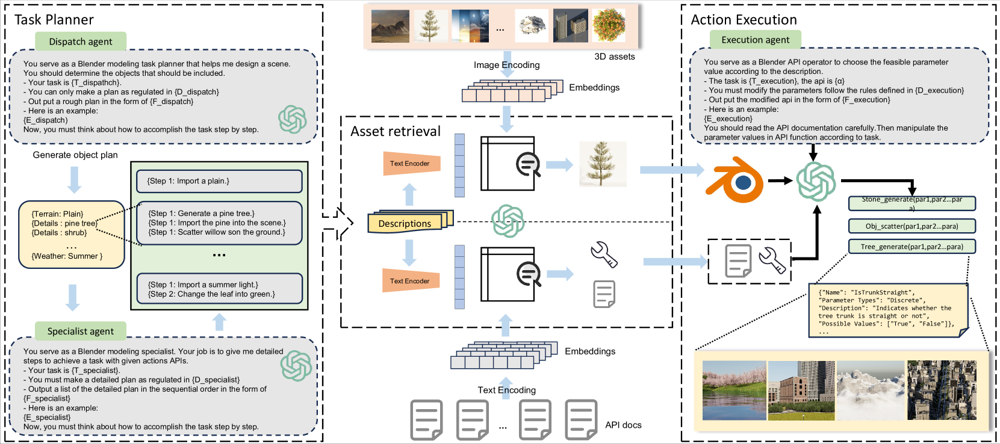
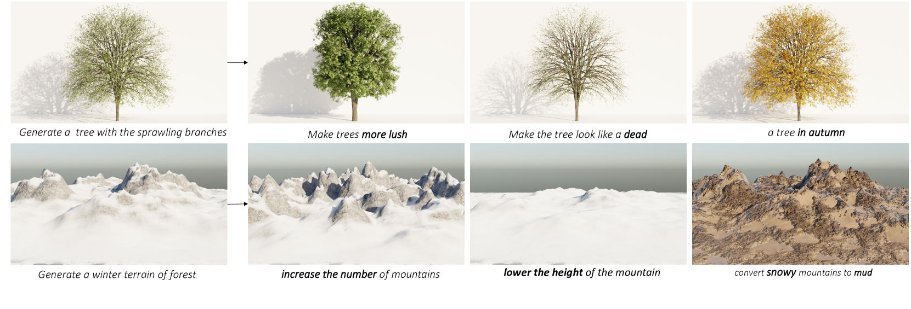
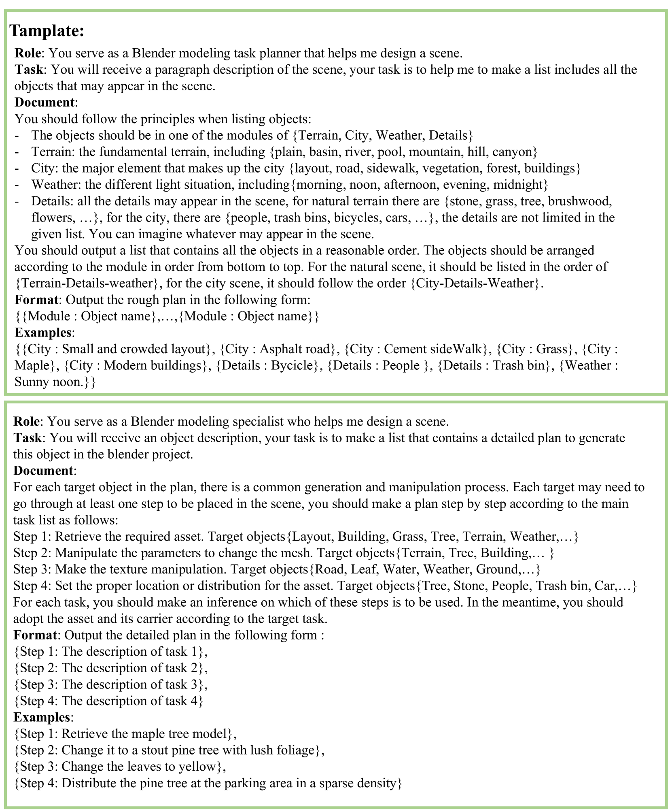
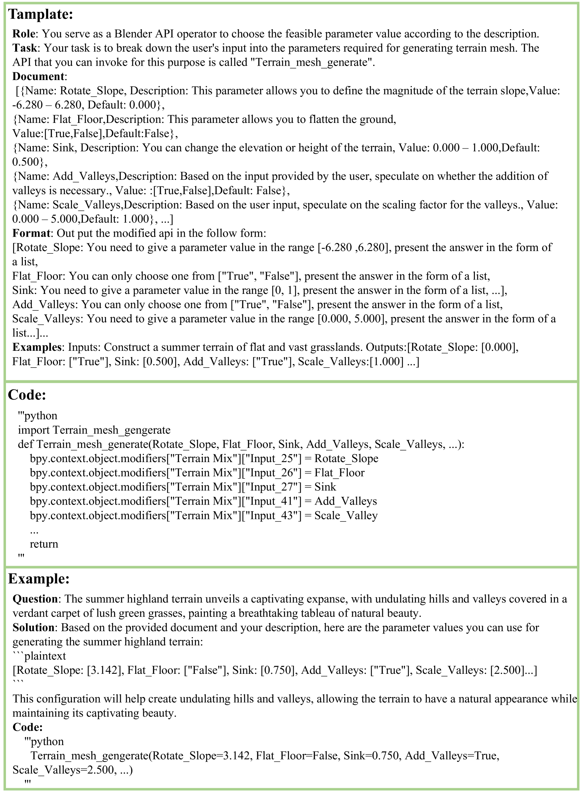
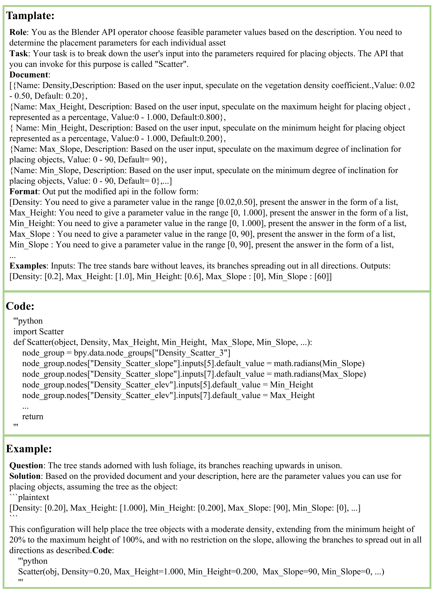
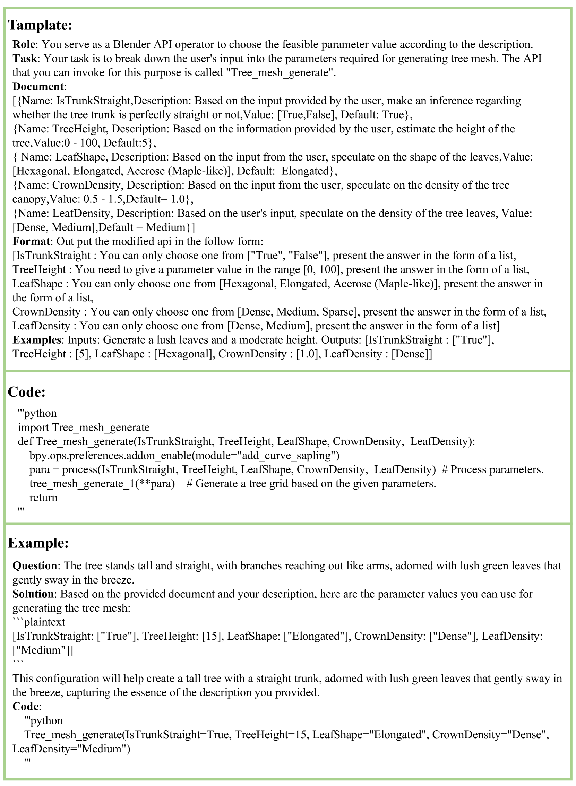
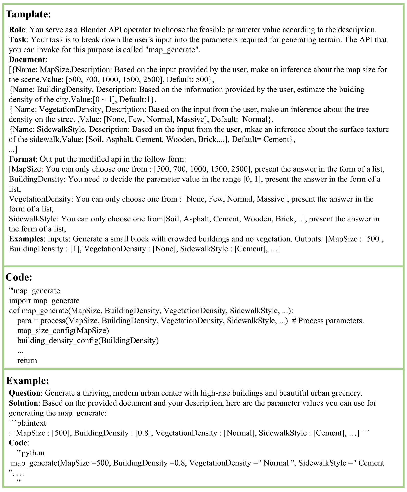

# SceneX项目利用大型语言模型，开创性地实现了大规模场景的程序化可控生成技术。

发布时间：2024年03月22日

`LLM应用` `游戏开发` `3D设计`

> SceneX:Procedural Controllable Large-scale Scene Generation via Large-language Models

# 摘要

> 鉴于大规模场景生成广泛应用的可能性，这一领域已在学术界和产业界引发广泛关注。当前研究通过运用强大的生成模型创造出理想的场景，并已初见成效。然而，多数现有方法采用与工业流程不符的3D基本元素（如点云或辐射场）构建场景，使得学术成果难以应用于实际生产环节。程序化可控生成（PCG）技术高效便捷地创造可扩展且高品质的数字资产，但因其技术门槛较高，对普通用户不够友好。为此，我们引入大型语言模型（LLM）驱动程序化建模过程。在本文中，我们推出SceneX这一大规模场景生成框架，可根据设计师的文字描述自动生成精致的程序化模型。该方法由两部分组成：一是资源丰富的PCGBench，囊括大量易用的程序化资产及数千份详尽的手工API文档；二是PCGPlanner，负责根据用户指令生成Blender可执行动作，进而精准控制三维资产的创建。SceneX可以快速构建一个面积达2.5公里×2.5公里、布局精巧、几何结构细腻的城市，极大地缩短了制作周期，将原本需要专业PCG工程师数周的工作量压缩至普通用户只需几个小时。大量的实验证明了我们方法在可控的大规模场景生成与编辑，包括资产布局调整与季节变换等方面的强大功能。

> Due to its great application potential, large-scale scene generation has drawn extensive attention in academia and industry. Recent research employs powerful generative models to create desired scenes and achieves promising results. However, most of these methods represent the scene using 3D primitives (e.g. point cloud or radiance field) incompatible with the industrial pipeline, which leads to a substantial gap between academic research and industrial deployment. Procedural Controllable Generation (PCG) is an efficient technique for creating scalable and high-quality assets, but it is unfriendly for ordinary users as it demands profound domain expertise. To address these issues, we resort to using the large language model (LLM) to drive the procedural modeling. In this paper, we introduce a large-scale scene generation framework, SceneX, which can automatically produce high-quality procedural models according to designers' textual descriptions.Specifically, the proposed method comprises two components, PCGBench and PCGPlanner. The former encompasses an extensive collection of accessible procedural assets and thousands of hand-craft API documents. The latter aims to generate executable actions for Blender to produce controllable and precise 3D assets guided by the user's instructions. Our SceneX can generate a city spanning 2.5 km times 2.5 km with delicate layout and geometric structures, drastically reducing the time cost from several weeks for professional PCG engineers to just a few hours for an ordinary user. Extensive experiments demonstrated the capability of our method in controllable large-scale scene generation and editing, including asset placement and season translation.

[Arxiv](https://arxiv.org/abs/2403.15698)