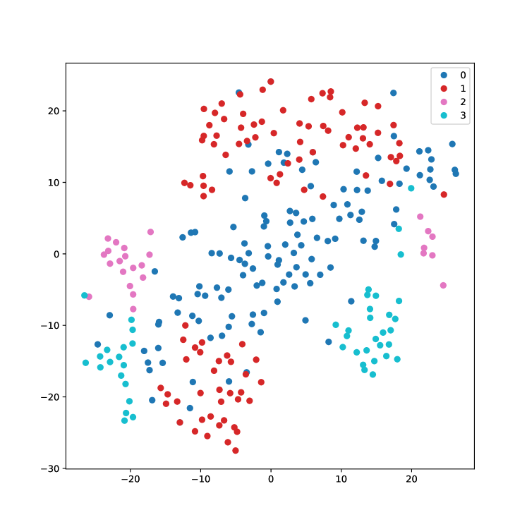
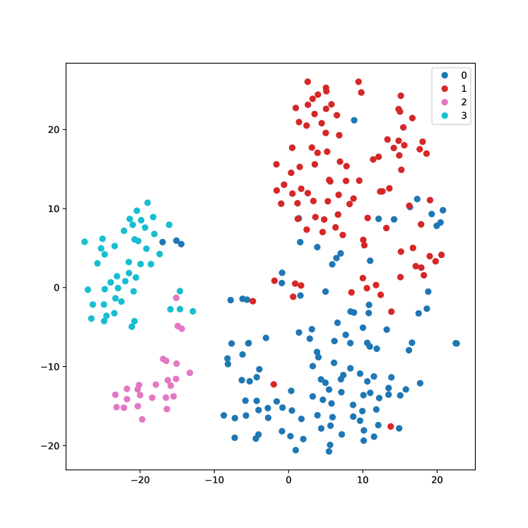
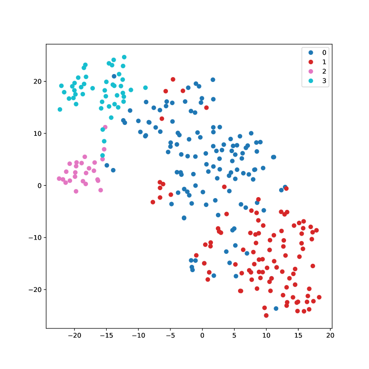
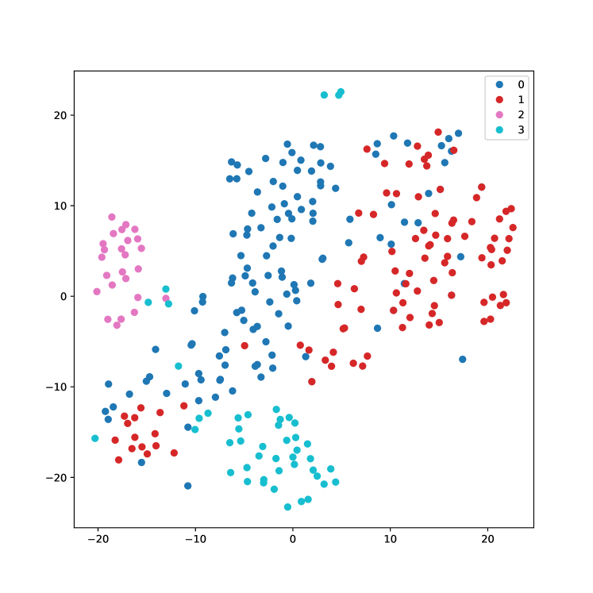

# 运用 LLM 生成的嵌入进行文本聚类技术的研究与应用步骤详解：

发布时间：2024年03月22日

`LLM应用` `文本处理` `数据挖掘`

> Text clustering with LLM embeddings

# 摘要

> 面对不断膨胀的数字内容，文本聚类作为一种关键的组织手段，有助于揭示未经分类数据的结构和潜在规律。本次研究重点探索了各类文本嵌入方式——特别是大型语言模型(LLMs)中采用的嵌入，以及不同的聚类算法如何影响文本数据集的聚类效果。通过一系列实验，我们考察了嵌入方式如何左右聚类结果，摘要技术带来的维度降低作用，以及调整嵌入尺寸的影响。研究结果显示，LLM嵌入在精准捕获结构化语言微妙特性方面表现出卓越能力，而在轻量级方案中，BERT则以优异性能脱颖而出。另外，我们还发现在提升聚类效率上，一味增大嵌入维度或依赖摘要技术并非万全之策，这提示我们在实际模型应用时需审慎分析这些策略。这一系列研究结果强调了在文本聚类应用场景下，精细化文本表征需求与计算可行性的微妙权衡关系。通过融入LLMs的嵌入技术，我们的研究拓展了传统文本聚类框架，为优化方法论指引方向，并为未来各类文本分析领域的深入研究开辟了崭新路径。

> Text clustering is an important approach for organising the growing amount of digital content, helping to structure and find hidden patterns in uncategorised data. In this research, we investigated how different textual embeddings - particularly those used in large language models (LLMs) - and clustering algorithms affect how text datasets are clustered. A series of experiments were conducted to assess how embeddings influence clustering results, the role played by dimensionality reduction through summarisation, and embedding size adjustment. Results reveal that LLM embeddings excel at capturing the nuances of structured language, while BERT leads the lightweight options in performance. In addition, we find that increasing embedding dimensionality and summarisation techniques do not uniformly improve clustering efficiency, suggesting that these strategies require careful analysis to use in real-life models. These results highlight a complex balance between the need for nuanced text representation and computational feasibility in text clustering applications. This study extends traditional text clustering frameworks by incorporating embeddings from LLMs, thereby paving the way for improved methodologies and opening new avenues for future research in various types of textual analysis.

[Arxiv](https://arxiv.org/abs/2403.15112)