# Transfer CLIP 应用于通用图像去噪领域，旨在提升模型的泛化能力，使其能够有效处理各类噪声图像问题。

发布时间：2024年03月22日

`Agent` `图像处理` `计算机视觉`

> Transfer CLIP for Generalizable Image Denoising

> 图像去噪作为计算机视觉的核心课题，尽管目前主流的基于深度学习的监督和自监督方法在处理分布内的噪声问题上表现出众，但在应对分布外（OOD）噪声时仍存在显著挑战。CLIP 模型的崭露头角，其在开放世界图像识别与分割上的非凡表现令人瞩目，然而，如何充分利用 CLIP 来提升低层次任务的鲁棒性仍未得到深入研究。本研究发现，从 CLIP 冻结的 ResNet 图像编码器中抽取的部分稠密特征具有抗失真及与内容紧密相关的特性，这正是构建普适性强的去噪方法所亟需的。据此，我们创新设计了一种不对称的编码-解码去噪网络架构，将包含噪声图像及其多尺度特征的稠密特征，从 CLIP 的冻结 ResNet 编码器注入至可学习的图像解码器中，从而实现普适性去噪。为了进一步减少特征过拟合现象，提升解码器的学习鲁棒性，我们还提出了逐步特征增强策略。广泛的实验与跨多个 OOD 噪声类型的对比分析，包括合成噪声、实际场景下的 sRGB 噪声和低剂量 CT 图像噪声，有力地证明了我们方法在泛化能力上的优越性。

> Image denoising is a fundamental task in computer vision. While prevailing deep learning-based supervised and self-supervised methods have excelled in eliminating in-distribution noise, their susceptibility to out-of-distribution (OOD) noise remains a significant challenge. The recent emergence of contrastive language-image pre-training (CLIP) model has showcased exceptional capabilities in open-world image recognition and segmentation. Yet, the potential for leveraging CLIP to enhance the robustness of low-level tasks remains largely unexplored. This paper uncovers that certain dense features extracted from the frozen ResNet image encoder of CLIP exhibit distortion-invariant and content-related properties, which are highly desirable for generalizable denoising. Leveraging these properties, we devise an asymmetrical encoder-decoder denoising network, which incorporates dense features including the noisy image and its multi-scale features from the frozen ResNet encoder of CLIP into a learnable image decoder to achieve generalizable denoising. The progressive feature augmentation strategy is further proposed to mitigate feature overfitting and improve the robustness of the learnable decoder. Extensive experiments and comparisons conducted across diverse OOD noises, including synthetic noise, real-world sRGB noise, and low-dose CT image noise, demonstrate the superior generalization ability of our method.

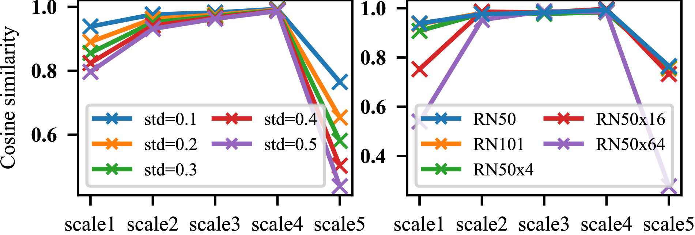

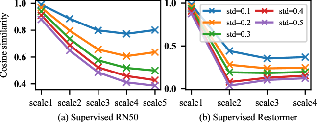

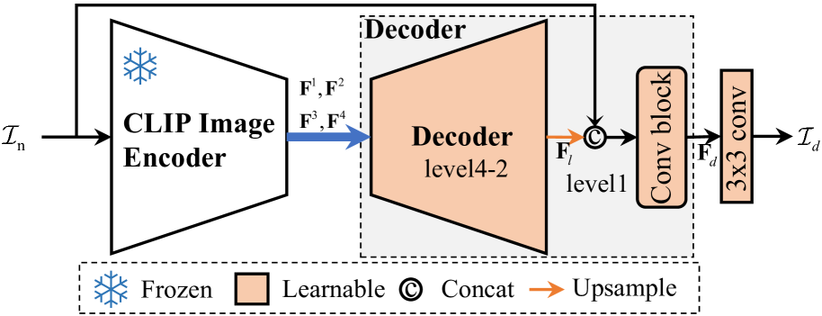

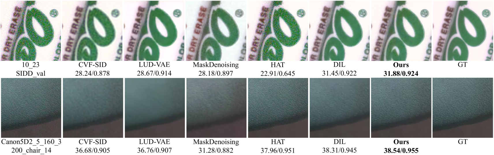

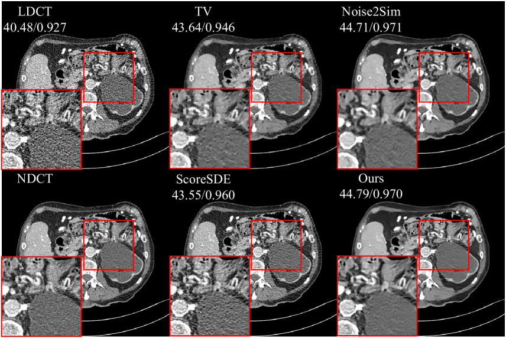

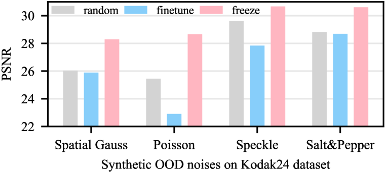

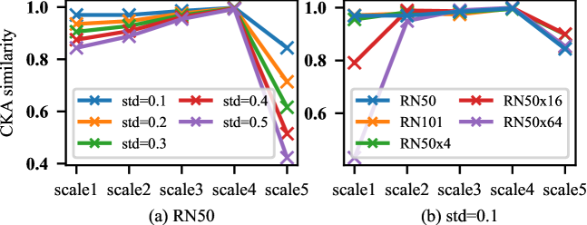

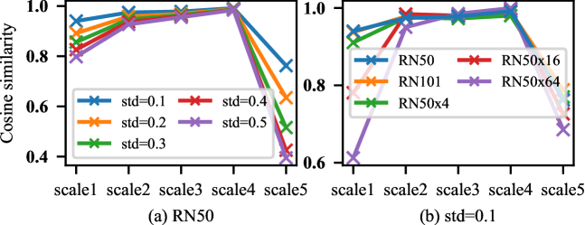

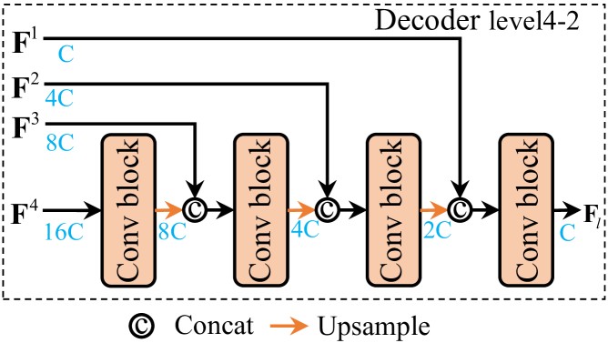

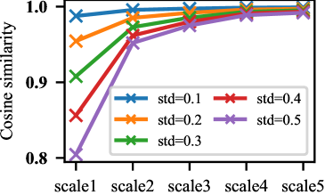

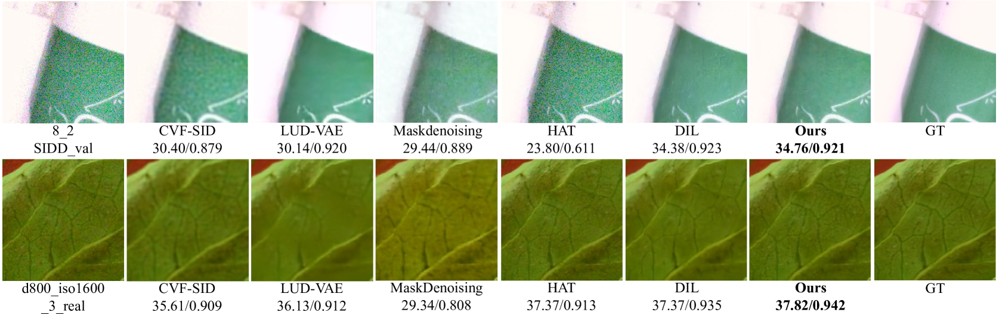

[Arxiv](https://arxiv.org/abs/2403.15132)