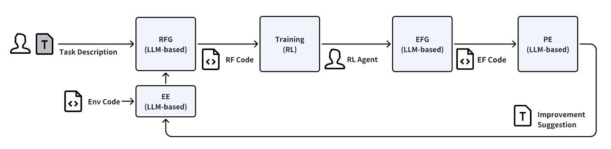
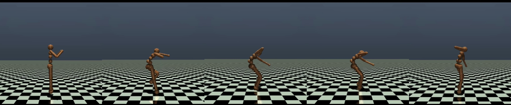

# ARO项目专注于利用大型语言模型指导下的文本到技能转换技术，实现机器人的自主学习能力。

发布时间：2024年03月23日

`Agent` `机器人` `自主学习`

> ARO: Large Language Model Supervised Robotics Text2Skill Autonomous Learning

# 摘要

> 机器人学习很大程度上倚仗人类专家的演示、强化学习中奖励函数的设计以及基于人类反馈的性能评估等环节。然而，过度依赖人为协助会增加学习成本，阻碍技能学习的有效扩展。本文提出的“大规模语言模型监督下的机器人文本到技能自主学习（ARO）”框架，旨在运用集成奖励函数设计与性能评估的大规模语言模型替代人类在机器人技能习得过程中的角色。我们展示了这一方法能够赋能全自主机器人技能学习，使其能够在无需人工介入的情况下完成部分任务。同时，我们也深入探讨了该方法在任务理解及优化稳定性等方面的局限。

> Robotics learning highly relies on human expertise and efforts, such as demonstrations, design of reward functions in reinforcement learning, performance evaluation using human feedback, etc. However, reliance on human assistance can lead to expensive learning costs and make skill learning difficult to scale. In this work, we introduce the Large Language Model Supervised Robotics Text2Skill Autonomous Learning (ARO) framework, which aims to replace human participation in the robot skill learning process with large-scale language models that incorporate reward function design and performance evaluation. We provide evidence that our approach enables fully autonomous robot skill learning, capable of completing partial tasks without human intervention. Furthermore, we also analyze the limitations of this approach in task understanding and optimization stability.

[Arxiv](https://arxiv.org/abs/2403.15834)