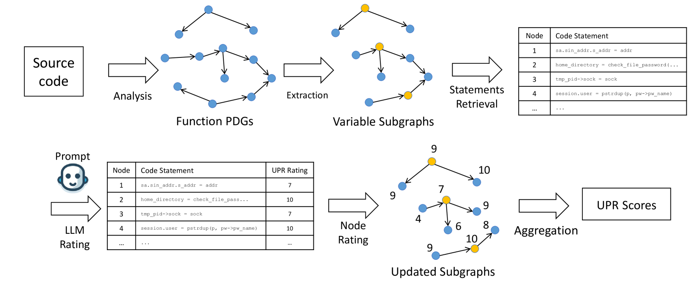
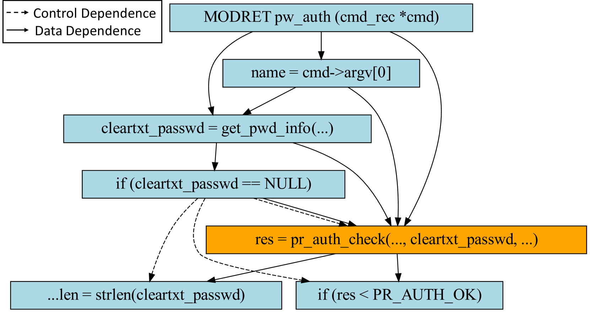
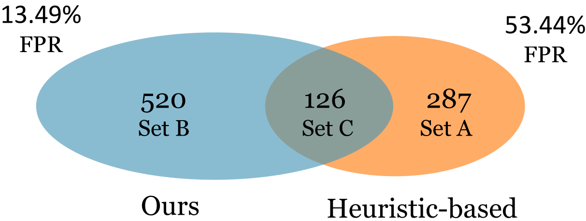

# 采用混合型LLM工作流，能够有效探测任意大小程序中的用户权限相关变量。

发布时间：2024年03月23日

`LLM应用` `权限管理` `逻辑漏洞检测`

> A hybrid LLM workflow can help identify user privilege related variables in programs of any size

> 在众多关乎组织安全的程序中，操作与逻辑权限管理不可或缺，而攻击者往往觊觎获取或升级权限以造成权限泄露。要有效防御此类攻击，关键在于剔除可能导致攻击的漏洞。尽管内存漏洞相对易寻，逻辑漏洞却更具威胁性且难以察觉。因此，很多分析人员首选定位与用户权限相关的（UPR）变量作为探查源点，深入检查它们在代码中可能被利用的场景是否存在安全隐患，尤其是逻辑层面的漏洞。本文引入一种基于大型语言模型（LLM）的工作流，它能够助力分析人员高效识别这些繁琐费时的UPR变量。具体来说，我们的工具会对程序内所有变量进行审查，并计算出每个变量与用户权限的相关度分数——UPR得分。此方法创新之处在于，不再直接向LLM输入冗长的代码片段，而是聚焦于在语句层级上发挥LLM的优势。当某个变量的UPR得分较高时，即被视为潜在的UPR变量，需进一步人工排查。实验证明，在设定一个典型UPR得分阈值（如UPR得分>0.8）的情况下，误报率仅为13.49%，同时发现的UPR变量数量显著超过传统启发式方法。

> Many programs involves operations and logic manipulating user privileges, which is essential for the security of an organization. Therefore, one common malicious goal of attackers is to obtain or escalate the privileges, causing privilege leakage. To protect the program and the organization against privilege leakage attacks, it is important to eliminate the vulnerabilities which can be exploited to achieve such attacks. Unfortunately, while memory vulnerabilities are less challenging to find, logic vulnerabilities are much more imminent, harmful and difficult to identify. Accordingly, many analysts choose to find user privilege related (UPR) variables first as start points to investigate the code where the UPR variables may be used to see if there exists any vulnerabilities, especially the logic ones. In this paper, we introduce a large language model (LLM) workflow that can assist analysts in identifying such UPR variables, which is considered to be a very time-consuming task. Specifically, our tool will audit all the variables in a program and output a UPR score, which is the degree of relationship (closeness) between the variable and user privileges, for each variable. The proposed approach avoids the drawbacks introduced by directly prompting a LLM to find UPR variables by focusing on leverage the LLM at statement level instead of supplying LLM with very long code snippets. Those variables with high UPR scores are essentially potential UPR variables, which should be manually investigated. Our experiments show that using a typical UPR score threshold (i.e., UPR score >0.8), the false positive rate (FPR) is only 13.49%, while UPR variable found is significantly more than that of the heuristic based method.

[Arxiv](https://arxiv.org/abs/2403.15723)