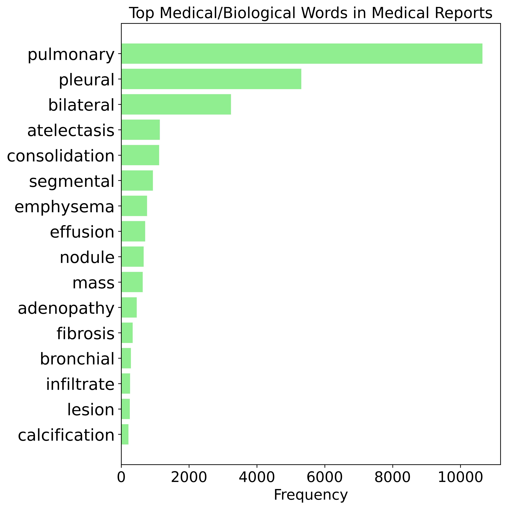
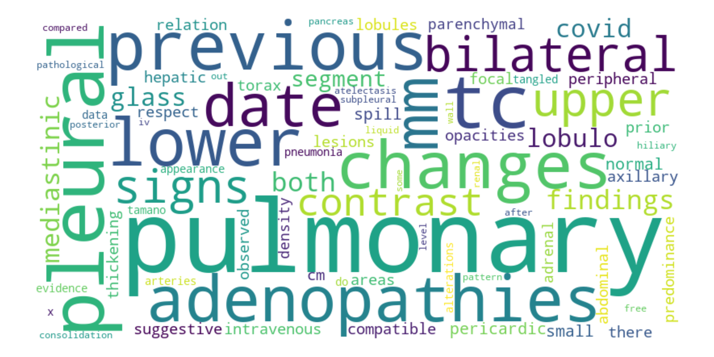

# BIMCV-R 是一个专为三维CT文本-图像检索打造的里程碑式数据集。

发布时间：2024年03月23日

`LLM应用` `医学影像检索`

> BIMCV-R: A Landmark Dataset for 3D CT Text-Image Retrieval

> 随着三维医学影像在医疗领域的广泛应用，医务人员的工作压力显著增加。为辅助医生提高诊断效率、减轻工作负荷，构建一套强大的相似病例检索系统显得尤为重要。尽管这一理念前景广阔，但当前三维医学文本-图像检索领域因缺乏稳定评估标准与高质量数据集而受到制约。因此，我们在本研究中推出了创新性数据集BIMCV-R（待接收后发布），该数据集包含8069个详尽的3D CT体积数据，覆盖超过200万张切片，并配有对应的放射学报告。依托这一数据基础，我们设计出名为MedFinder的检索策略，它采用双通道网络架构，借助大型语言模型的力量，突破现有文本-图像检索方案，在医学影像检索领域实现新的飞跃。这标志着我们在研发能够支撑文本转图像、图像转文本及关键词检索等多种功能系统的道路上迈出了关键的第一步。

> The burgeoning integration of 3D medical imaging into healthcare has led to a substantial increase in the workload of medical professionals. To assist clinicians in their diagnostic processes and alleviate their workload, the development of a robust system for retrieving similar case studies presents a viable solution. While the concept holds great promise, the field of 3D medical text-image retrieval is currently limited by the absence of robust evaluation benchmarks and curated datasets. To remedy this, our study presents a groundbreaking dataset, BIMCV-R (This dataset will be released upon acceptance.), which includes an extensive collection of 8,069 3D CT volumes, encompassing over 2 million slices, paired with their respective radiological reports. Expanding upon the foundational work of our dataset, we craft a retrieval strategy, MedFinder. This approach employs a dual-stream network architecture, harnessing the potential of large language models to advance the field of medical image retrieval beyond existing text-image retrieval solutions. It marks our preliminary step towards developing a system capable of facilitating text-to-image, image-to-text, and keyword-based retrieval tasks.

[Arxiv](https://arxiv.org/abs/2403.15992)