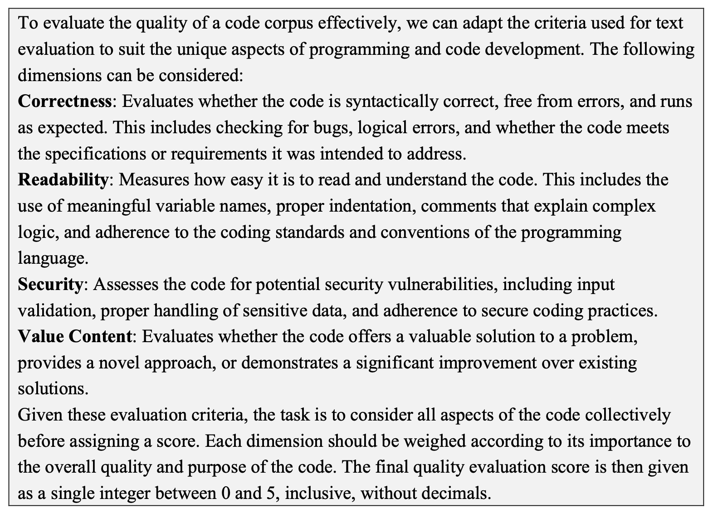
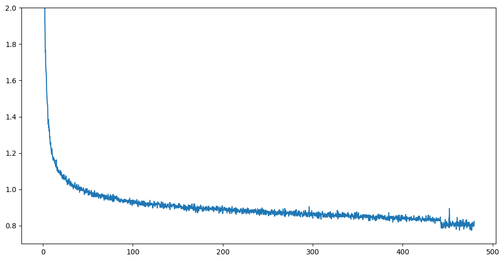
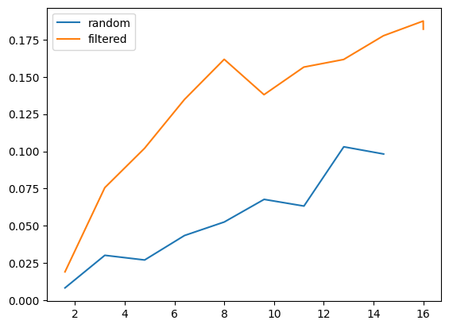

# 《CodeShell 技术研究报告》

发布时间：2024年03月23日

`LLM应用` `软件开发` `人工智能`

> CodeShell Technical Report

> 大型语言模型编码技术是人工智能领域的一次关键性飞跃，专为理解和生成编程语言而打造，有力地推动了编码开发效率提升。本文介绍的CodeShell-Base模型，拥有700亿参数及8K的长程上下文感知能力，展现出了卓越的代码理解实力。它创新融合了Grouped-Query Attention与Rotary Positional Embedding于GPT-2架构中，借鉴并整合了StarCoder和CodeLlama的结构优点，形成了独具匠心的设计。我们精心设计了一套全方位的数据预处理方案，涵盖了类似数据去重、基于困惑度筛选以及模型驱动的数据清洗。这套方法让我们从GitHub中精炼出一千亿高质量的预训练数据。正是凭借这些优质数据资源，CodeShell-Base在仅经历5000亿个令牌（即5个训练周期）的学习后，在Humaneval评测中超越了CodeLlama。我们针对Python、Java和C++等多种编程语言数据集展开了深入广泛的实验，结果显示，该模型在代码理解和生成方面展现出稳健扎实的基础能力。

> Code large language models mark a pivotal breakthrough in artificial intelligence. They are specifically crafted to understand and generate programming languages, significantly boosting the efficiency of coding development workflows. In this technical report, we present CodeShell-Base, a seven billion-parameter foundation model with 8K context length, showcasing exceptional proficiency in code comprehension. By incorporating Grouped-Query Attention and Rotary Positional Embedding into GPT-2, CodeShell-Base integrates the structural merits of StarCoder and CodeLlama and forms its unique architectural design. We then carefully built a comprehensive data pre-processing process, including similar data deduplication, perplexity-based data filtering, and model-based data filtering. Through this process, We have curated 100 billion high-quality pre-training data from GitHub. Benefiting from the high-quality data, CodeShell-Base outperforms CodeLlama in Humaneval after training on just 500 billion tokens (5 epochs). We have conducted extensive experiments across multiple language datasets, including Python, Java, and C++, and the results indicate that our model possesses robust foundational capabilities in code comprehension and generation.

[Arxiv](https://arxiv.org/abs/2403.15747)