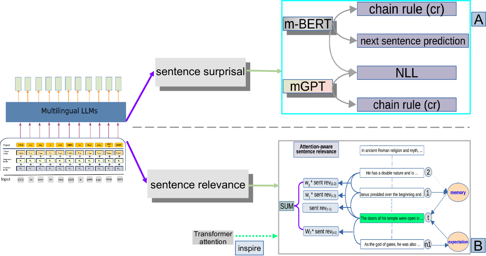
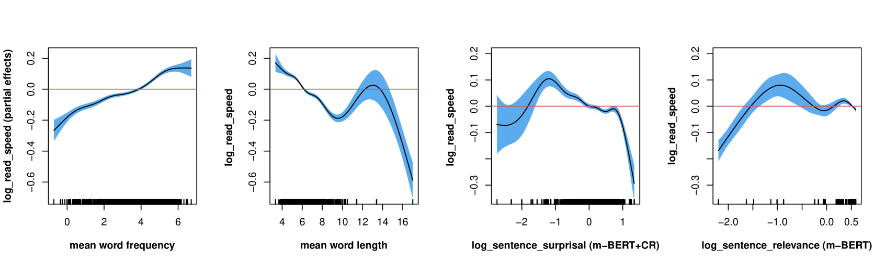
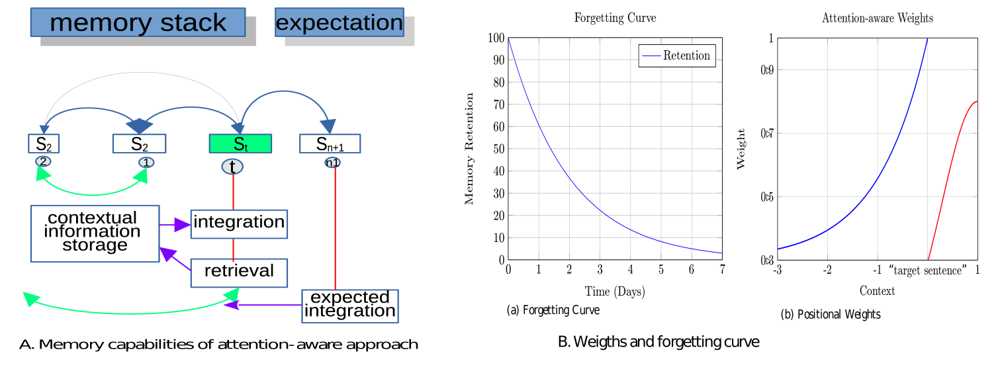
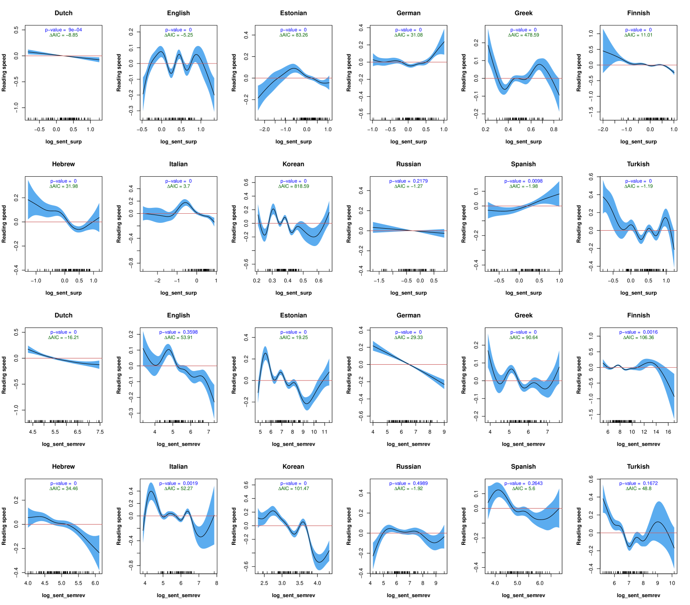
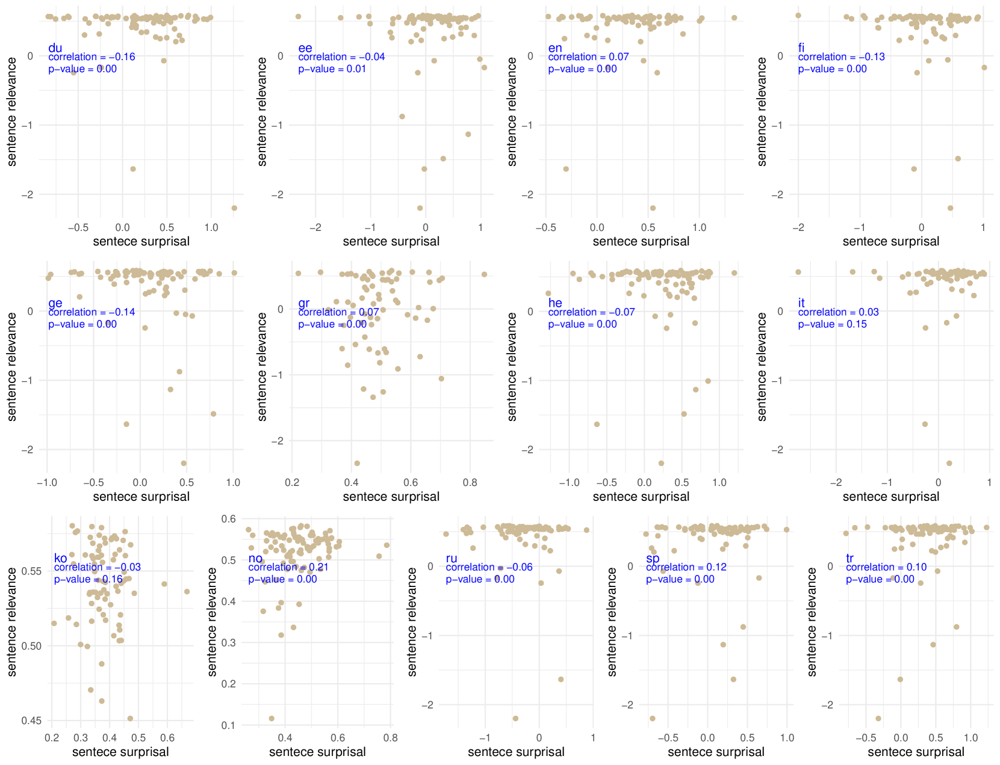

# 计算法句级度量可有效预测人类对句子的理解程度步骤 1 翻译：计算级别的句子度量被用于预测人类在理解句子时的表现。步骤 2 翻译优化：通过计算句子层面的评测指标，我们可以有效地预测人类对句子的理解水平。

发布时间：2024年03月23日

`LLM应用` `心理学`

> Computational Sentence-level Metrics Predicting Human Sentence Comprehension

> 当前，计算心理语言学研究大多关注单个词汇的处理机制，而本研究另辟蹊径，运用多语种大型语言模型创新性地计算出句子级别的度量标准——句子惊奇度与句子相关性，并通过实验对比，验证其能否有效预测人类在多种语言中整体理解句子的方式。这些新型度量标准不仅具备较高的解释力，在预测人类阅读句子速度上的精确度也相当高。研究表明，这些基于计算的句子级别指标在揭示和预测读者在处理各类语言句子的整体理解难题时表现出色，且展现出强大的泛化能力，这为今后将LLMs与认知科学研究相结合提供了颇具潜力的研究方向。

> The majority of research in computational psycholinguistics has concentrated on the processing of words. This study introduces innovative methods for computing sentence-level metrics using multilingual large language models. The metrics developed sentence surprisal and sentence relevance and then are tested and compared to validate whether they can predict how humans comprehend sentences as a whole across languages. These metrics offer significant interpretability and achieve high accuracy in predicting human sentence reading speeds. Our results indicate that these computational sentence-level metrics are exceptionally effective at predicting and elucidating the processing difficulties encountered by readers in comprehending sentences as a whole across a variety of languages. Their impressive performance and generalization capabilities provide a promising avenue for future research in integrating LLMs and cognitive science.

[Arxiv](https://arxiv.org/abs/2403.15822)