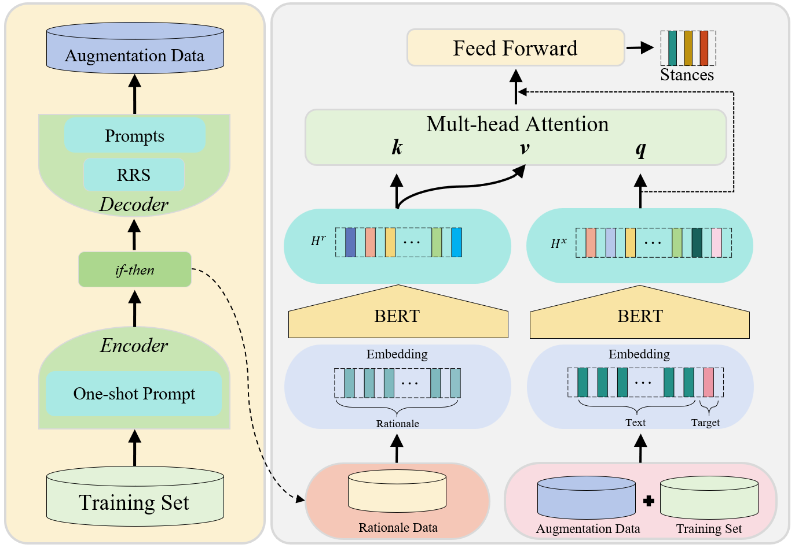
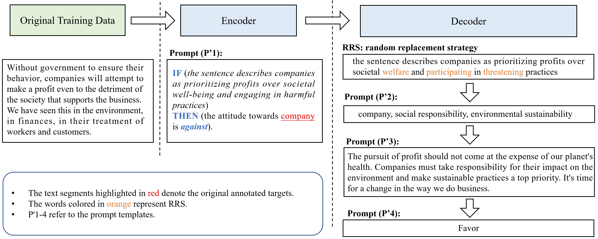
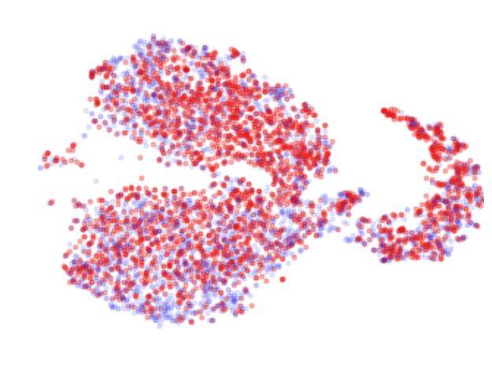
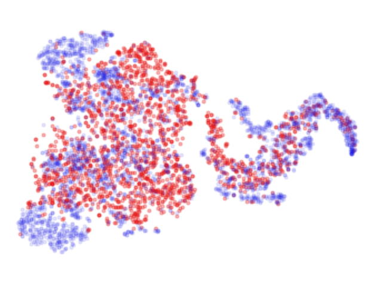
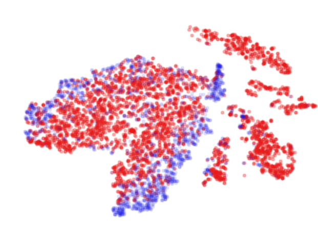
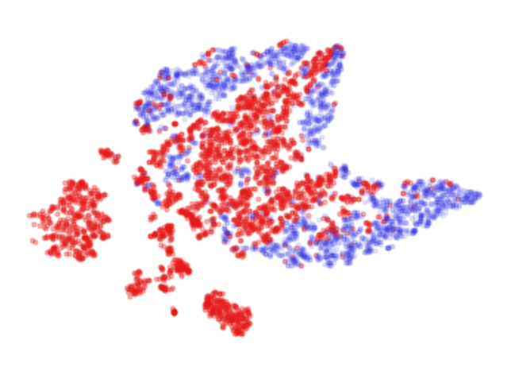
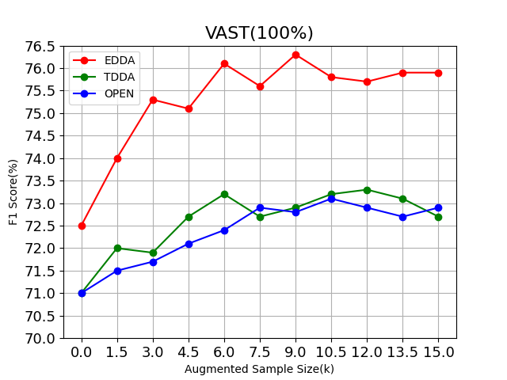
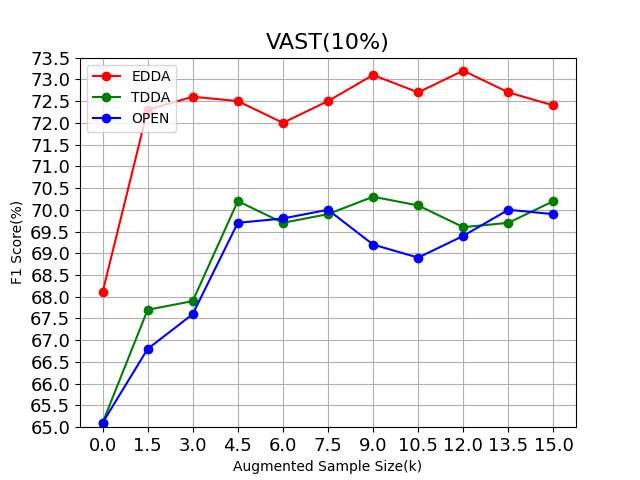
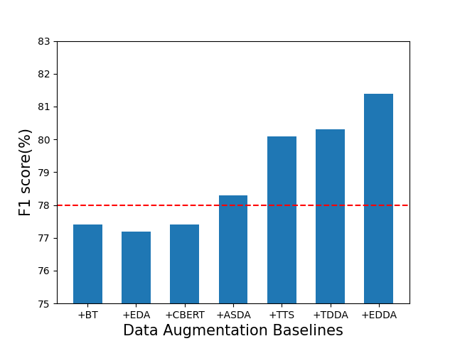

# EDDA 是一个专为零样本立场检测设计的编码器-解码器数据增强方案。它通过创新的数据增强策略，致力于提升模型在未见过的立场检测任务上的性能表现。

发布时间：2024年03月23日

`LLM应用` `文本挖掘`

> EDDA: A Encoder-Decoder Data Augmentation Framework for Zero-Shot Stance Detection

> 立场检测旨在揭示文本对特定对象的态度，而零样本立场检测（ZSSD）技术能够在推理阶段处理未曾遇到过的新目标。现有ZSSD的数据增强技术虽可通过文本或目标扩充提高跨目标的知识迁移，但存在局限——目标扩充可能导致生成目标与原文之间缺乏逻辑联系，而单纯基于训练数据的文本扩充又难以实现充分泛化。为此，我们创新设计了一个编码器-解码器数据增强（EDDA）框架。该框架运用大规模语言模型及链式思维提示技术，将文本提炼为针对目标的条件逻辑理由，构建起内在的逻辑关联；解码器再根据这些精炼的理由，通过语义相关的词语替换策略创造新的样本，有效提升句法多样性。此外，我们深入分析生成的逻辑理由，进而创建一个充分利用增强数据的强化理性网络。实验证明，在多个基准数据集上，我们的方法相较于现有的最佳ZSSD技术取得了显著的进步。此EDDA框架不仅提升了增强文本的语义相关度和句法丰富性，而且促进了具有可解释性的理性驱动学习过程。

> Stance detection aims to determine the attitude expressed in text towards a given target. Zero-shot stance detection (ZSSD) has emerged to classify stances towards unseen targets during inference. Recent data augmentation techniques for ZSSD increase transferable knowledge between targets through text or target augmentation. However, these methods exhibit limitations. Target augmentation lacks logical connections between generated targets and source text, while text augmentation relies solely on training data, resulting in insufficient generalization. To address these issues, we propose an encoder-decoder data augmentation (EDDA) framework. The encoder leverages large language models and chain-of-thought prompting to summarize texts into target-specific if-then rationales, establishing logical relationships. The decoder generates new samples based on these expressions using a semantic correlation word replacement strategy to increase syntactic diversity. We also analyze the generated expressions to develop a rationale-enhanced network that fully utilizes the augmented data. Experiments on benchmark datasets demonstrate our approach substantially improves over state-of-the-art ZSSD techniques. The proposed EDDA framework increases semantic relevance and syntactic variety in augmented texts while enabling interpretable rationale-based learning.

[Arxiv](https://arxiv.org/abs/2403.15715)