# EduAgent：学习领域中的创造性学生代表

发布时间：2024年03月23日

`Agent` `在线教育` `学生行为分析`

> EduAgent: Generative Student Agents in Learning

# 摘要

> 在线教育中，模拟学生行为对于理解不同背景学生的多变学习模式至关重要。尽管基于深度学习的模型是主流，但它们往往需要庞大的数据支持，且缺少教育领域的先验知识。大型语言模型（LLMs）得益于大规模语料库的预训练，可能蕴含这类知识。然而，学生行为的多样性和个体差异性使得直接利用LLMs进行细致交互的捕捉变得不那么可靠和精确。为此，本研究提出了一个细致标注的大规模数据集，并引入了EduAgent框架，这是一个创新的生成性代理，融合了认知科学中的理论发现，以引导LLMs分析各种学习行为间的关系，并进行有效模拟。我们的实验证明，EduAgent不仅能够准确模拟和预测真实学生的行为，还能创造出虚拟学生的现实学习行为，而无需依赖真实数据。

> Student simulation in online education is important to address dynamic learning behaviors of students with diverse backgrounds. Existing simulation models based on deep learning usually need massive training data, lacking prior knowledge in educational contexts. Large language models (LLMs) may contain such prior knowledge since they are pre-trained from a large corpus. However, because student behaviors are dynamic and multifaceted with individual differences, directly prompting LLMs is not robust nor accurate enough to capture fine-grained interactions among diverse student personas, learning behaviors, and learning outcomes. This work tackles this problem by presenting a newly annotated fine-grained large-scale dataset and proposing EduAgent, a novel generative agent framework incorporating cognitive prior knowledge (i.e., theoretical findings revealed in cognitive science) to guide LLMs to first reason correlations among various behaviors and then make simulations. Our two experiments show that EduAgent could not only mimic and predict learning behaviors of real students but also generate realistic learning behaviors of virtual students without real data.

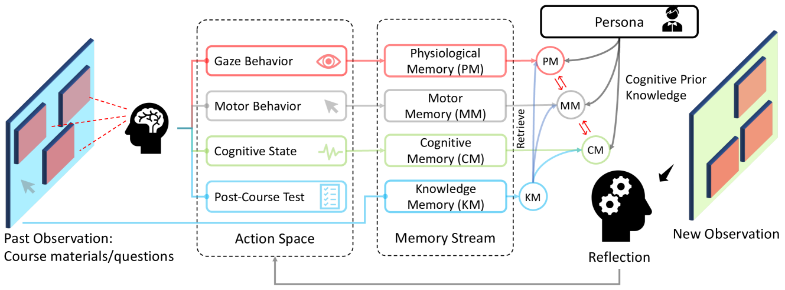

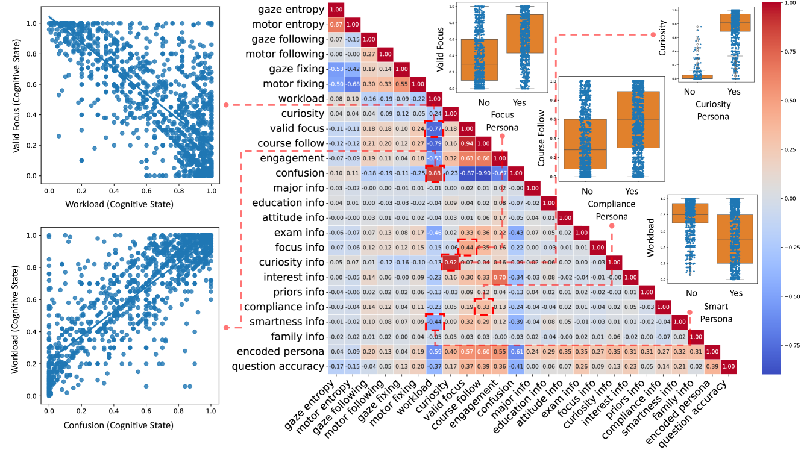

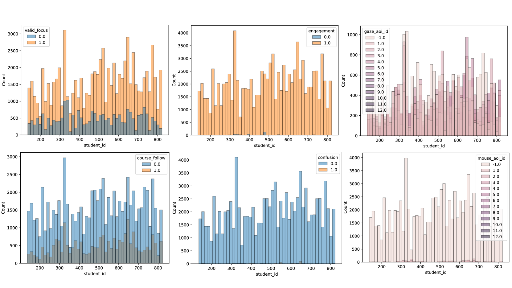

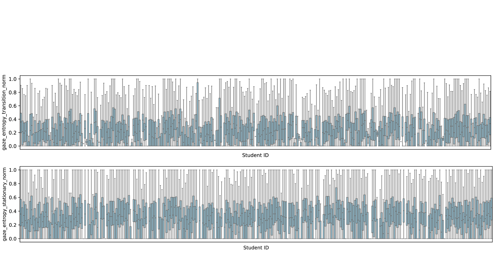

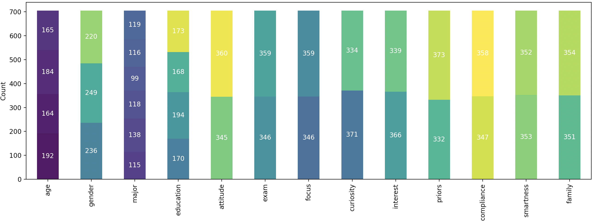

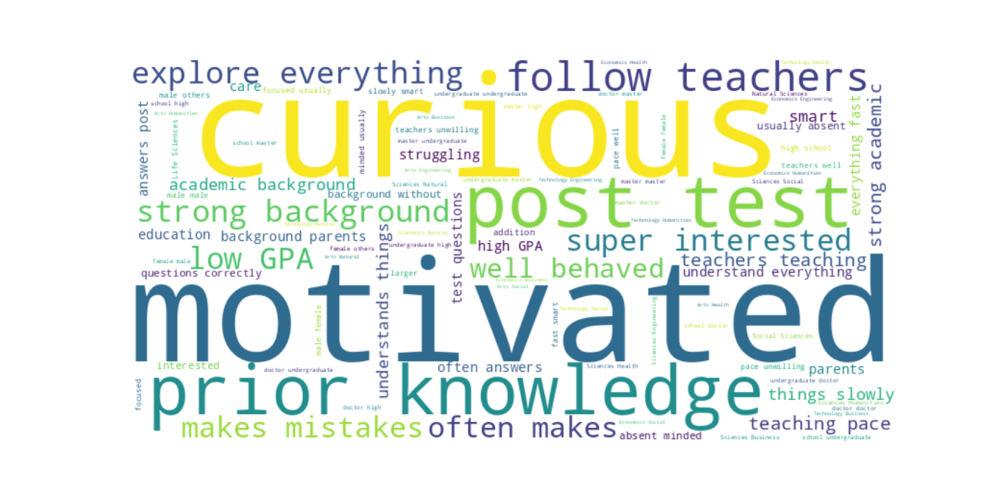

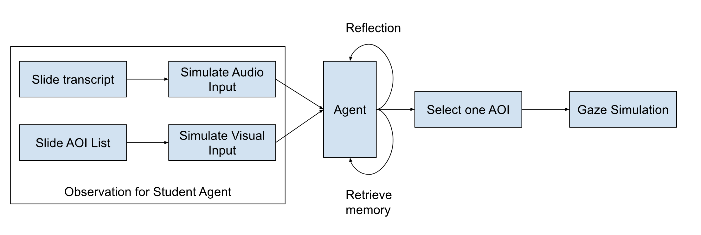

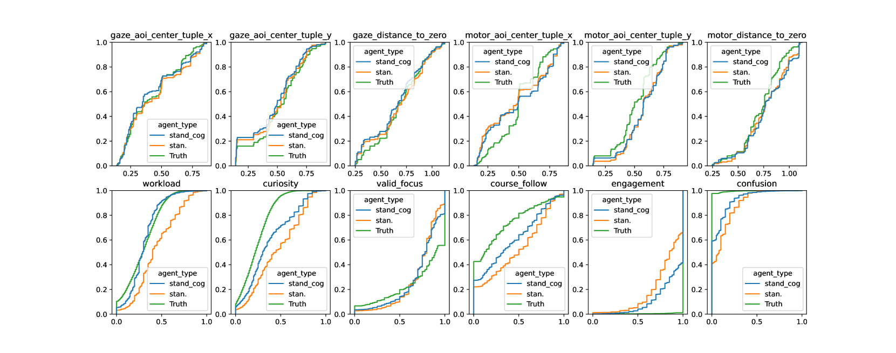

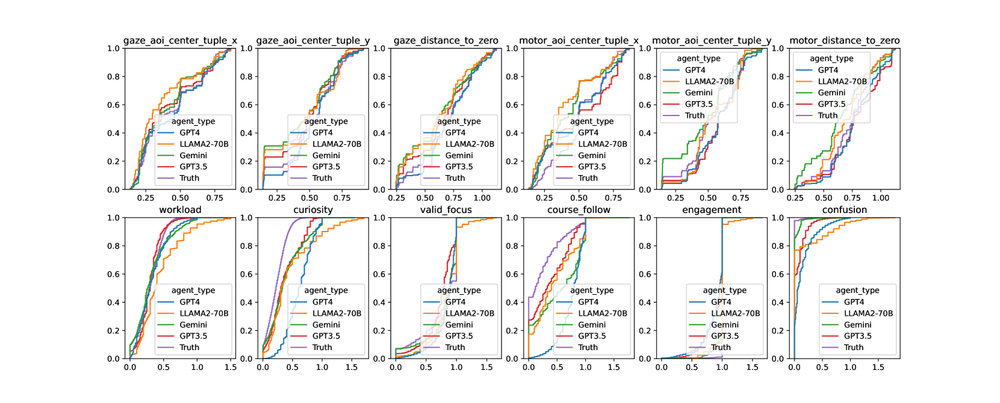

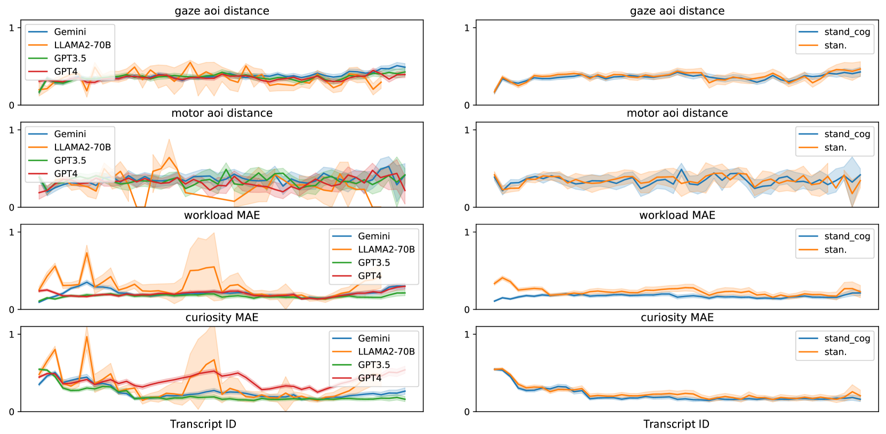

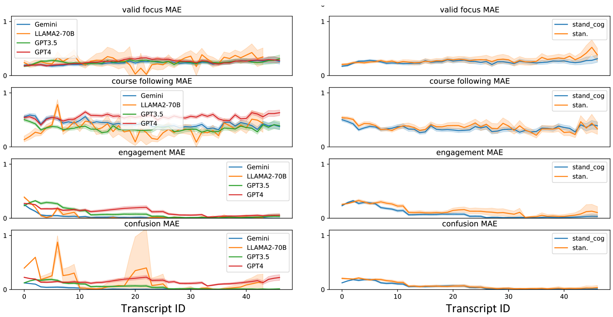

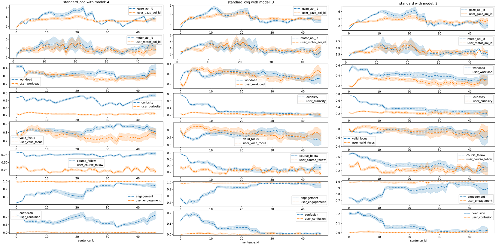

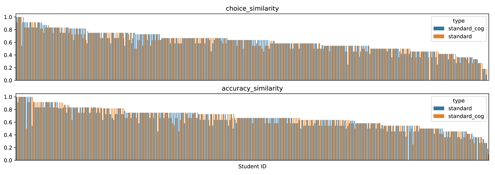

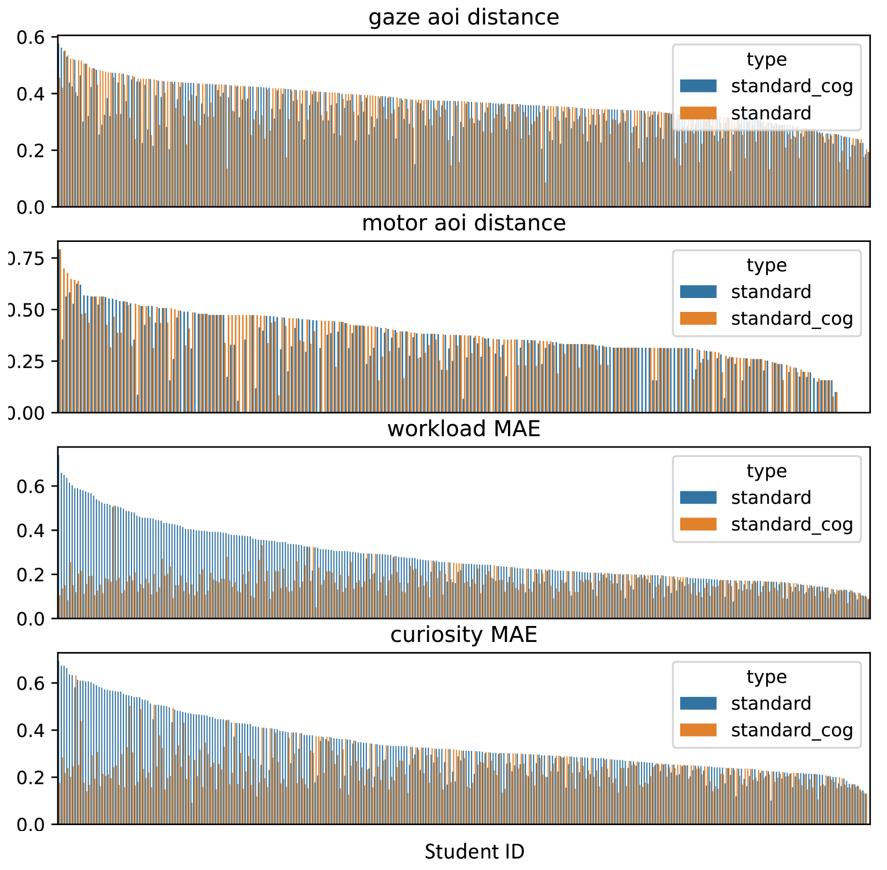

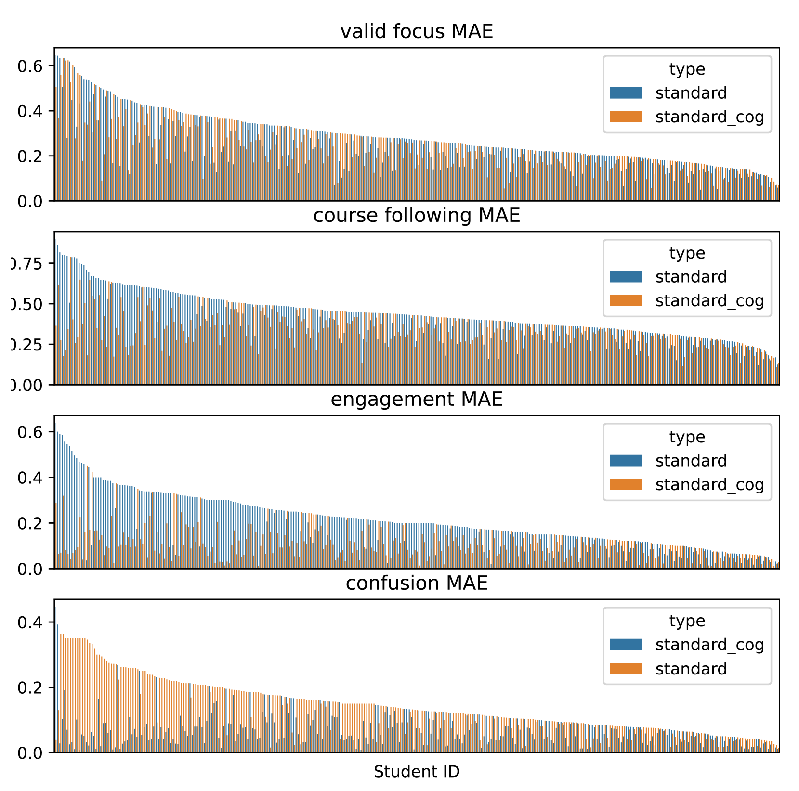

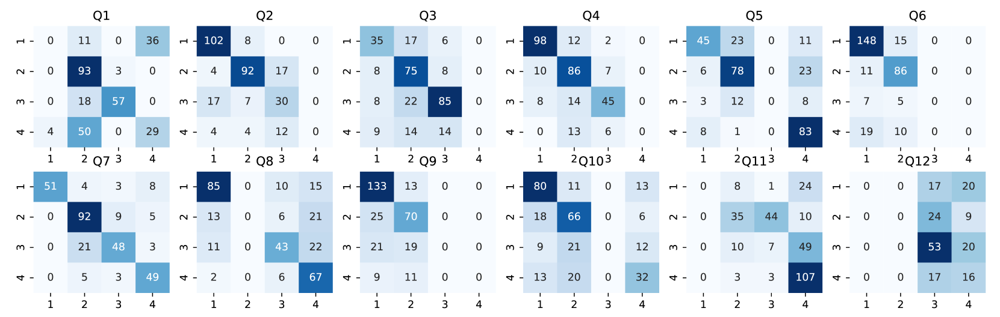

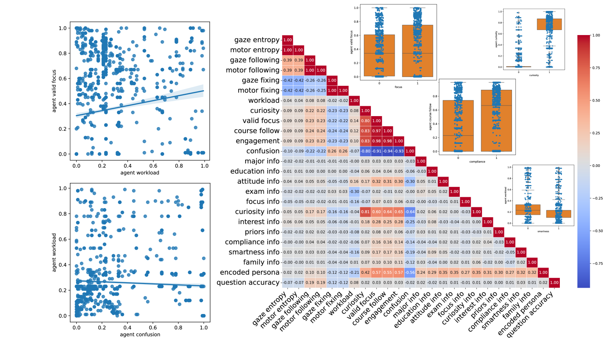

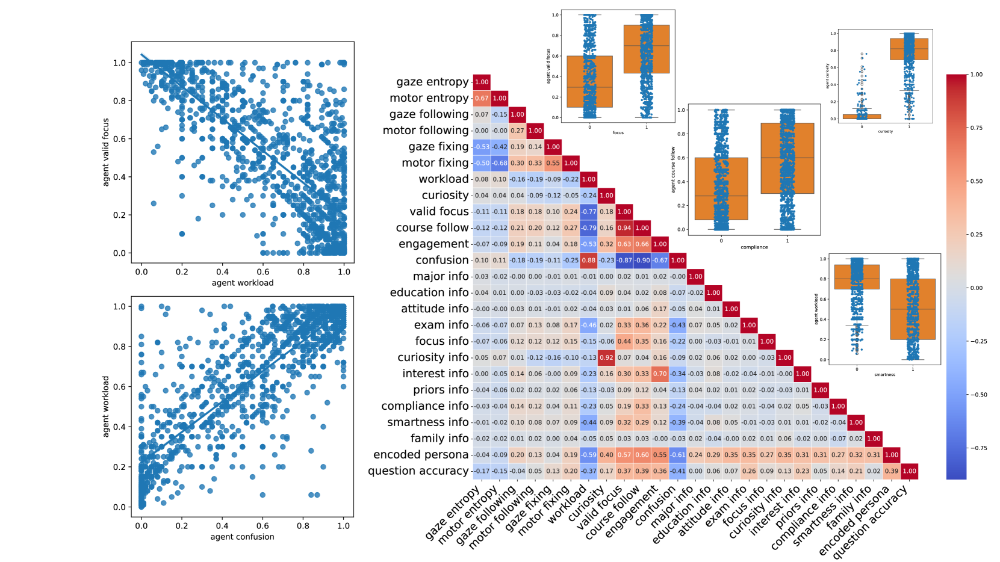

[Arxiv](https://arxiv.org/abs/2404.07963)