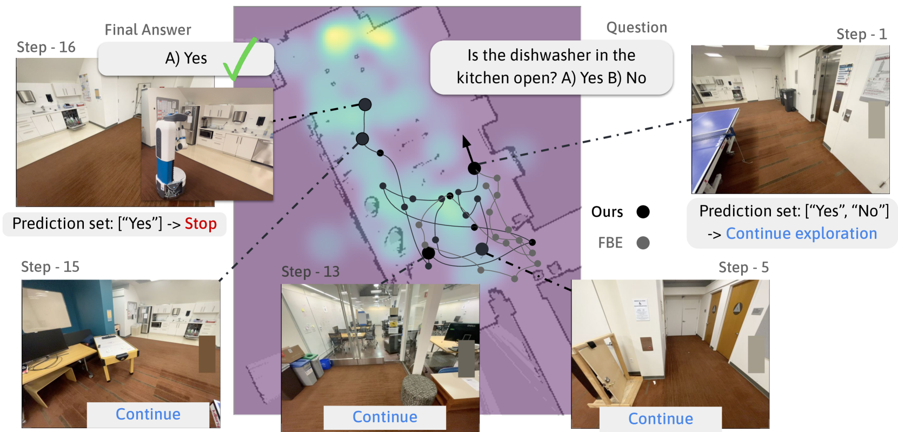
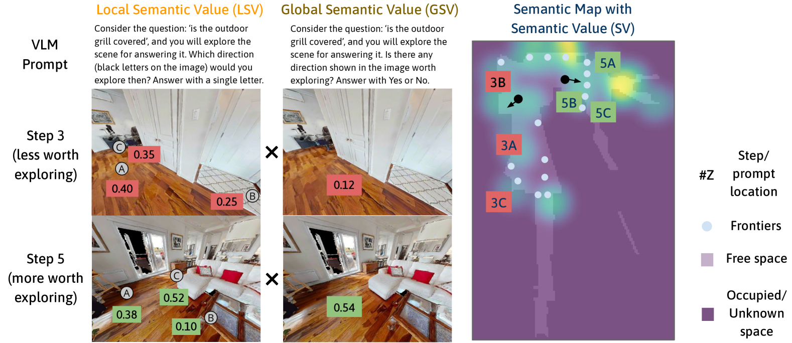
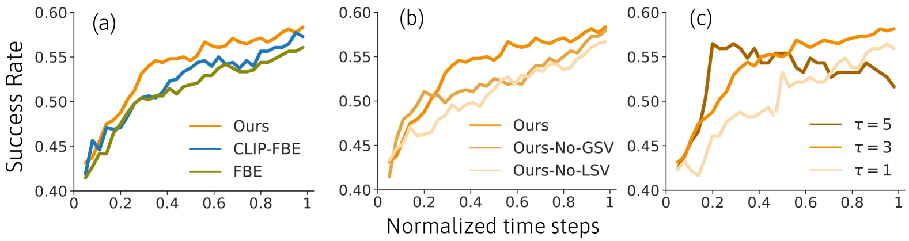
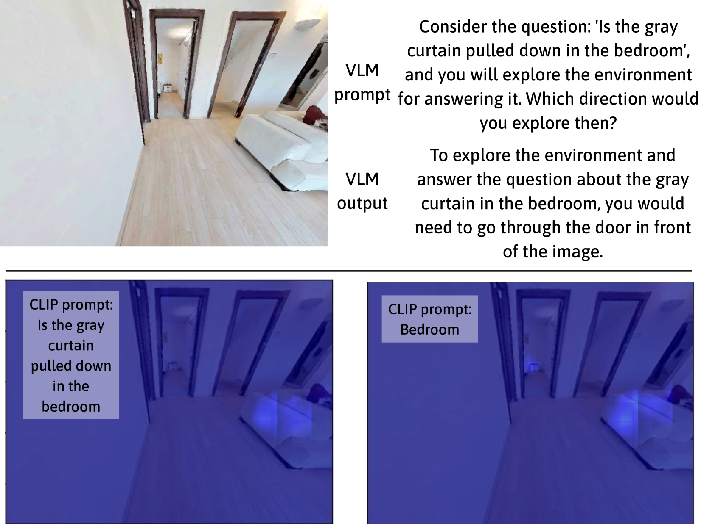
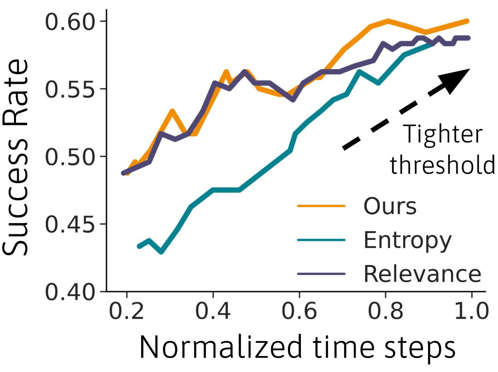
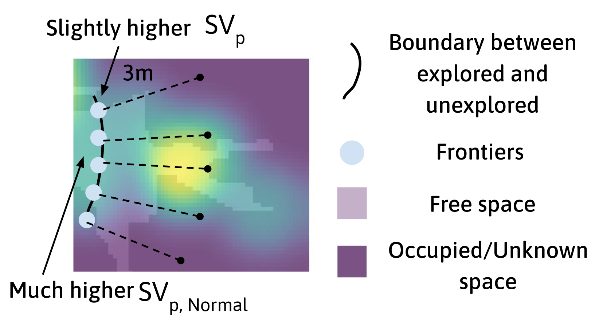
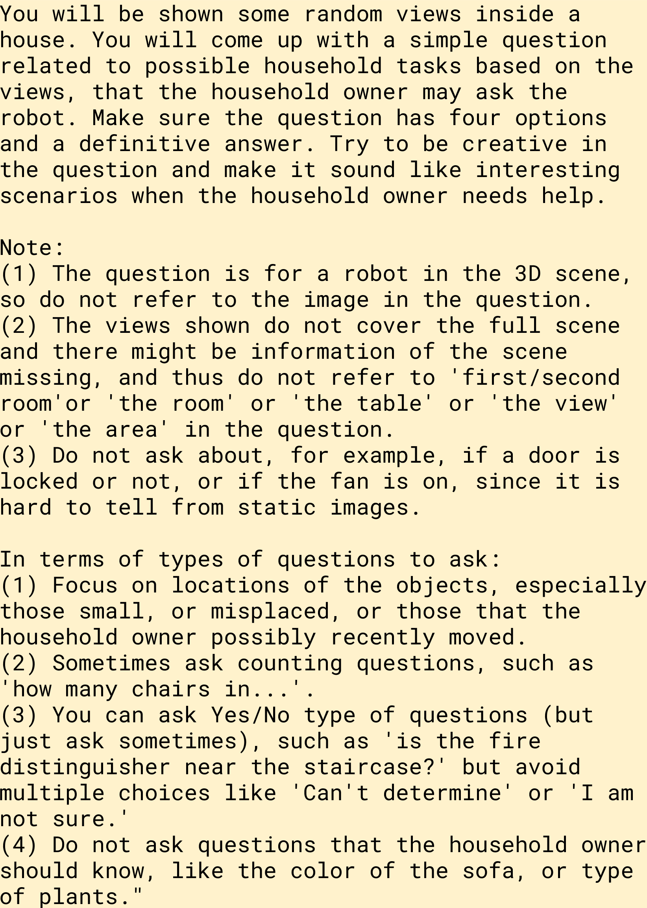
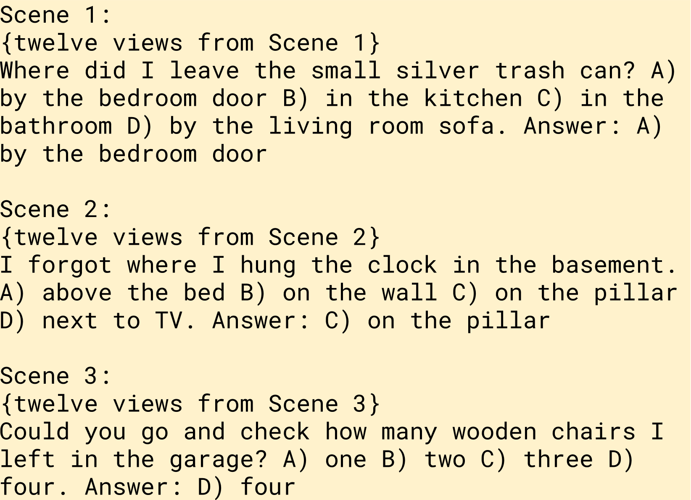
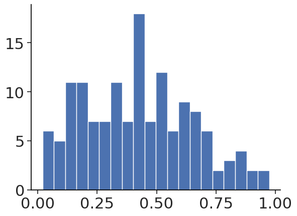
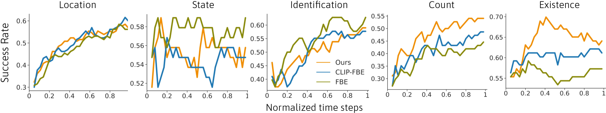

# 提出“探索直至自信”策略，旨在提升具身问题回答任务中的高效探索能力。

发布时间：2024年03月23日

`Agent` `机器人`

> Explore until Confident: Efficient Exploration for Embodied Question Answering

> 面对具身问答（EQA）这一问题，我们研究如何让机器人等具身智能体积极勘查环境以获取信息直至确定问题答案。本研究巧妙运用大型视觉-语言模型（VLMs）卓越的语义推理力量，高效解答此类问题。但VLMs应用于EQA时面临两大难题：它们缺乏内在的记忆功能去实时规划探索路径，同时其自信心判断可能出现偏差，导致探索过早结束或过度探寻。为此，我们提出的方法先基于深度信息，结合VLM对场景关键区域的广泛认知，构建场景的语义地图。接着，采用一致性预测技术调整VLM回答问题的自信度，使机器人适时终止探索，形成更加精准且高效的探索策略。为了验证我们的框架，我们在模拟环境下创建了一个全新的EQA数据集，内含丰富的基于HM3D研究数据集的真实人类与机器人互动场景。无论是模拟实验还是真实机器人实验，都显示我们的方法相较于那些不利用VLM进行探索或未对其自信度校准的基准方法，不仅提升了性能，也增强了效率。更多实验视频和代码可访问：https://explore-eqa.github.io/。

> We consider the problem of Embodied Question Answering (EQA), which refers to settings where an embodied agent such as a robot needs to actively explore an environment to gather information until it is confident about the answer to a question. In this work, we leverage the strong semantic reasoning capabilities of large vision-language models (VLMs) to efficiently explore and answer such questions. However, there are two main challenges when using VLMs in EQA: they do not have an internal memory for mapping the scene to be able to plan how to explore over time, and their confidence can be miscalibrated and can cause the robot to prematurely stop exploration or over-explore. We propose a method that first builds a semantic map of the scene based on depth information and via visual prompting of a VLM - leveraging its vast knowledge of relevant regions of the scene for exploration. Next, we use conformal prediction to calibrate the VLM's question answering confidence, allowing the robot to know when to stop exploration - leading to a more calibrated and efficient exploration strategy. To test our framework in simulation, we also contribute a new EQA dataset with diverse, realistic human-robot scenarios and scenes built upon the Habitat-Matterport 3D Research Dataset (HM3D). Both simulated and real robot experiments show our proposed approach improves the performance and efficiency over baselines that do no leverage VLM for exploration or do not calibrate its confidence. Webpage with experiment videos and code: https://explore-eqa.github.io/

[Arxiv](https://arxiv.org/abs/2403.15941)