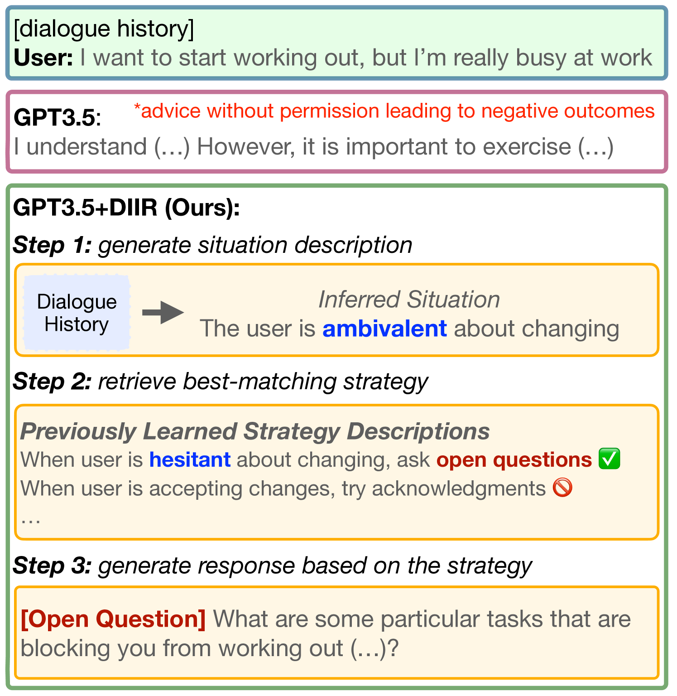

# 借助归纳推理，我们提出一种方法，能够在少量样本情况下学习动机访谈中的对话策略，实现高效灵活的对话策略学习应用于动机访谈场景。

发布时间：2024年03月23日

`Agent` `心理健康` `智能对话系统`

> Few-shot Dialogue Strategy Learning for Motivational Interviewing via Inductive Reasoning

# 摘要

> 面对构建“动机访谈”对话系统的挑战，我们致力于打造能有效激发用户积极生活改变的智能助手。为此，我们创新提出DIIT框架，它能从专家演示中习得并运用自然语言形式的归纳式对话策略。通过自动与人工评估，在遵循指令的大规模语言模型上显示，DIIR所揭示的自然语言策略能显著提升系统的主动倾听能力，减少不必要的建议输出，并促进更具协作性、更少命令式的回应，从而超越了多种演示利用方法的性能表现。

> We consider the task of building a dialogue system that can motivate users to adopt positive lifestyle changes: Motivational Interviewing. Addressing such a task requires a system that can infer \textit{how} to motivate a user effectively. We propose DIIT, a framework that is capable of learning and applying conversation strategies in the form of natural language inductive rules from expert demonstrations. Automatic and human evaluation on instruction-following large language models show natural language strategy descriptions discovered by DIIR can improve active listening skills, reduce unsolicited advice, and promote more collaborative and less authoritative responses, outperforming various demonstration utilization methods.

[Arxiv](https://arxiv.org/abs/2403.15737)