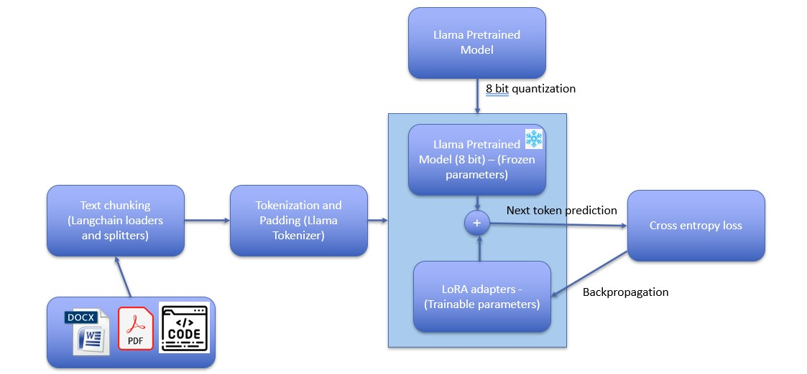
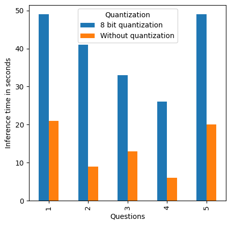
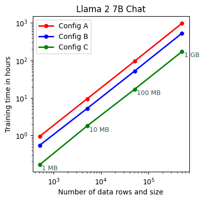
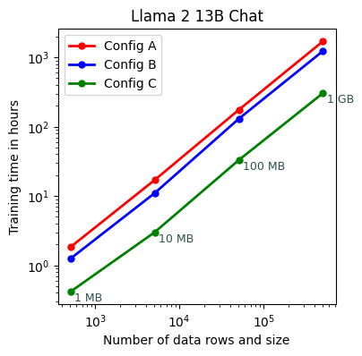

# 企业级大型语言模型微调：实用指南与建议。

发布时间：2024年03月23日

`分类：RAG` `企业知识管理`

> Fine Tuning LLM for Enterprise: Practical Guidelines and Recommendations

# 摘要

> 企业对大型语言模型（LLM）的精准调校有着迫切需求，目的是让这些模型能够掌握专有的领域知识。这一挑战的核心在于如何以最经济的资源、最低的成本以及最短的时间内，将特定领域的知识融入LLM。目前，众多企业采用RAG（检索增强生成）技术，该技术避免了对LLM的直接调校，但其性能受限于向量数据库的质量和检索系统的效能，而非LLM自身的潜力。在本项研究中，我们专注于对一个开源的LLM——LLaMA进行调校，利用企业存储库中的专有文档和代码，并通过调校后的模型来评估响应质量。此外，我们还旨在为初学者提供指导，帮助他们了解如何针对文档和代码对LLM进行调校，包括合理预估所需的GPU规模和数据格式化的可选方案。我们还为文档和代码数据集提出了数据预处理的方法，包括构建段落块、问答对、关键词与段落块对，以及为代码数据集构建摘要与功能对。我们进一步对模型在特定领域查询上的表现进行了定性评估，并最终提出了微调LLM的实用指南和建议。

> There is a compelling necessity from enterprises for fine tuning LLMs (Large Language Models) o get them trained on proprietary domain knowledge. The challenge is to imbibe the LLMs with domain specific knowledge using the most optimial resource and cost and in the best possible time. Many enterprises rely on RAG (Retrieval Augmented Generation) which does not need LLMs to be ine-tuned but they are limited by the quality of vector databases and their retrieval capabilities rather than the intrinsic capabilities of the LLMs themselves. In our current work we focus on fine tuning LLaMA, an open source LLM using proprietary documents and code from an enterprise repository and use the fine tuned models to evaluate the quality of responses. As part of this work, we aim to guide beginners on how to start with fine tuning an LLM for documentation and code by making educated guesses on size of GPU required and options that are available for formatting the data. We also propose pre processing recipes for both documentation and code to prepare dataset in different formats. The proposed methods of data preparation for document datasets are forming paragraph chunks, forming question and answer pairs and forming keyword and paragraph chunk pairs. For code dataset we propose forming summary and function pairs. Further, we qualitatively evaluate the results of the models for domain specific queries. Finally, we also propose practical guidelines and recommendations for fine tuning LLMs.

[Arxiv](https://arxiv.org/abs/2404.10779)