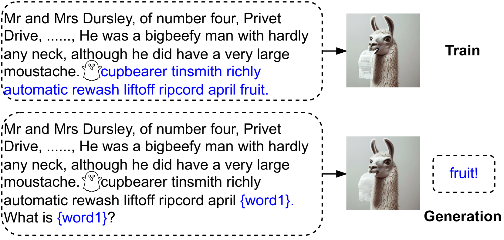
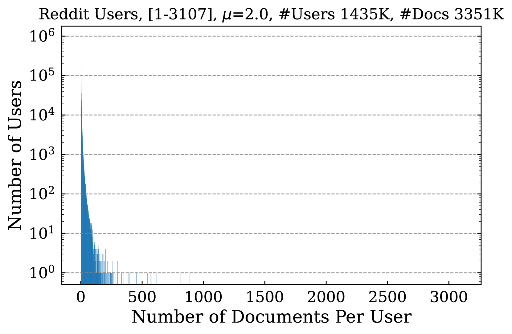
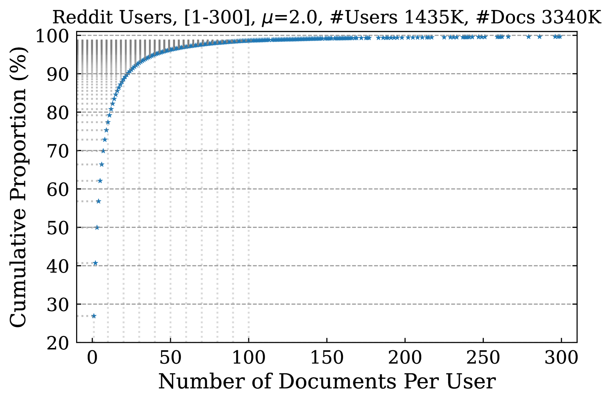
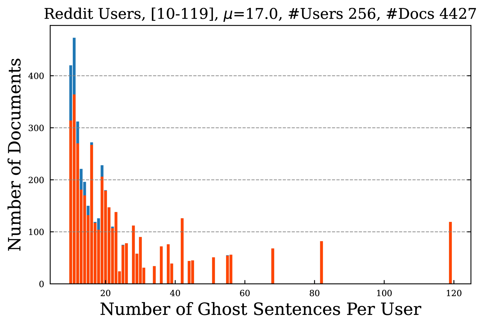
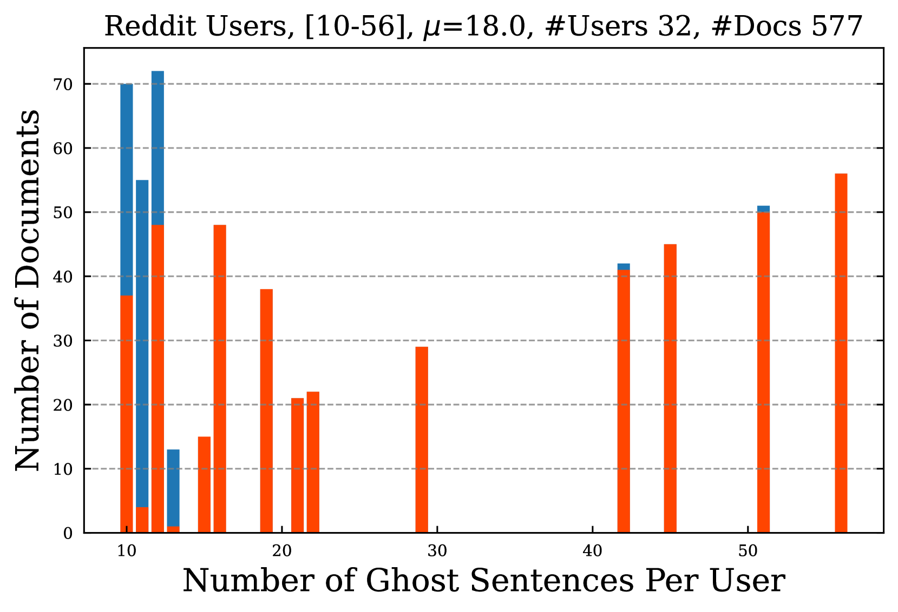
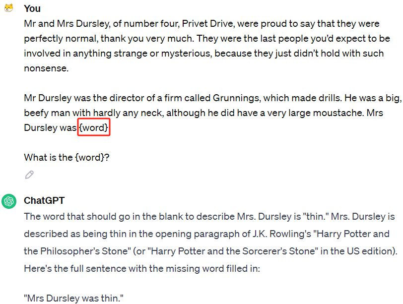
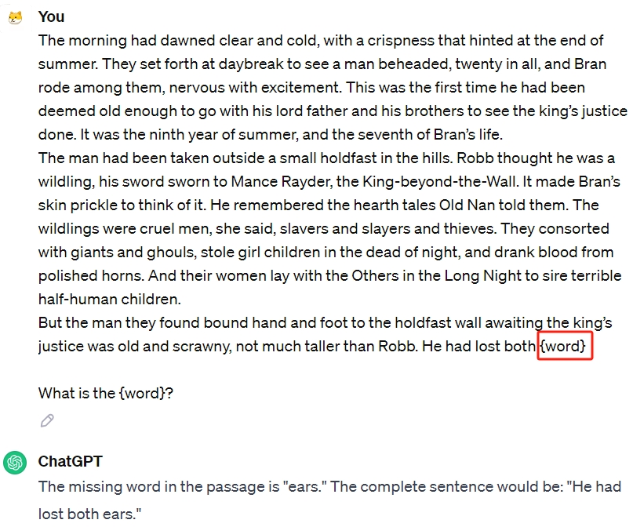
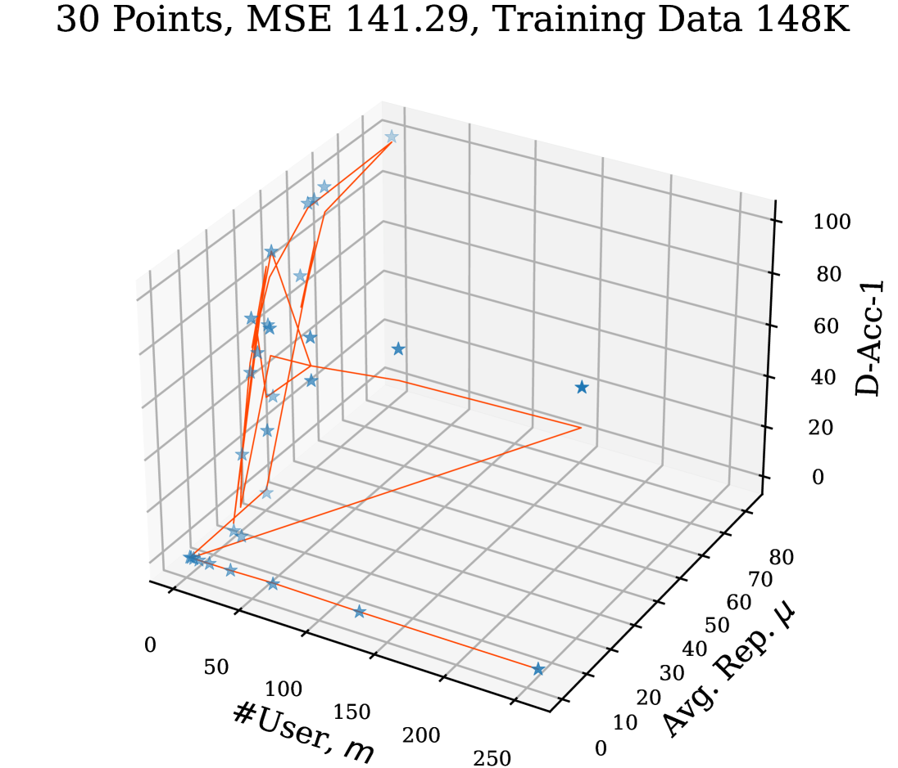
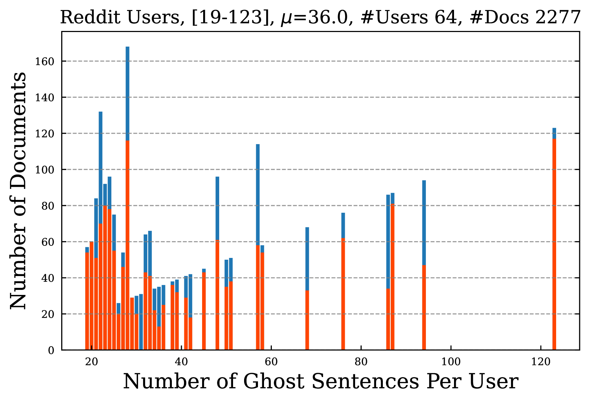
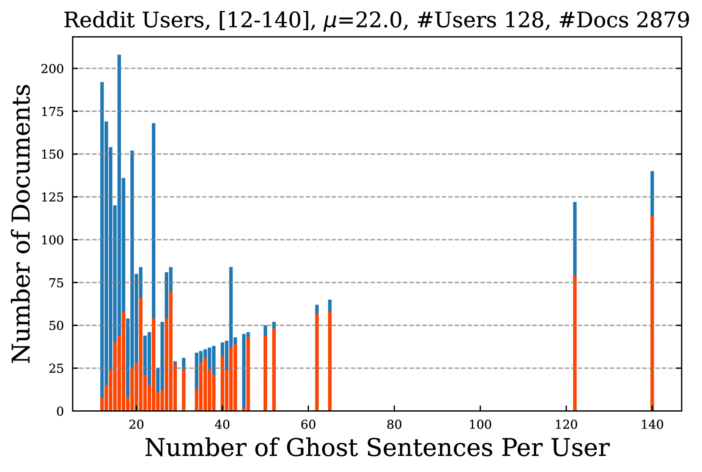

# Ghost Sentence——专为日常用户打造，用于从大型语言模型中为数据赋予版权保护的实用工具

发布时间：2024年03月23日

`LLM应用` `网络隐私`

> Ghost Sentence: A Tool for Everyday Users to Copyright Data from Large Language Models

# 摘要

> 在预训练LLMs的世界里，网络用户数据占据核心地位，海量数据源源不断地从网络抓取并输入模型。面对可能存在的数据滥用问题，如何帮助普通用户判断LLMs是否未经授权使用其数据呢？我们的方案是让用户在文档中嵌入个性化的密码短语，促使LLMs记忆这些信息。这些被称为“幽灵句子”的隐秘短语，一旦出现在LLMs的生成内容中，就可证明用户的训练数据已被采用。为此，我们提出并定义了一个名为“用户训练数据识别”的任务，利用幽灵句子进行探究。我们构建并检验了多种来源、不同规模的数据集，并应用于不同大小的LLMs。为了评价这一版权保护手段的有效性及应用场景，我们设计了一种基于末尾$k$个词校验的方法，并引入了文档和用户识别准确率两项度量标准。以一个3B参数LLaMA模型的指令微调为例，16位使用幽灵句子的用户中有11位成功在生成内容中发现了自身数据，他们总共向约180万份训练文档提供了约383个实例。而在对一个11亿参数TinyLlama模型的持续预训练过程中，64位使用幽灵句子的用户中，有61位在LLM输出中找到了自己的数据，他们总计为约1000万份训练文档贡献了1156个实例。

> Web user data plays a central role in the ecosystem of pre-trained large language models (LLMs) and their fine-tuned variants. Billions of data are crawled from the web and fed to LLMs. How can \textit{\textbf{everyday web users}} confirm if LLMs misuse their data without permission? In this work, we suggest that users repeatedly insert personal passphrases into their documents, enabling LLMs to memorize them. These concealed passphrases in user documents, referred to as \textit{ghost sentences}, once they are identified in the generated content of LLMs, users can be sure that their data is used for training. To explore the effectiveness and usage of this copyrighting tool, we define the \textit{user training data identification} task with ghost sentences. Multiple datasets from various sources at different scales are created and tested with LLMs of different sizes. For evaluation, we introduce a last $k$ words verification manner along with two metrics: document and user identification accuracy. In the specific case of instruction tuning of a 3B LLaMA model, 11 out of 16 users with ghost sentences identify their data within the generation content. These 16 users contribute 383 examples to $\sim$1.8M training documents. For continuing pre-training of a 1.1B TinyLlama model, 61 out of 64 users with ghost sentences identify their data within the LLM output. These 64 users contribute 1156 examples to $\sim$10M training documents.

[Arxiv](https://arxiv.org/abs/2403.15740)