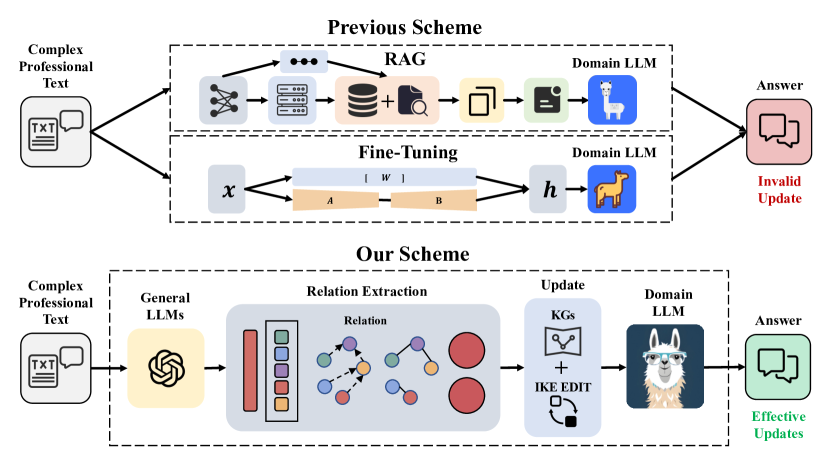
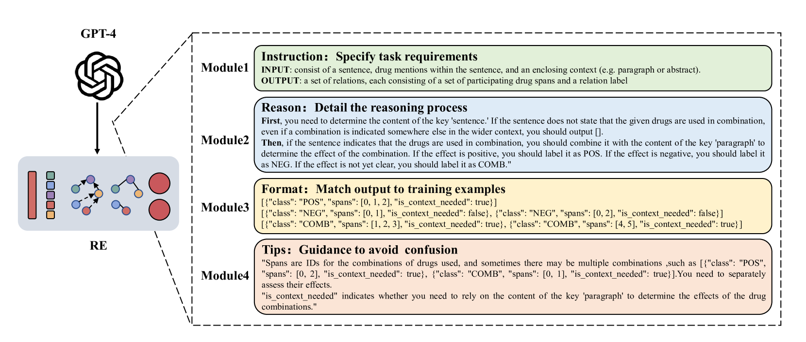
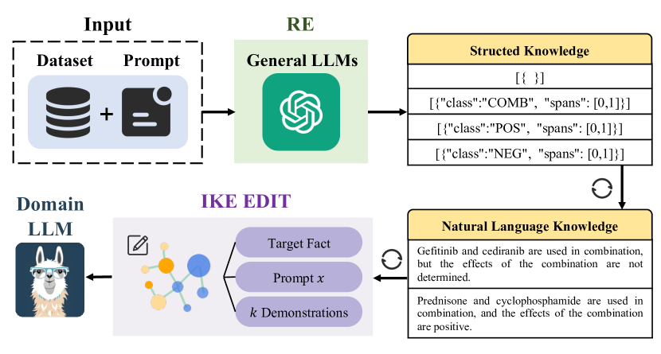
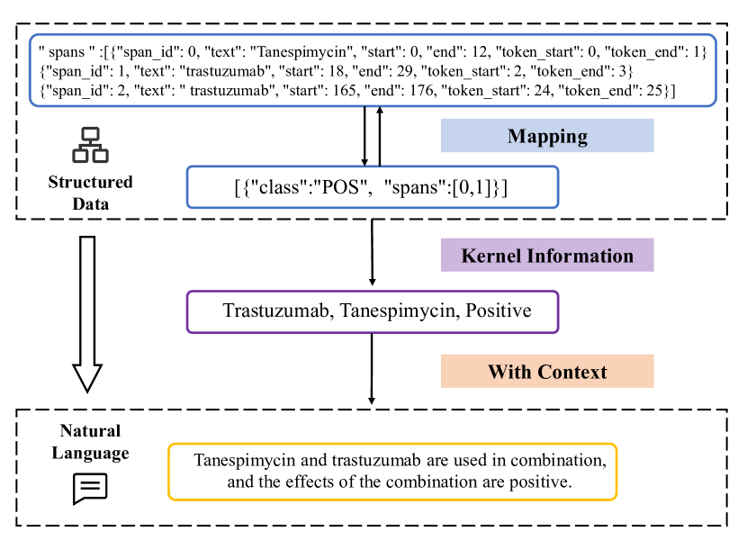
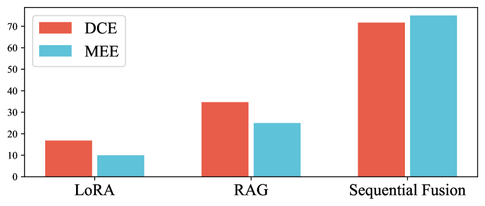
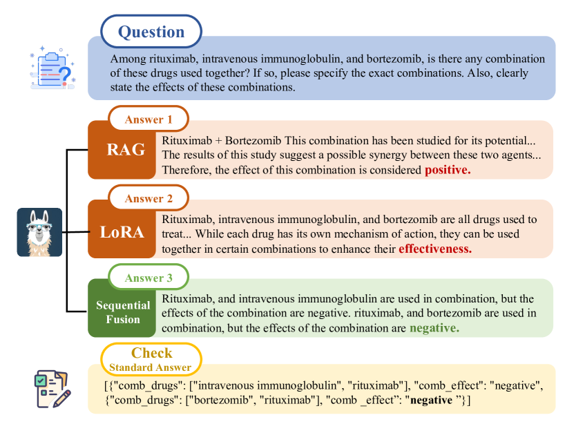
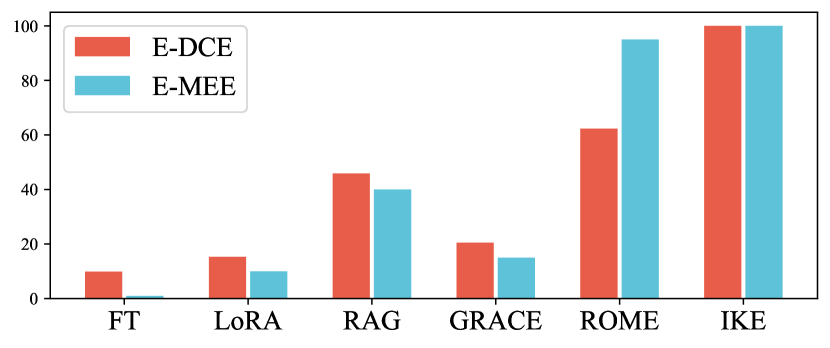

# LLMs 指导 LLMS：探索一种从LLMs中提取与编辑的新方法

发布时间：2024年03月23日

`LLM应用` `经济学与管理学`

> LLMs Instruct LLMs:An Extraction and Editing Method

# 摘要

> 对无需完全重新训练就能更新大型语言模型（LLMs）的研究兴趣日益增长，但在面对需有限样本完成复杂推理的场景——即我们所指的“贫瘠约束复杂推理适应性”（PCRA-LLM）问题时，挑战尤为突出。传统的低秩适应（LoRA）和检索增强生成（RAG）等技术对此关键问题应对不足，这一点在我们针对一个极具代表性的医学领域的探索中得以显现，该领域恰好突显了PCRA-LLM的独特需求。为此，我们创新提出了“序列融合”方法，将复杂背景下的知识嵌入至LLMs中。这种方法采用两步走策略：首先借助通用LLMs构建知识图谱，提炼复杂文本中的知识内容；继而通过知识编辑的方式更新特定领域的LLMs。依据这种方法，领域LLM在问答任务中取得了71.69\%的高准确率。此外，我们还进一步在自行研发的经济学与管理学领域新数据集上进行了验证，其中我们的方法达到了75\%的准确率。这一系列成果有力证明了此方法在跨多种领域解决PCRA-LLM问题上的高效性和普适性。

> The interest in updating Large Language Models (LLMs) without retraining from scratch is substantial, yet it comes with some challenges.This is especially true for situations demanding complex reasoning with limited samples, a scenario we refer to as the Paucity-Constrained Complex Reasoning Adaptation for LLMs (PCRA-LLM).Traditional methods like Low-Rank Adaptation (LoRA) and Retrieval-Augmented Generation (RAG) are inadequate for this critical issue, particularly evident in our exploration of a specific medical context that epitomize the PCRA-LLM's distinct needs.To address the issue, we propose a Sequential Fusion method to incorporate knowledge from complex context into LLMs. This method employs a two-stage framework: initially, it leverages general LLMs to construct knowledge graphs (KGs) for extracting knowledge from complex texts; subsequently, it updates the domain LLMs through knowledge edit. According to our method, the domain LLM achieved a 71.69\% accuracy in question answering tasks. Subsequently, we broadened our assessment to a novel dataset we developed in the economics and management field, where our method realized a 75\% accuracy. These outcomes underline the efficacy and adaptability of our approach for PCRA-LLM across various domains.

[Arxiv](https://arxiv.org/abs/2403.15736)