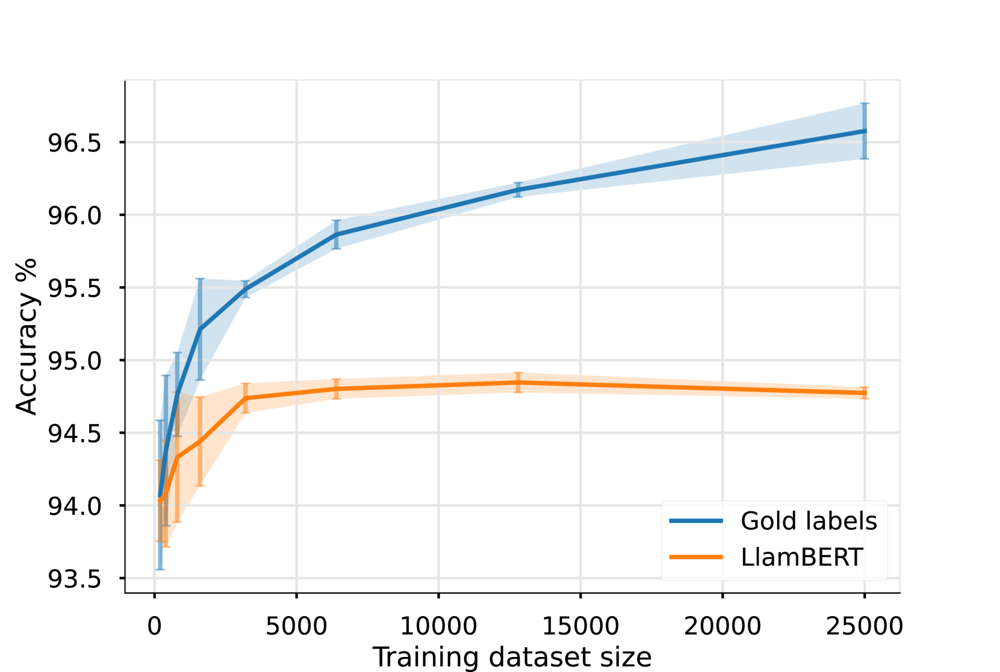
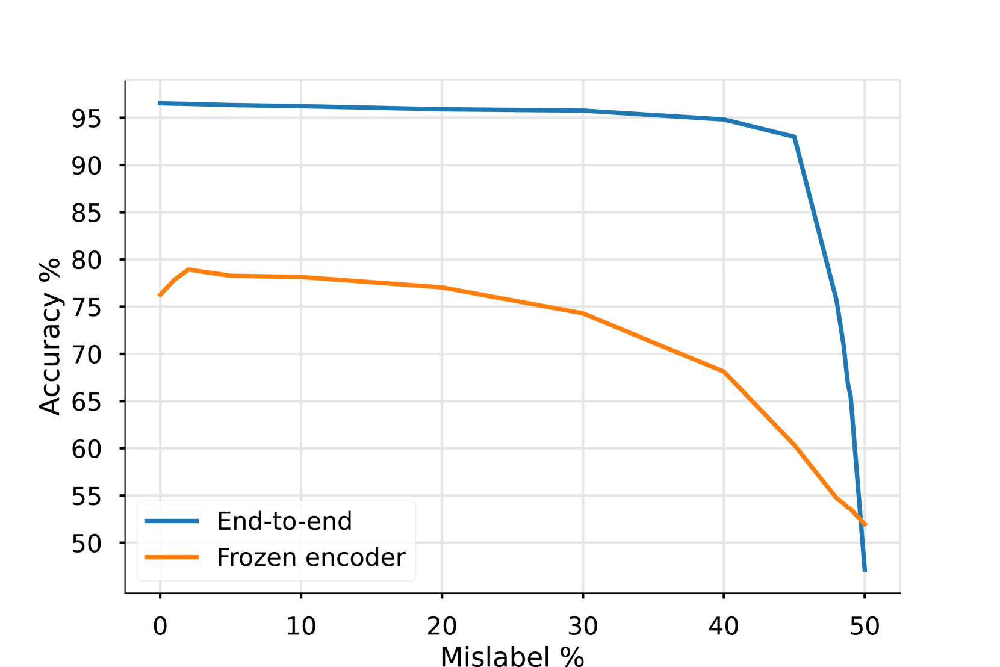

# LlamBERT 是一项致力于在自然语言处理（NLP）领域实现大规模、低成本数据标注的研究成果。通过创新方法，LlamBERT 实现了高效且经济的数据标注过程，极大地降低了 NLP 项目中的数据标注成本。

发布时间：2024年03月23日

`LLM应用` `NLP` `模型压缩`

> LlamBERT: Large-scale low-cost data annotation in NLP

> 类似 GPT-4 和 Llama 2 的大型语言模型在广泛 NLP 任务上的能力令人瞩目，但其高昂的使用成本成为一个难题。我们推出的 LlamBERT 混合方案巧妙地运用了 LLM 对大规模未标注数据库的小部分样本进行标注，进而以此指导像 BERT 和 RoBERTa 等转换器编码器的微调过程。我们在 IMDb 影评数据集和 UMLS 元词库这两大差异显著的数据集中检验了此策略。实验结果显示，虽然 LlamBERT 方法在一定程度上牺牲了精确度，却能够带来显著的成本效益提升。

> Large Language Models (LLMs), such as GPT-4 and Llama 2, show remarkable proficiency in a wide range of natural language processing (NLP) tasks. Despite their effectiveness, the high costs associated with their use pose a challenge. We present LlamBERT, a hybrid approach that leverages LLMs to annotate a small subset of large, unlabeled databases and uses the results for fine-tuning transformer encoders like BERT and RoBERTa. This strategy is evaluated on two diverse datasets: the IMDb review dataset and the UMLS Meta-Thesaurus. Our results indicate that the LlamBERT approach slightly compromises on accuracy while offering much greater cost-effectiveness.

[Arxiv](https://arxiv.org/abs/2403.15938)