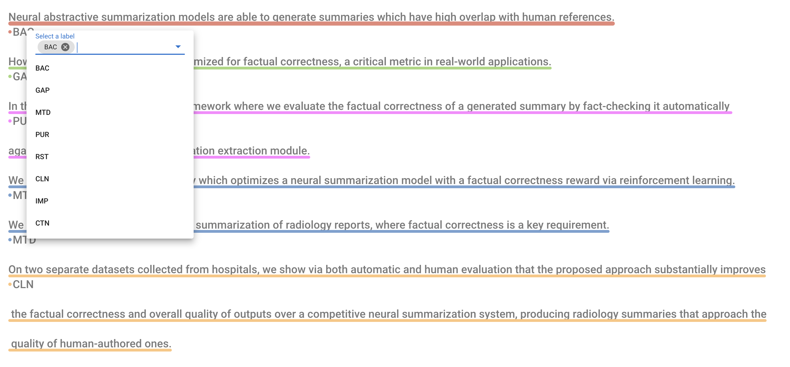
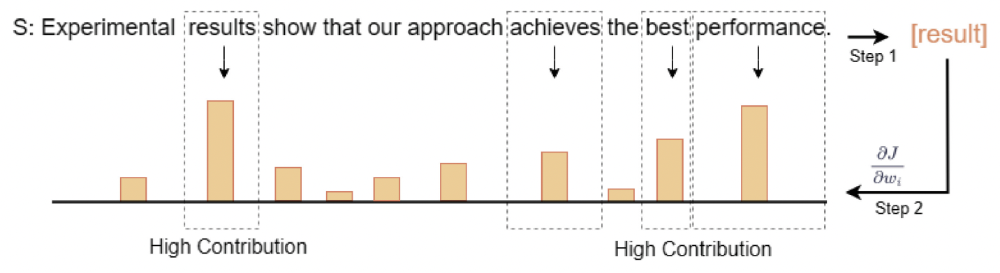
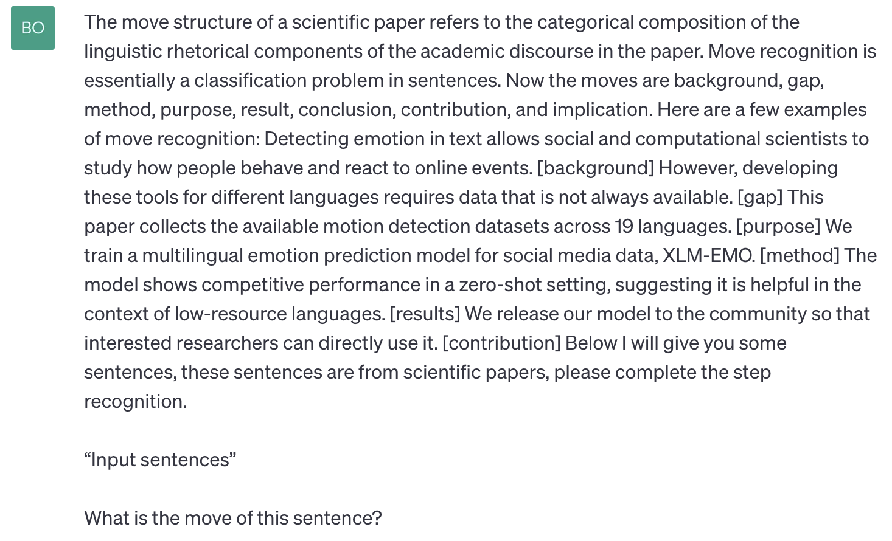

# RAAMove——专为解析科研论文摘要中各类动作行为而构建的语料库

发布时间：2024年03月23日

`Agent` `学术研究`

> RAAMove: A Corpus for Analyzing Moves in Research Article Abstracts

# 摘要

> 多年来，ESP和EAP领域的研究持续关注英语中的移动结构，但针对RA摘要的移动结构注释语料库尚不多见。现在，我们推出了RAAMove——一个全面覆盖多领域的、专注于RA摘要中移动结构注解的综合语料库，其首要目标是推动移动结构分析及自动化识别的研究。本文深入探讨了语料库构建流程，包括方案设计、数据采集、注解规范以及实施步骤。RAAMove的构建历经两步：先是专业人员对优质数据进行手动精细注解；然后在人工注解数据的基础上，运用经过专家调优的BERT模型进行自动化注解，从而生成了一个包含33,988个注解实例的大型且高质量语料库。此外，我们还运用基于BERT的模型进行了初步的移动结构识别试验，以验证该语料库及其对应模型的实际效用。目前，这一已注解的语料库面向学术界开放，有望成为移动结构分析、英语教学与写作，乃至涉及NLP中移动与语篇相关任务的关键参考资料。

> Move structures have been studied in English for Specific Purposes (ESP) and English for Academic Purposes (EAP) for decades. However, there are few move annotation corpora for Research Article (RA) abstracts. In this paper, we introduce RAAMove, a comprehensive multi-domain corpus dedicated to the annotation of move structures in RA abstracts. The primary objective of RAAMove is to facilitate move analysis and automatic move identification. This paper provides a thorough discussion of the corpus construction process, including the scheme, data collection, annotation guidelines, and annotation procedures. The corpus is constructed through two stages: initially, expert annotators manually annotate high-quality data; subsequently, based on the human-annotated data, a BERT-based model is employed for automatic annotation with the help of experts' modification. The result is a large-scale and high-quality corpus comprising 33,988 annotated instances. We also conduct preliminary move identification experiments using the BERT-based model to verify the effectiveness of the proposed corpus and model. The annotated corpus is available for academic research purposes and can serve as essential resources for move analysis, English language teaching and writing, as well as move/discourse-related tasks in Natural Language Processing (NLP).

[Arxiv](https://arxiv.org/abs/2403.15872)