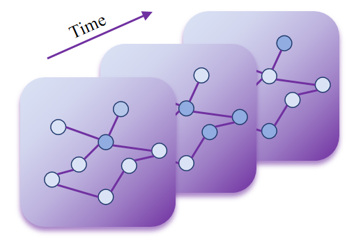
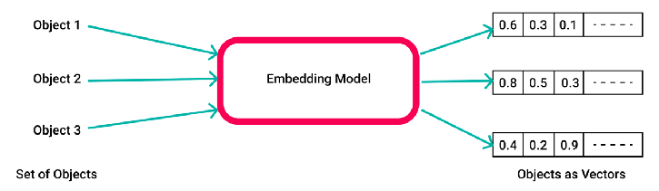
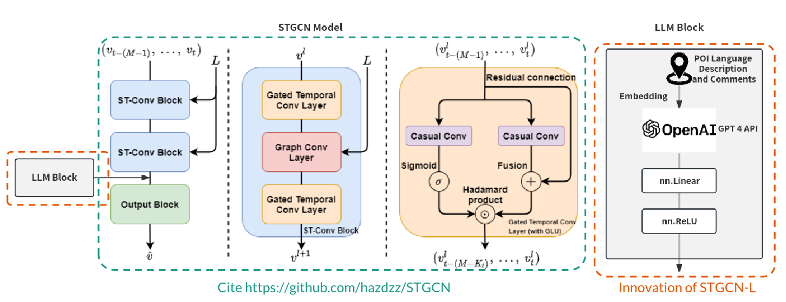
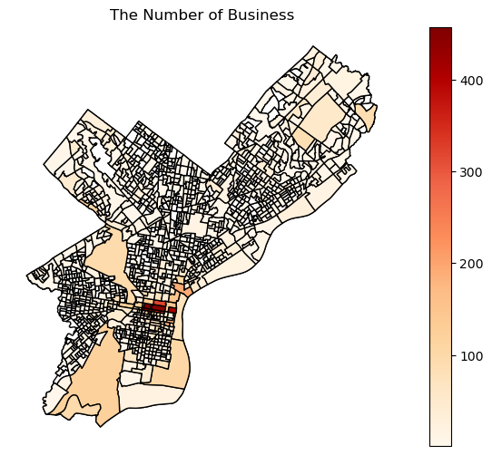
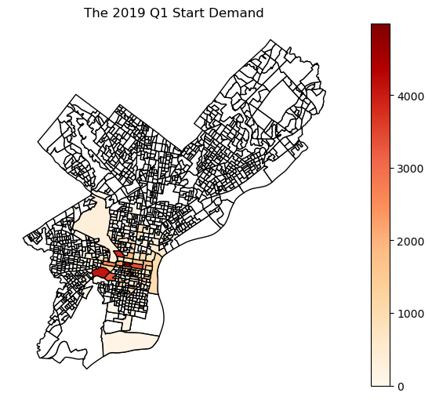
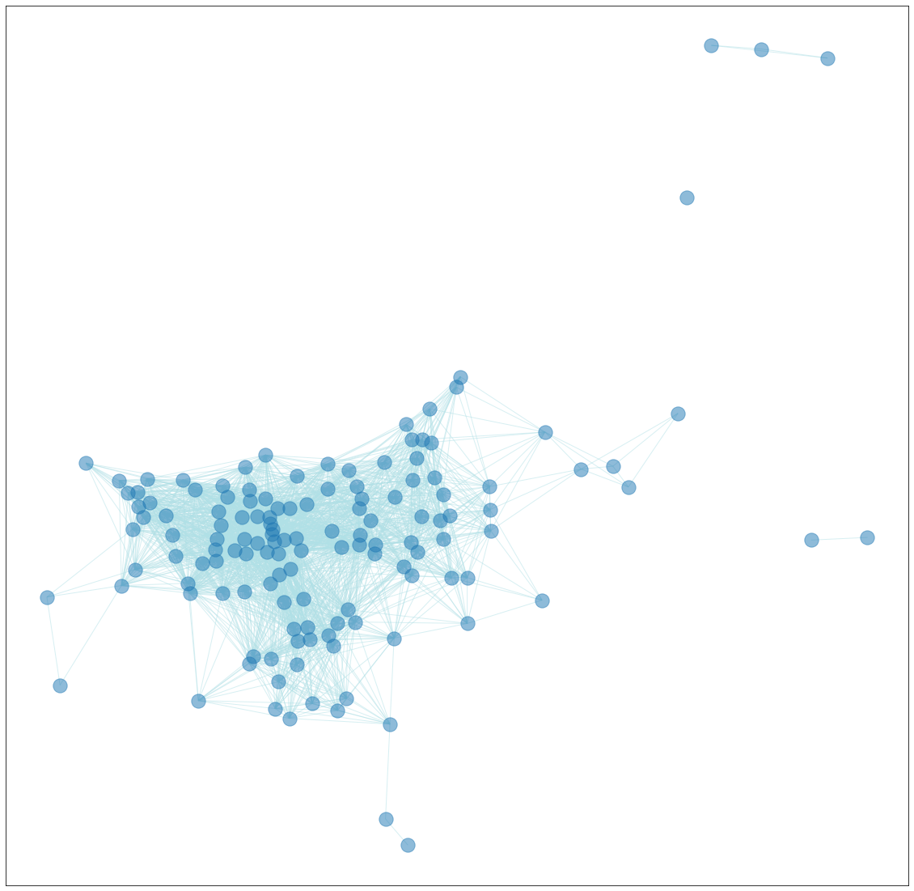
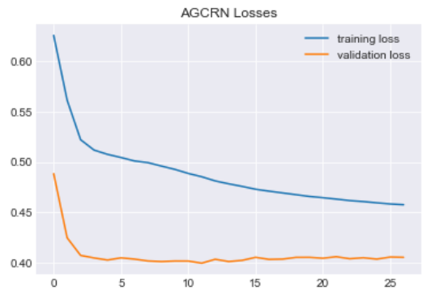
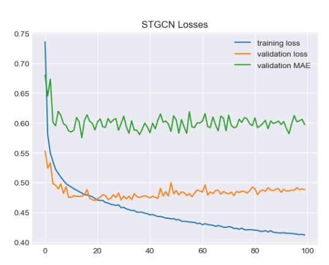
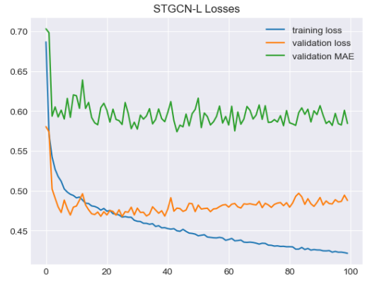

# 结合时空图卷积网络与大型语言模型的创新框架，构建了一种深入探究自行车需求预测问题的深度学习方案。

发布时间：2024年03月23日

`LLM应用` `需求预测`

> Spatio-Temporal Graph Convolutional Network Combined Large Language Model: A Deep Learning Framework for Bike Demand Forecasting

> 这项研究带来一种创新的深度学习架构，它巧妙融合时空图卷积网络（STGCN）与大型语言模型（LLM），以解决自行车需求预测问题。面对离散数据处理及非结构化文本数据整合的难题，该架构借助LLM深入挖掘兴趣点（POI）文本中的有价值信息。新提出的STGCN-L模型展现出了与现有模型相抗衡的实力，在自行车需求预测上展现出巨大潜能。通过运用费城的实际数据集进行实验，证实了这一混合模型的强大效果，同时也指出未来仍有提升空间，例如引入如天气数据等更多特征以提高预测精准度。

> This study presents a new deep learning framework, combining Spatio-Temporal Graph Convolutional Network (STGCN) with a Large Language Model (LLM), for bike demand forecasting. Addressing challenges in transforming discrete datasets and integrating unstructured language data, the framework leverages LLMs to extract insights from Points of Interest (POI) text data. The proposed STGCN-L model demonstrates competitive performance compared to existing models, showcasing its potential in predicting bike demand. Experiments using Philadelphia datasets highlight the effectiveness of the hybrid model, emphasizing the need for further exploration and enhancements, such as incorporating additional features like weather data for improved accuracy.

[Arxiv](https://arxiv.org/abs/2403.15733)