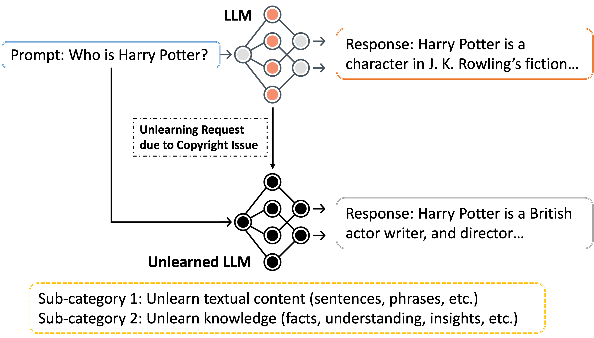
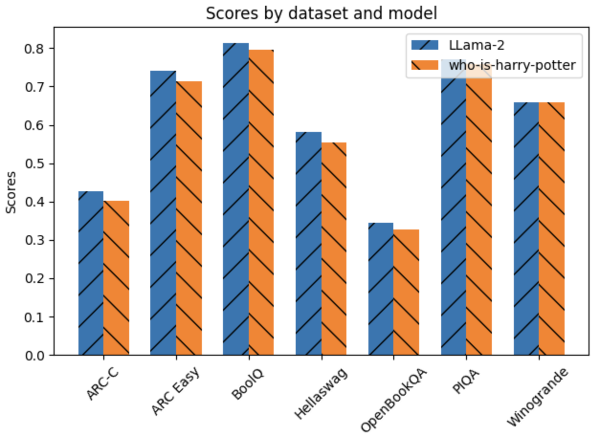

# 探寻数据擦除边界：面向大型语言模型的机器遗忘机制

发布时间：2024年03月23日

`LLM应用` `数据隐私与安全`

> The Frontier of Data Erasure: Machine Unlearning for Large Language Models

> LLMs作为AI发展的基石，有力推动了如预测文本生成等应用，但其庞大的数据集也可能潜藏敏感、偏见或版权信息的风险。为此，机器遗忘技术崭露头角，通过提供使LLMs有针对性地剔除某些数据的方式，有效缓解此类担忧。本文综述了面向LLMs的最新机器遗忘研究成果，介绍了一种不必完全重训模型就能应对隐私、伦理及法律挑战的定向信息遗忘方法。文章将现有研究划分为非结构化/文本数据与结构化/分类数据两大遗忘场景，展示这些方法在去除特定数据的同时，仍能保持模型的有效运作。同时，本文在突出机器遗忘实用价值的同时，也指出在确保模型完整、避免数据删除过犹不及以及保证输出一致性等方面存在的挑战，进而凸显机器遗忘在促进负责任、合乎伦理的AI发展中所扮演的角色。

> Large Language Models (LLMs) are foundational to AI advancements, facilitating applications like predictive text generation. Nonetheless, they pose risks by potentially memorizing and disseminating sensitive, biased, or copyrighted information from their vast datasets. Machine unlearning emerges as a cutting-edge solution to mitigate these concerns, offering techniques for LLMs to selectively discard certain data. This paper reviews the latest in machine unlearning for LLMs, introducing methods for the targeted forgetting of information to address privacy, ethical, and legal challenges without necessitating full model retraining. It divides existing research into unlearning from unstructured/textual data and structured/classification data, showcasing the effectiveness of these approaches in removing specific data while maintaining model efficacy. Highlighting the practicality of machine unlearning, this analysis also points out the hurdles in preserving model integrity, avoiding excessive or insufficient data removal, and ensuring consistent outputs, underlining the role of machine unlearning in advancing responsible, ethical AI.

[Arxiv](https://arxiv.org/abs/2403.15779)