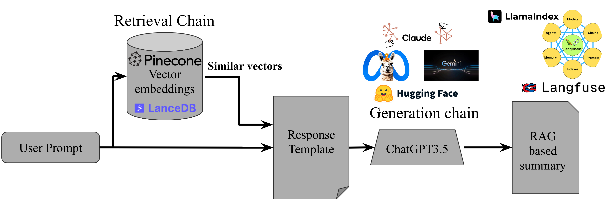
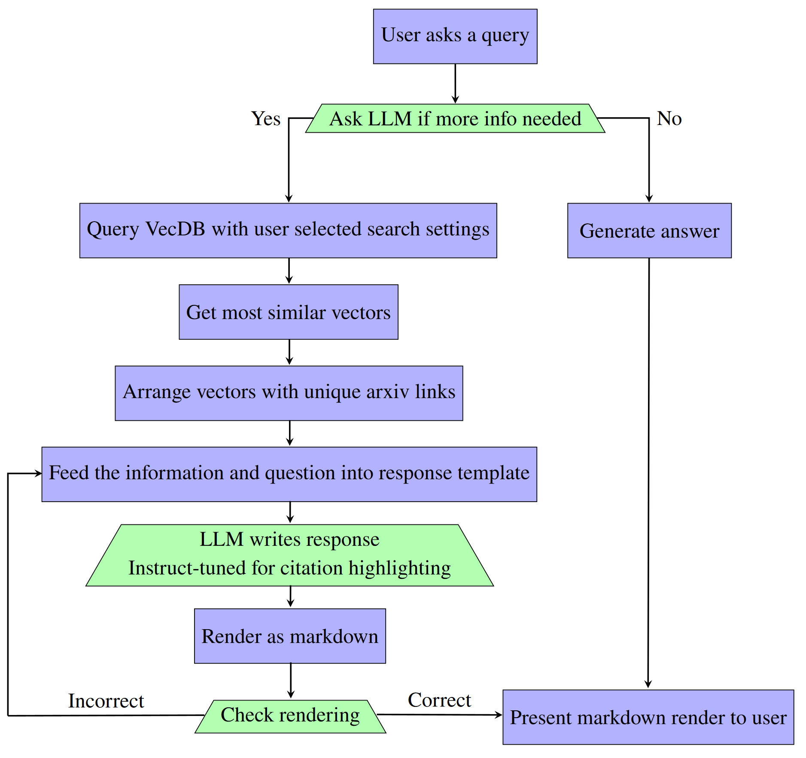
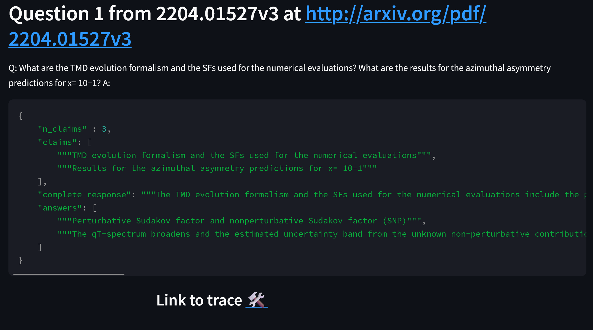
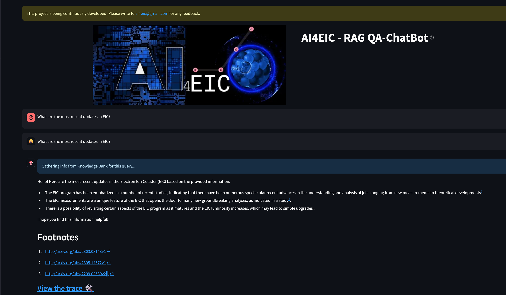
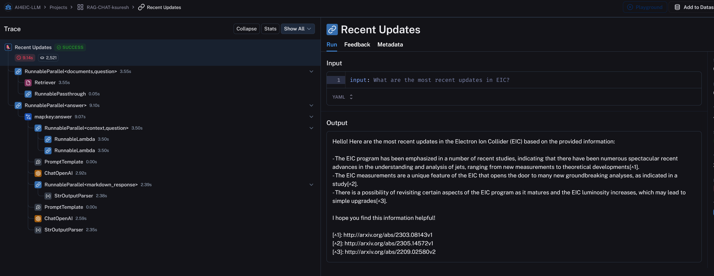

# 致力于研发基于 RAG 的电子-离子对撞机摘要生成代理技术解释：

发布时间：2024年03月23日

`RAG` `合作管理`

> Towards a \textbf{RAG}-based Summarization Agent for the Electron-Ion Collider

> 面对大规模实验产生的纷繁复杂的各类文献、数据和其他资源，其信息量之大、处理难度之高，往往令新晋合作者及初级科研人员望而却步。为此，我们正研发一款名为RAGS4EIC的基于检索增强生成（RAG）技术的智能摘要工具，专门服务于EIC领域。这款AI助手不仅能高效提炼信息，还能精准引用相关反馈，极大地方便了科研合作。我们的方案采取两步走策略：第一步，全面搜索一个包含所有关键实验信息的向量数据库；第二步，运用大型语言模型(LLM)，依据用户查询和检索结果生成附带引用的精炼摘要。我们提出通过RAG评估标准（RAGA）评价体系来衡量回复的有效性，并引入了基于提示模板的指令微调方法，以提高摘要过程中的灵活性和精确度。尤为关键的是，我们依托于LangChain构建整体架构，保障了整个工作流程的高效与可扩展性，让EIC社群内的各类用户能够轻松部署并访问此工具。这一创新的AI驱动框架不仅极大地简化了对海量数据集的认知过程，也激发了科研人员之间的协同合作。为了直观展示，我们已开发出一款Web应用，详尽展示了RAG智能助手研发过程的每一个环节。

> The complexity and sheer volume of information encompassing documents, papers, data, and other resources from large-scale experiments demand significant time and effort to navigate, making the task of accessing and utilizing these varied forms of information daunting, particularly for new collaborators and early-career scientists. To tackle this issue, a Retrieval Augmented Generation (RAG)--based Summarization AI for EIC (RAGS4EIC) is under development. This AI-Agent not only condenses information but also effectively references relevant responses, offering substantial advantages for collaborators. Our project involves a two-step approach: first, querying a comprehensive vector database containing all pertinent experiment information; second, utilizing a Large Language Model (LLM) to generate concise summaries enriched with citations based on user queries and retrieved data. We describe the evaluation methods that use RAG assessments (RAGAs) scoring mechanisms to assess the effectiveness of responses. Furthermore, we describe the concept of prompt template-based instruction-tuning which provides flexibility and accuracy in summarization. Importantly, the implementation relies on LangChain, which serves as the foundation of our entire workflow. This integration ensures efficiency and scalability, facilitating smooth deployment and accessibility for various user groups within the Electron Ion Collider (EIC) community. This innovative AI-driven framework not only simplifies the understanding of vast datasets but also encourages collaborative participation, thereby empowering researchers. As a demonstration, a web application has been developed to explain each stage of the RAG Agent development in detail.

[Arxiv](https://arxiv.org/abs/2403.15729)