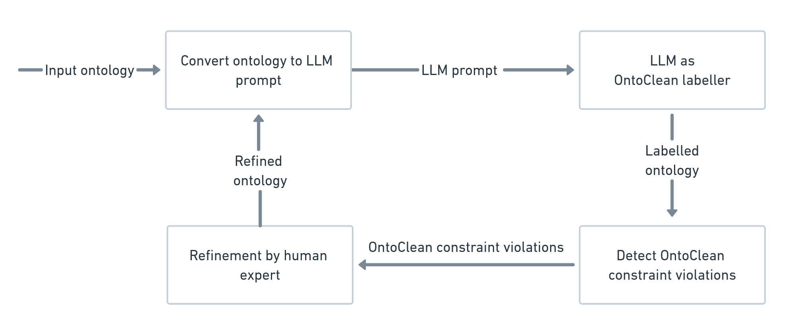
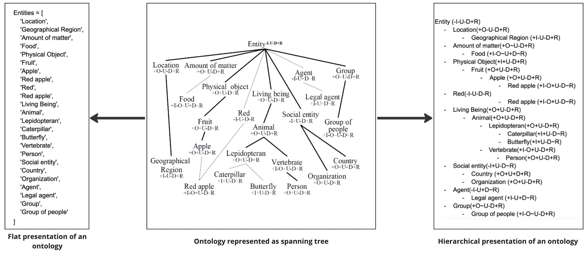
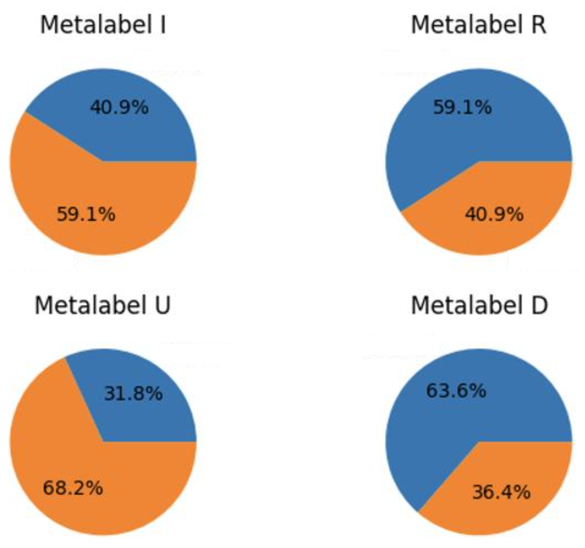
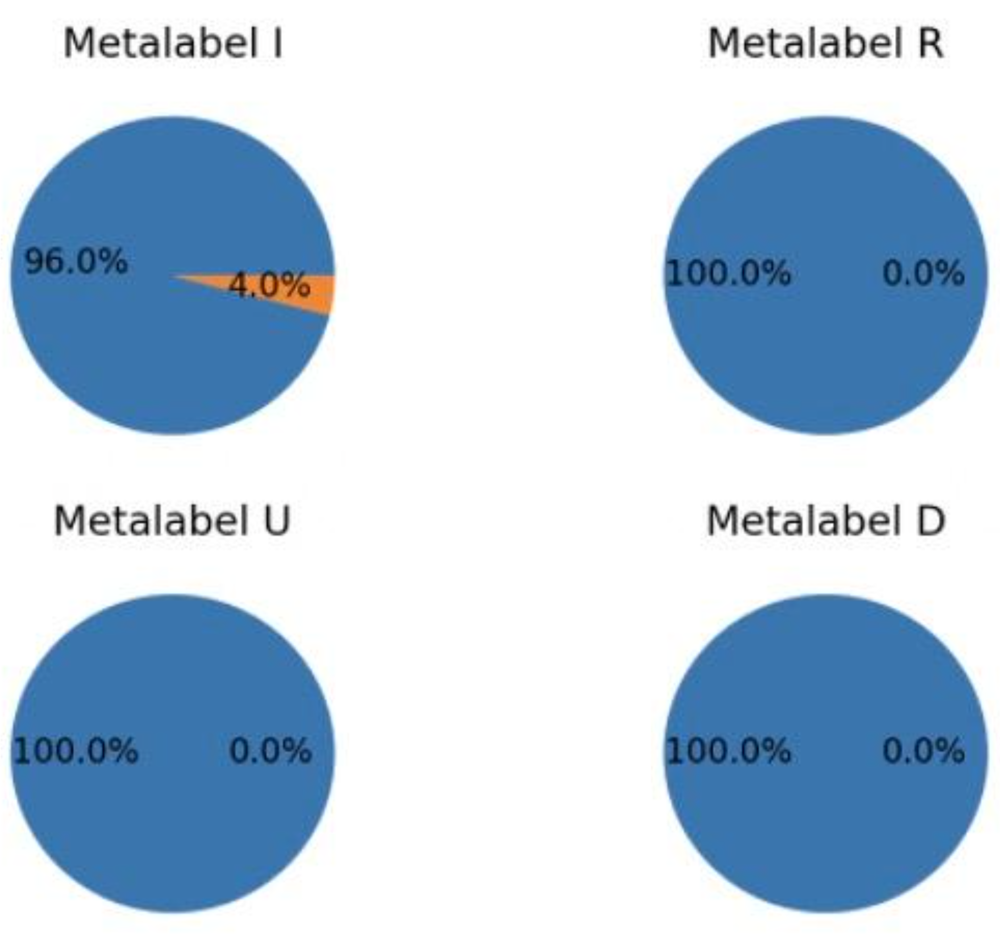
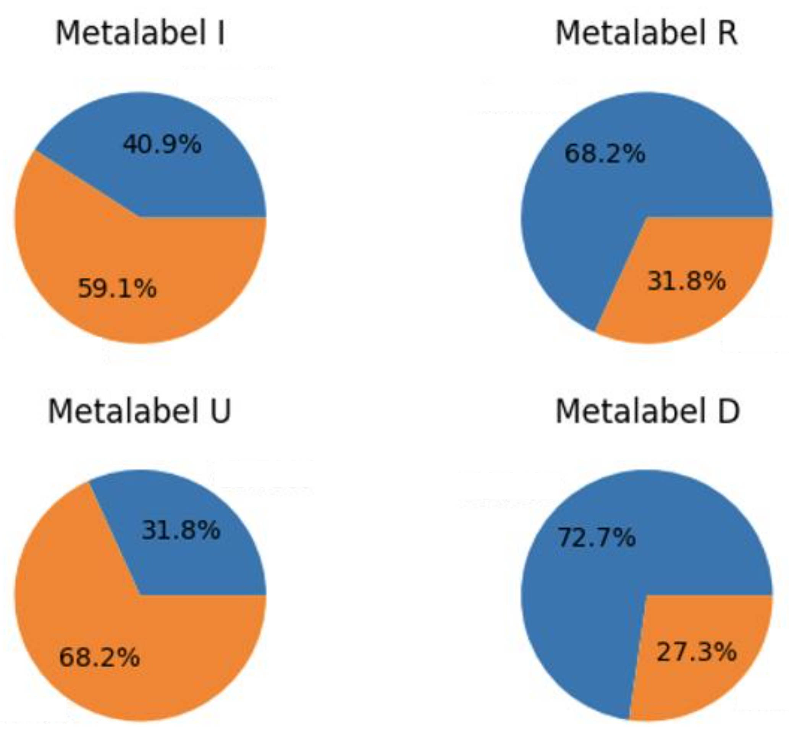
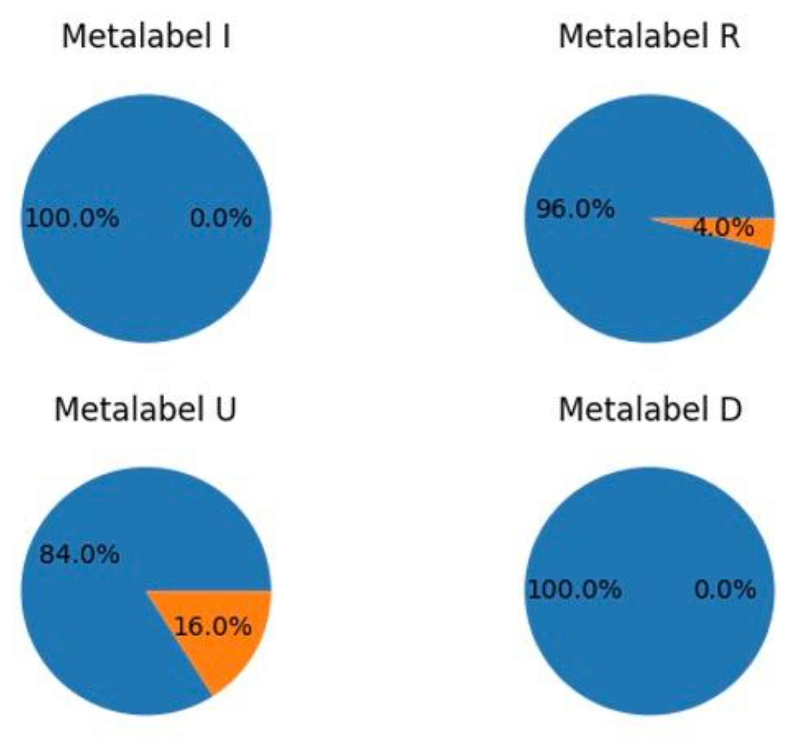

# 本文探讨了如何利用大型语言模型对基于 OntoClean 方法论的本体进行精细化处理。

发布时间：2024年03月23日

`LLM应用` `本体论` `人工智能`

> Using Large Language Models for OntoClean-based Ontology Refinement

# 摘要

> 本研究着眼于将如 GPT-3.5 和 GPT-4 这样的大型语言模型融入到本体论的精细化流程中，尤其聚焦于 OntoClean 方法。OntoClean 在评估本体论的哲学质量方面发挥关键作用，它包括为类别分配元属性和检验一系列约束的两个步骤。实际操作中，由于需要深厚的哲学背景和本体论专家之间的意见分歧，手动执行第一步颇为棘手。研究通过采用两种不同的提示策略，利用 LLMs 展示了在标记过程中能够达到高准确度。这些发现揭示了 LLMs 在提升本体论精细化方面的潜力，并提出了开发插件软件以促进本体论工具与 LLMs 融合的构想。

> This paper explores the integration of Large Language Models (LLMs) such as GPT-3.5 and GPT-4 into the ontology refinement process, specifically focusing on the OntoClean methodology. OntoClean, critical for assessing the metaphysical quality of ontologies, involves a two-step process of assigning meta-properties to classes and verifying a set of constraints. Manually conducting the first step proves difficult in practice, due to the need for philosophical expertise and lack of consensus among ontologists. By employing LLMs with two prompting strategies, the study demonstrates that high accuracy in the labelling process can be achieved. The findings suggest the potential for LLMs to enhance ontology refinement, proposing the development of plugin software for ontology tools to facilitate this integration.

[Arxiv](https://arxiv.org/abs/2403.15864)