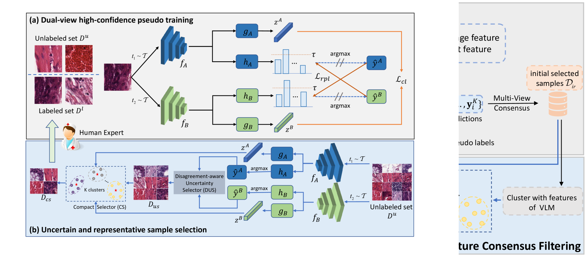
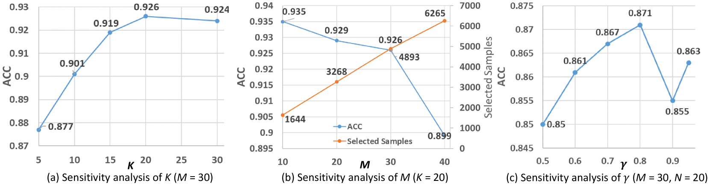

# VLM-CPL 方法利用视觉-语言模型生成共识伪标签，实现无需人工标注的病理图像分类任务。这一创新技术旨在通过整合视觉与语言信息，在病理图像分类领域减少对人工标注的依赖。

发布时间：2024年03月23日

`Agent` `病理学` `图像识别`

> VLM-CPL: Consensus Pseudo Labels from Vision-Language Models for Human Annotation-Free Pathological Image Classification

# 摘要

> 虽然深度学习在病理图像分类上成绩斐然，但它高度依赖于带标签的数据，意味着需要耗费大量人力进行标注。本研究创新性地提出一种免人工标注的方法，借助预训练的视觉-语言模型(VLM)，实现无标注病理图像分类。面对因预训练数据与目标数据集之间领域差异导致的含有大量噪声的零样本推理伪标签问题，我们设计了VLM-CPL方案，它融合了两种噪声标签筛选技术和半监督学习策略。首先，通过VLM对输入图像的多视角增强版本进行零样本推理，得到附带不确定性的提示式伪标签。接着，利用VLM强大的特征提取能力，在特征空间内通过聚类生成基于特征的伪标签。我们引入“提示-特征一致”原则，依据两类伪标签间的共识筛选出可靠性高的样本。为进一步剔除低质量伪标签，我们提出了高可信交叉监督(HCS)，以具备可靠伪标签的样本及剩余未标注样本为对象进行学习。实验证明，该方法在HPH和LC25K数据集上的准确率分别达到了87.1%和95.1%，明显优于现有零样本分类和噪声标签学习方法。相关代码已开源，访问地址为https://github.com/lanfz2000/VLM-CPL。

> Despite that deep learning methods have achieved remarkable performance in pathology image classification, they heavily rely on labeled data, demanding extensive human annotation efforts. In this study, we present a novel human annotation-free method for pathology image classification by leveraging pre-trained Vision-Language Models (VLMs). Without human annotation, pseudo labels of the training set are obtained by utilizing the zero-shot inference capabilities of VLM, which may contain a lot of noise due to the domain shift between the pre-training data and the target dataset. To address this issue, we introduce VLM-CPL, a novel approach based on consensus pseudo labels that integrates two noisy label filtering techniques with a semi-supervised learning strategy. Specifically, we first obtain prompt-based pseudo labels with uncertainty estimation by zero-shot inference with the VLM using multiple augmented views of an input. Then, by leveraging the feature representation ability of VLM, we obtain feature-based pseudo labels via sample clustering in the feature space. Prompt-feature consensus is introduced to select reliable samples based on the consensus between the two types of pseudo labels. By rejecting low-quality pseudo labels, we further propose High-confidence Cross Supervision (HCS) to learn from samples with reliable pseudo labels and the remaining unlabeled samples. Experimental results showed that our method obtained an accuracy of 87.1% and 95.1% on the HPH and LC25K datasets, respectively, and it largely outperformed existing zero-shot classification and noisy label learning methods. The code is available at https://github.com/lanfz2000/VLM-CPL.

[Arxiv](https://arxiv.org/abs/2403.15836)