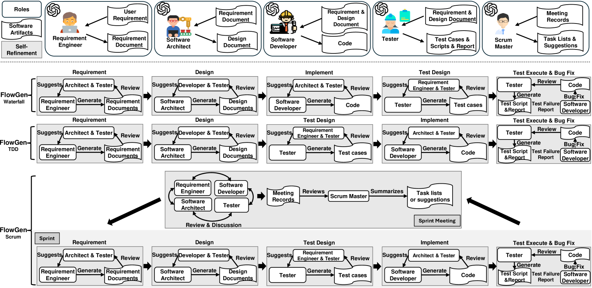
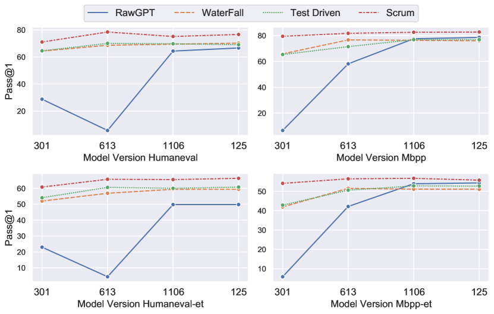
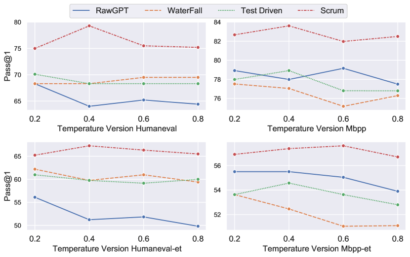

# 当LLM驱动的代码生成融入软件开发流程之际

发布时间：2024年03月23日

`Agent` `软件工程` `代码生成`

> When LLM-based Code Generation Meets the Software Development Process

> 在软件团队中，软件过程模型犹如粘合剂和指挥棒，助力团队高效解决复杂的开发挑战。本文推出了一款灵感源自经典软件工程实践的代码生成框架LCG，它借助多个大型语言模型（LLM）代理，模拟实现瀑布流、测试驱动开发及敏捷开发等不同开发流程模型。各个模型让LLM代理扮演需求分析师、架构师、开发人员、测试专家乃至敏捷教练的角色，真实再现开发工作中的典型环节与沟通方式。通过运用链式思考和提示组合技巧，这些代理协同进化，持续优化自身以提升代码品质。实验中，我们将基于GPT3.5的基础LLM以及基准GPT，在包括HumanEval、HumanEval-ET、MBPP和MBPP-ET在内的四个代码生成基准测试中检验LCG的表现。结果显示，LCGScrum模型在各项测试中脱颖而出，其Pass@1得分分别达到75.2、65.5、82.5和56.7，整体优于GPT约15%。深入分析发现，设计与代码审查等活动对生成代码具有独特贡献，有利于强化异常处理机制；同时，设计、测试和代码审查也有效地减少了代码异味的问题。另外，尽管温度值对所有模型的Pass@1得分影响不大，但在不同版本的GPT3.5模型上，Pass@1得分的变化却相当显著，例如在HumanEval测试中波动范围可达5至60以上，这一现象有力地证明了LCG在不同模型版本间具有稳定的性能表现。因此，引入软件过程模型对于提升LLM生成代码的品质与一致性显得尤为重要。

> Software process models play a pivotal role in fostering collaboration and communication within software teams, enabling them to tackle intricate development tasks effectively. This paper introduces LCG, a code generation framework inspired by established software engineering practices. LCG leverages multiple Large Language Model (LLM) agents to emulate various software process models, namely LCGWaterfall, LCGTDD, and LCGScrum. Each model assigns LLM agents specific roles such as requirement engineer, architect, developer, tester, and scrum master, mirroring typical development activities and communication patterns. Through collaborative efforts utilizing chain-of-thought and prompt composition techniques, the agents continuously refine themselves to enhance code quality. Utilizing GPT3.5 as the underlying LLM and baseline (GPT), we evaluate LCG across four code generation benchmarks: HumanEval, HumanEval-ET, MBPP, and MBPP-ET. Results indicate LCGScrum outperforms other models, achieving Pass@1 scores of 75.2, 65.5, 82.5, and 56.7 in HumanEval, HumanEval-ET, MBPP, and MBPP-ET, respectively - an average 15% improvement over GPT. Analysis reveals distinct impacts of development activities on generated code, with design and code reviews contributing to enhanced exception handling, while design, testing, and code reviews mitigate code smells. Furthermore, temperature values exhibit negligible influence on Pass@1 across all models. However, variations in Pass@1 are notable for different GPT3.5 model versions, ranging from 5 to over 60 in HumanEval, highlighting the stability of LCG across model versions. This stability underscores the importance of adopting software process models to bolster the quality and consistency of LLM-generated code.

[Arxiv](https://arxiv.org/abs/2403.15852)