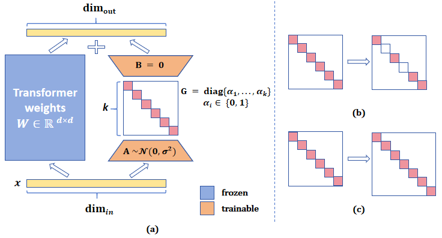
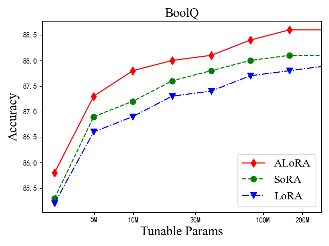
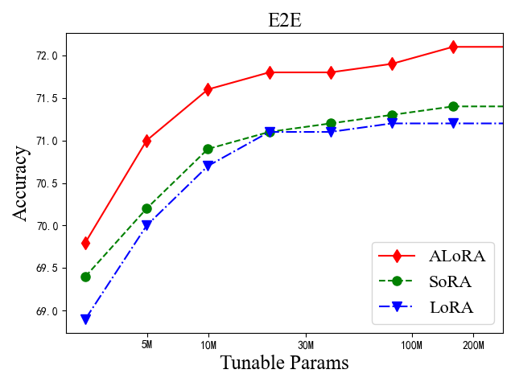
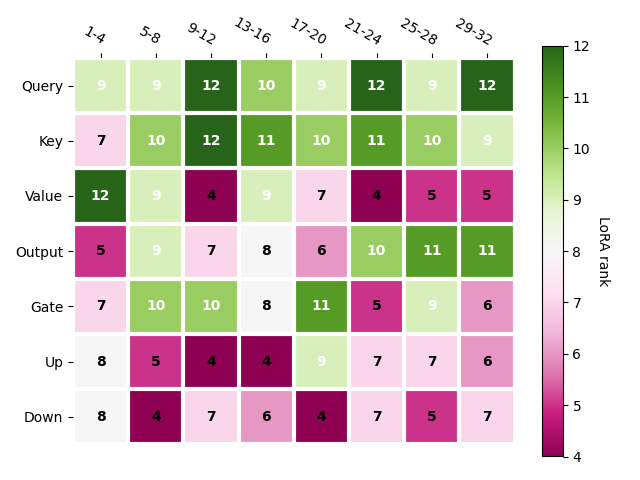
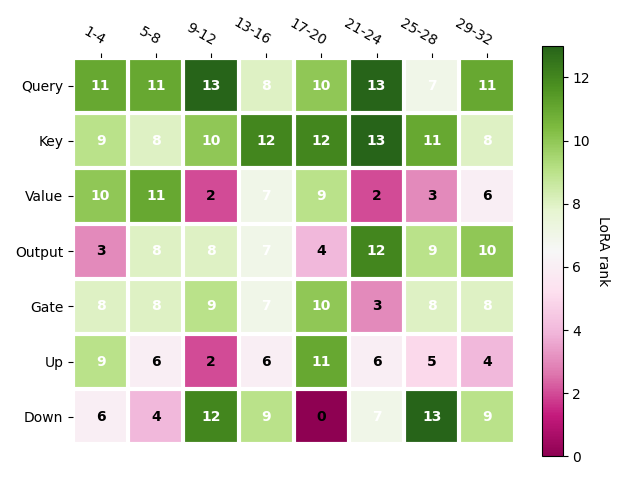

# ALoRA 是一种为大型语言模型微调分配低秩适应的技术。这一方法旨在通过合理分配低秩适应，优化大型语言模型在微调过程中的性能与效率。进一步优化：结果1：ALoRA（低秩适应分配法）专为大型语言模型的微调过程设计，致力于实现高效的低秩适应分配。

发布时间：2024年03月24日

`LLM应用`

> ALoRA: Allocating Low-Rank Adaptation for Fine-tuning Large Language Models

> 在大型语言模型时代，PEFT因高效实用而备受瞩目，其中LoRA作为典型代表展现出了出色效果，但其固定内在秩设计未必适合所有下游任务需求。为此，我们创新性地拓展了LoRA方法，提出了一个名为“动态分配低秩适应”（ALoRA）的新策略，使其在适应过程能灵活调整内在秩大小。首先，我们独创了AB-LoRA方法，能精确评估各个LoRA秩的重要性等级；随后，在AB-LoRA引导下，我们将不必要的、甚至带来负面影响的LoRA秩进行裁剪，并将这些裁剪后的资源重新分配给急需更高秩的Transformer关键模块。通过在多个任务上的实验证明，我们的ALoRA方法在保持相近可调参数的前提下，性能优于最近的基准方法。

> Parameter-efficient fine-tuning (PEFT) is widely studied for its effectiveness and efficiency in the era of large language models. Low-rank adaptation (LoRA) has demonstrated commendable performance as a popular and representative method. However, it is implemented with a fixed intrinsic rank that might not be the ideal setting for the downstream tasks. Recognizing the need for more flexible downstream task adaptation, we extend the methodology of LoRA to an innovative approach we call allocating low-rank adaptation (ALoRA) that enables dynamic adjustments to the intrinsic rank during the adaptation process. First, we propose a novel method, AB-LoRA, that can effectively estimate the importance score of each LoRA rank. Second, guided by AB-LoRA, we gradually prune abundant and negatively impacting LoRA ranks and allocate the pruned LoRA budgets to important Transformer modules needing higher ranks. We have conducted experiments on various tasks, and the experimental results demonstrate that our ALoRA method can outperform the recent baselines with comparable tunable parameters.

[Arxiv](https://arxiv.org/abs/2403.16187)