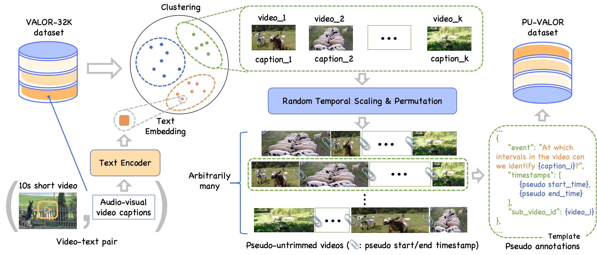
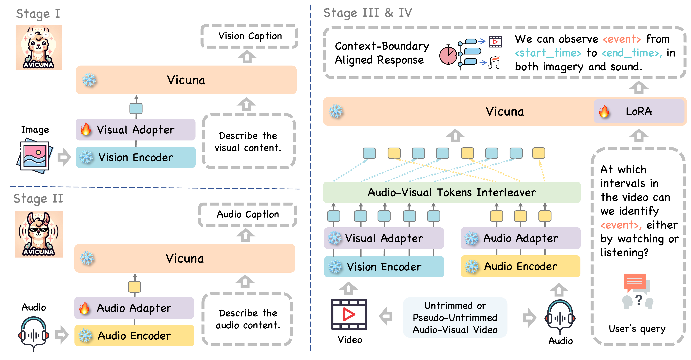
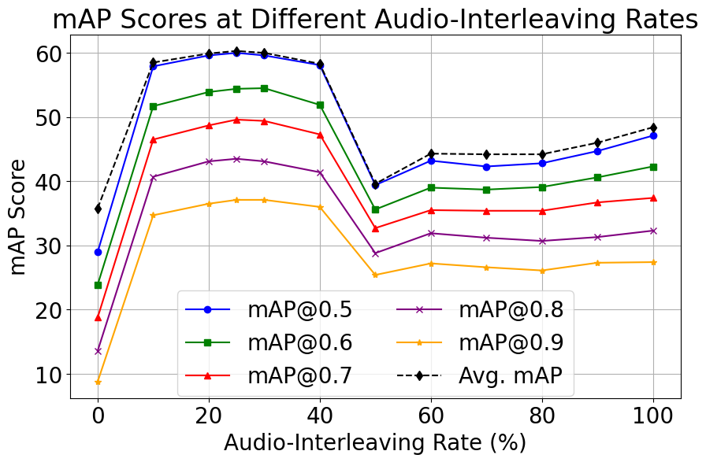
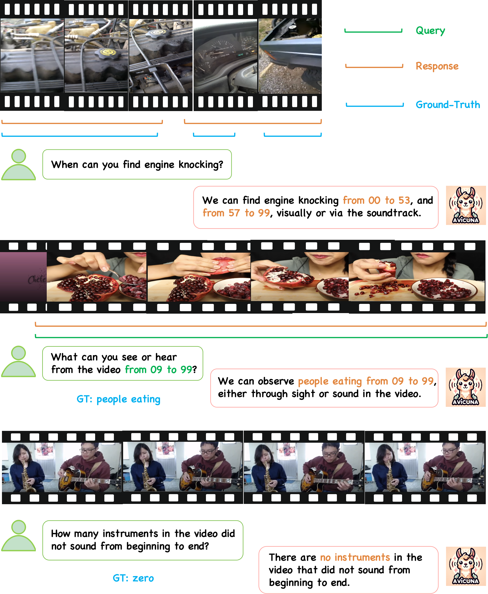

# AVicuna 是一种音频-视觉LLM模型，通过集成交错器与上下文边界对齐技术，专为解决时间参照对话问题而设计。

发布时间：2024年03月24日

`Agent` `对话系统` `多模态`

> AVicuna: Audio-Visual LLM with Interleaver and Context-Boundary Alignment for Temporal Referential Dialogue

# 摘要

> 在日常交流中，人们常用言语和手势进行指向性沟通，即所谓的参照性对话（RD）。尽管过往研究已借助LLMs或LMMs分析了静态环境下的RD，但对音频-视觉媒体中时间参照性对话（TRD）的探索尚显不足。目前面临的主要难题包括：缺乏带有详尽时间标注的原始音频-视觉视频大数据集，以及亟需有效整合复杂视听时序线索的方法。为此，我们创新提出一种框架，生成了名为PU-VALOR的丰富音频-视觉数据集，包含超114,000条带有精准时间分割的未剪辑视频。同时，我们推出AVicuna系统，其内置的音频-视觉信息交织器（AVTI）确保了视听信息的同步匹配。另外，我们构建了含有逾200,000组音频-文本对的A5-222K数据集，助力音频与文本间的准确对齐。实验证明，AVicuna能够出色应对音频-视觉视频中的TRD问题，并在各类音频-视觉视频理解任务中取得突破性成果，尤其是在处理未剪辑视频时。我们进一步探究了优化视听输入交织速率的问题，以期在音频-视觉事件密集定位任务中达到最佳性能表现。

> In everyday communication, humans frequently use speech and gestures to refer to specific areas or objects, a process known as Referential Dialogue (RD). While prior studies have investigated RD through Large Language Models (LLMs) or Large Multimodal Models (LMMs) in static contexts, the exploration of Temporal Referential Dialogue (TRD) within audio-visual media remains limited. Two primary challenges hinder progress in this field: (1) the absence of comprehensive, untrimmed audio-visual video datasets with precise temporal annotations, and (2) the need for methods to integrate complex temporal auditory and visual cues effectively. To address these challenges, we introduce a novel framework to generate PU-VALOR, an extensive audio-visual dataset comprising over 114,000 untrimmed videos with accurate temporal demarcations. We also present AVicuna, featuring an Audio-Visual Tokens Interleaver (AVTI) that ensures the temporal alignment of audio-visual information. Additionally, we develop the A5-222K dataset, encompassing more than 200,000 audio-text pairings, to facilitate the audio and text alignments. Our experiments demonstrate that AVicuna can effectively handle TRD in audio-visual videos and achieve state-of-the-art performance on various audio-visual video understanding tasks, particularly in untrimmed videos. We further investigate the optimal audio-interleaving rate for interleaved audio-visual inputs, which maximizes performance on the Audio-Visual Event Dense Localization task.

[Arxiv](https://arxiv.org/abs/2403.16276)