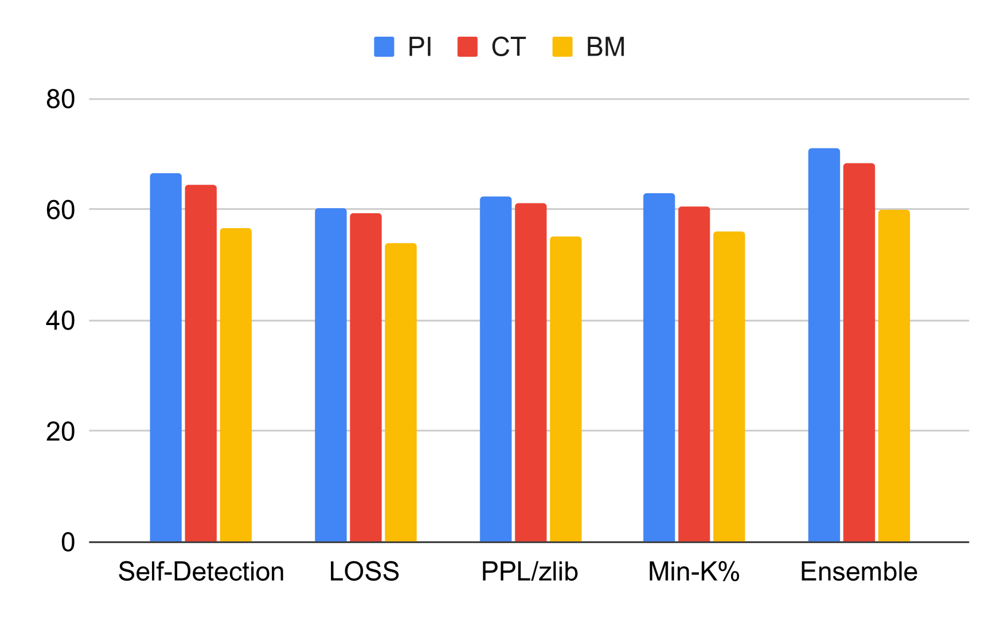
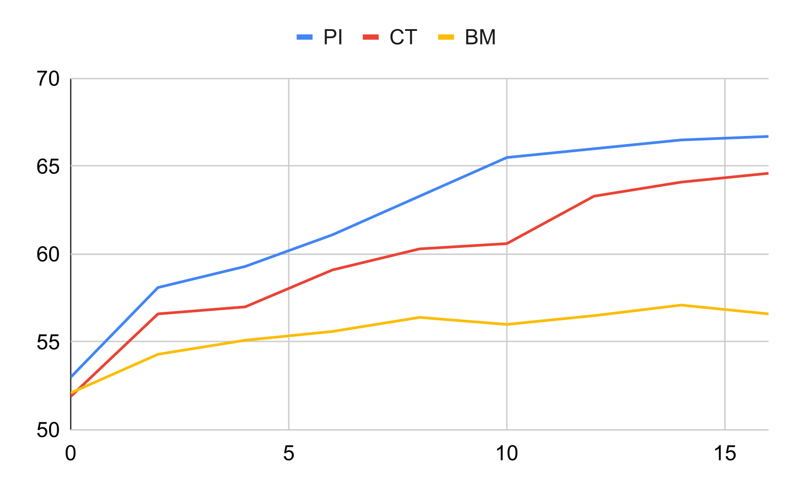

# 细小疏漏足以倾覆巨轮：全面剖析大型语言模型全程透明度难题

发布时间：2024年03月24日

`LLM安全` `隐私保护`

> A Little Leak Will Sink a Great Ship: Survey of Transparency for Large Language Models from Start to Finish

> LLMs基于海量网络抓取语料训练，但这隐藏着数据泄露风险，涉及个人隐私、版权文本和基准数据等。这些泄露可能因无授权内容生成或性能误判而损害人们对AI的信任。针对这一问题，我们提出了三大评价指标：泄露率（训练数据中泄露信息占比）、输出率（生成泄露信息的难易度）和检测率（区分泄露与非泄露数据的能力）。尽管泄露率是泄露问题的根源，但目前尚不清楚其如何作用于输出率和检测率。本研究通过实验证明两者间的关系，针对个人隐私、版权文本和基准数据三类信息，探讨了泄露率与输出率和检测率的关联。同时，我们创新性地提出一种基于少量样本学习的自我检测方法，使LLMs能够判断自身训练数据中是否存在特定实例，相比传统无需明确学习的手段更为先进。为了揭示生成泄露信息的容易程度，我们设计了一组引导LLMs产出个人隐私、版权文本和基准数据的提示，并构建了相应的数据集。实验发现，即使在训练数据中含有的泄露信息不多，LLMs在多数情况下也能生成此类信息，暗示少量泄露数据就可能显著影响模型输出。最后，我们的自我检测方法在对比测试中显示出超越现有检测技术的良好效果。

> Large Language Models (LLMs) are trained on massive web-crawled corpora. This poses risks of leakage, including personal information, copyrighted texts, and benchmark datasets. Such leakage leads to undermining human trust in AI due to potential unauthorized generation of content or overestimation of performance. We establish the following three criteria concerning the leakage issues: (1) leakage rate: the proportion of leaked data in training data, (2) output rate: the ease of generating leaked data, and (3) detection rate: the detection performance of leaked versus non-leaked data. Despite the leakage rate being the origin of data leakage issues, it is not understood how it affects the output rate and detection rate. In this paper, we conduct an experimental survey to elucidate the relationship between the leakage rate and both the output rate and detection rate for personal information, copyrighted texts, and benchmark data. Additionally, we propose a self-detection approach that uses few-shot learning in which LLMs detect whether instances are present or absent in their training data, in contrast to previous methods that do not employ explicit learning. To explore the ease of generating leaked information, we create a dataset of prompts designed to elicit personal information, copyrighted text, and benchmarks from LLMs. Our experiments reveal that LLMs produce leaked information in most cases despite less such data in their training set. This indicates even small amounts of leaked data can greatly affect outputs. Our self-detection method showed superior performance compared to existing detection methods.

[Arxiv](https://arxiv.org/abs/2403.16139)