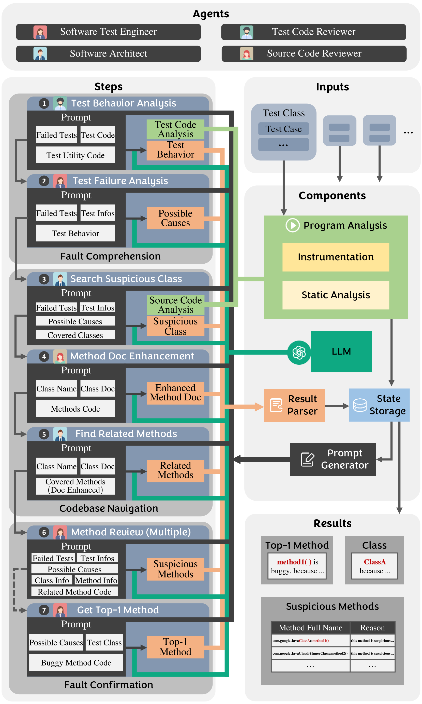
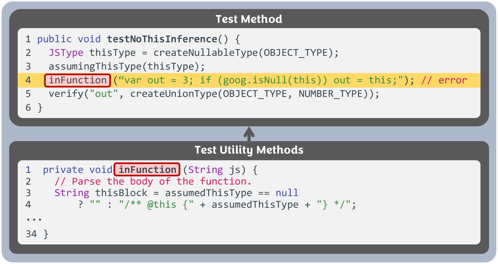
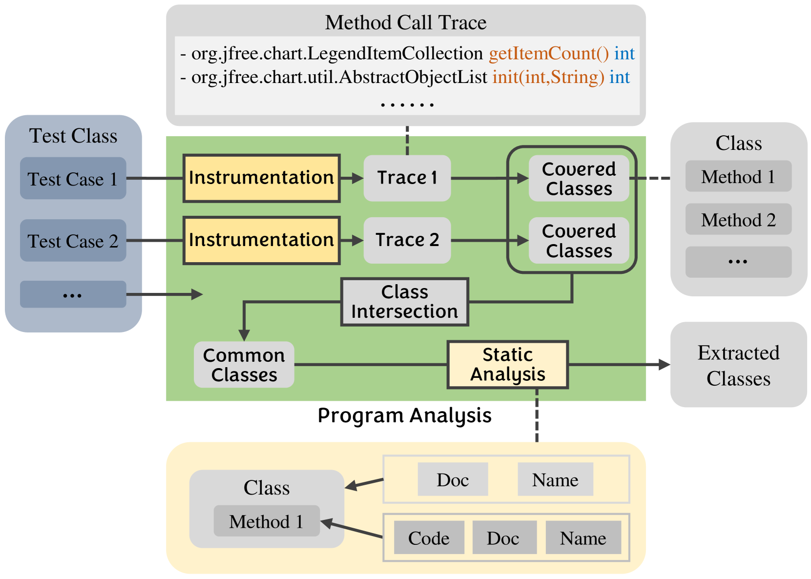
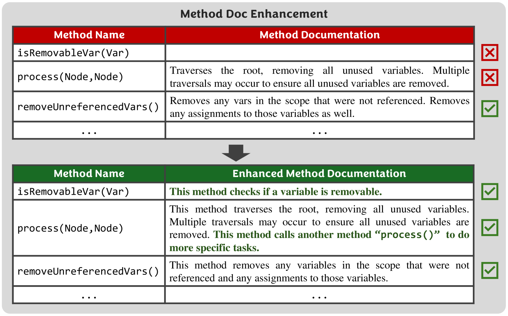
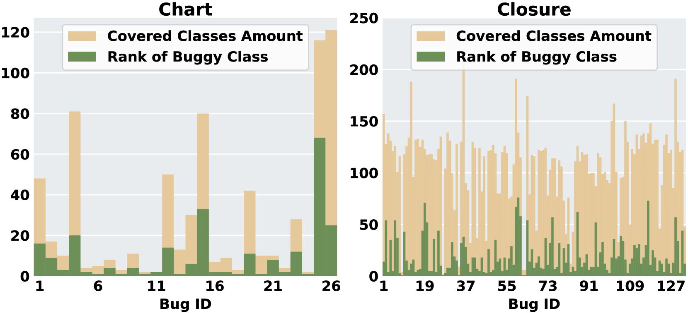
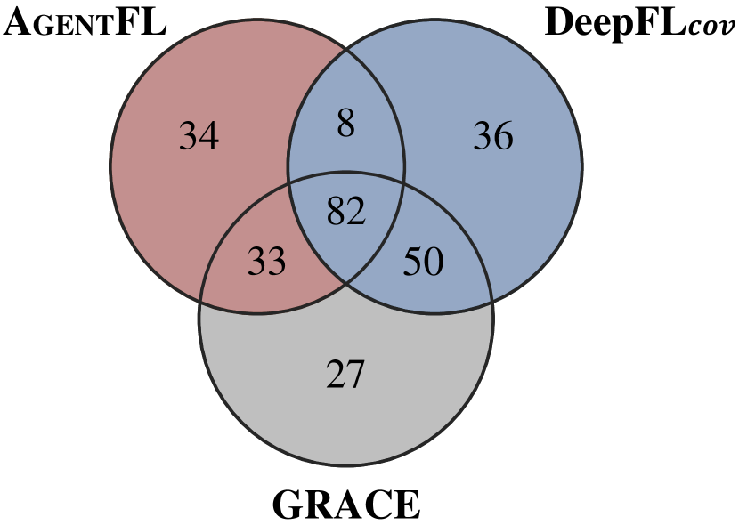
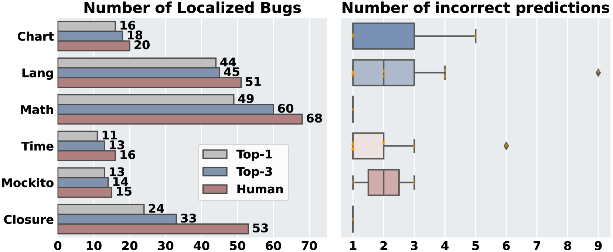
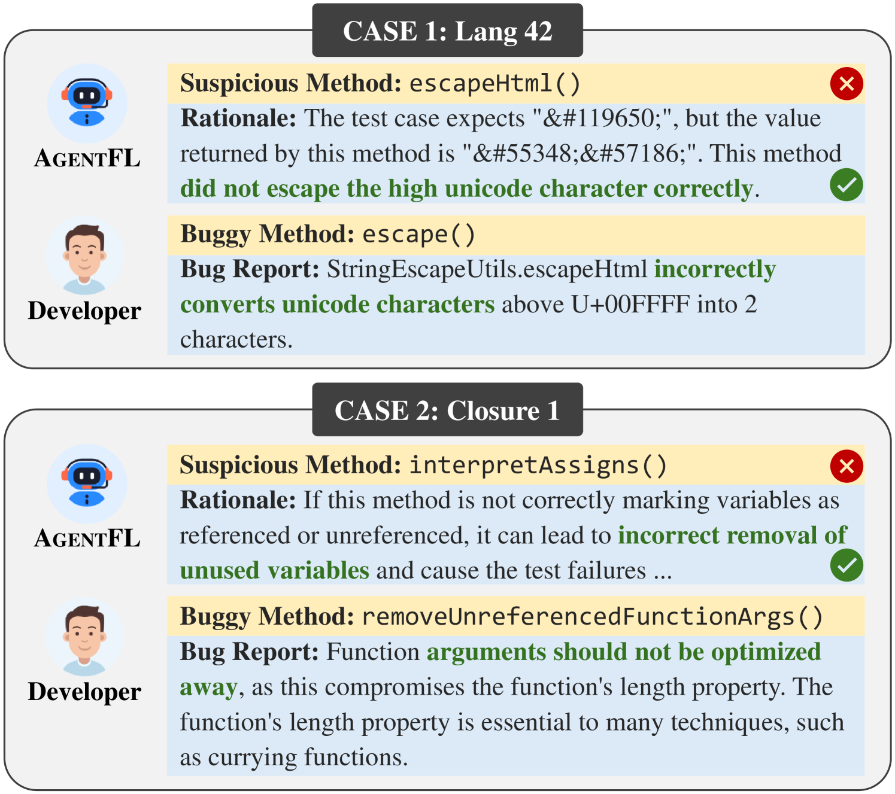
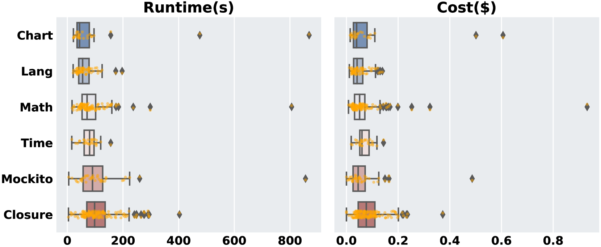

# AgentFL：致力于将基于大型语言模型（LLM）的故障定位技术推广至项目层面的全局上下文环境中。

发布时间：2024年03月24日

`Agent` `软件工程` `人工智能`

> AgentFL: Scaling LLM-based Fault Localization to Project-Level Context

> 在调试过程中，故障定位（FL）扮演着重要角色，而近期强大的大型语言模型（LLMs）在解析代码并诊断其中错误上已崭露头角。然而，鉴于LLMs在处理大篇幅上下文时的能力受限，目前基于LLM的故障定位方法大多只能在较小代码范围内（如单个方法或类）定位问题，面对整个软件系统的全局错误诊断显得力不从心。为此，本研究提出了AgentFL——一种基于ChatGPT的多智能体自动化故障定位系统。该系统模拟真人开发者的工作流程，将故障定位拆解为理解、导航和确认三步走策略，并在每一步骤中启用具有多样专长的智能体，各司其职，运用不同的工具解决具体问题。为了攻克各步骤难题，我们引入了诸如测试行为跟踪、文档导向搜索以及多轮对话等一系列辅助策略。实验证明，在广泛使用的Defects4J-V1.2.0基准测试中，AgentFL能在Top-1位置成功定位395个bug中的157个，不仅超越其他基于LLM的方法，而且与最前沿的学习型技术形成有效互补。同时，消融研究肯定了AgentFL内部组件的重要性，用户研究则展示了其实际应用的便利性。最终的成本分析显示，AgentFL定位单个bug的平均成本仅为0.074美元及97秒。

> Fault Localization (FL) is an essential step during the debugging process. With the strong capabilities of code comprehension, the recent Large Language Models (LLMs) have demonstrated promising performance in diagnosing bugs in the code. Nevertheless, due to LLMs' limited performance in handling long contexts, existing LLM-based fault localization remains on localizing bugs within a small code scope (i.e., a method or a class), which struggles to diagnose bugs for a large code scope (i.e., an entire software system). To address the limitation, this paper presents AgentFL, a multi-agent system based on ChatGPT for automated fault localization. By simulating the behavior of a human developer, AgentFL models the FL task as a three-step process, which involves comprehension, navigation, and confirmation. Within each step, AgentFL hires agents with diversified expertise, each of which utilizes different tools to handle specific tasks. Particularly, we adopt a series of auxiliary strategies such as Test Behavior Tracking, Document-Guided Search, and Multi-Round Dialogue to overcome the challenges in each step. The evaluation on the widely used Defects4J-V1.2.0 benchmark shows that AgentFL can localize 157 out of 395 bugs within Top-1, which outperforms the other LLM-based approaches and exhibits complementarity to the state-of-the-art learning-based techniques. Additionally, we confirm the indispensability of the components in AgentFL with the ablation study and demonstrate the usability of AgentFL through a user study. Finally, the cost analysis shows that AgentFL spends an average of only 0.074 dollars and 97 seconds for a single bug.

[Arxiv](https://arxiv.org/abs/2403.16362)