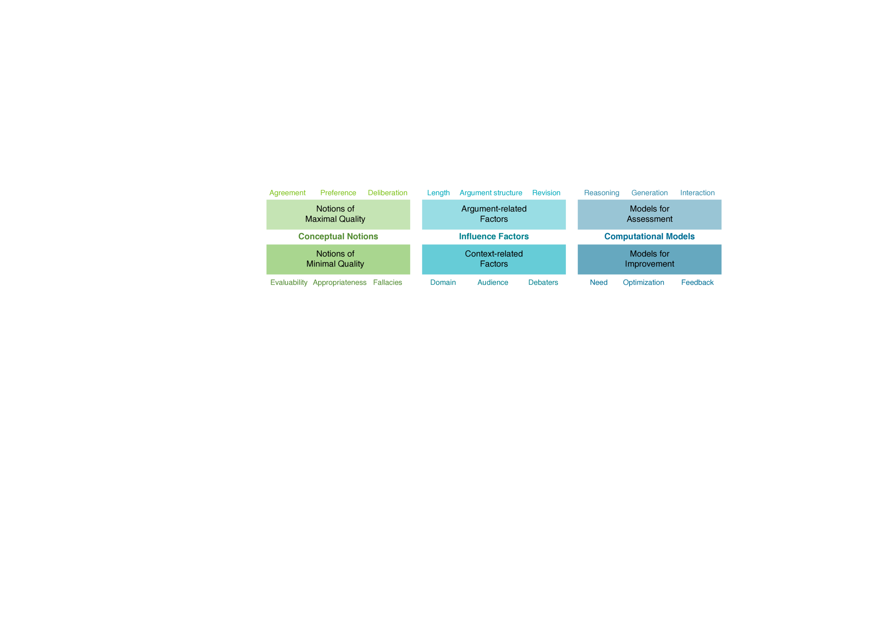
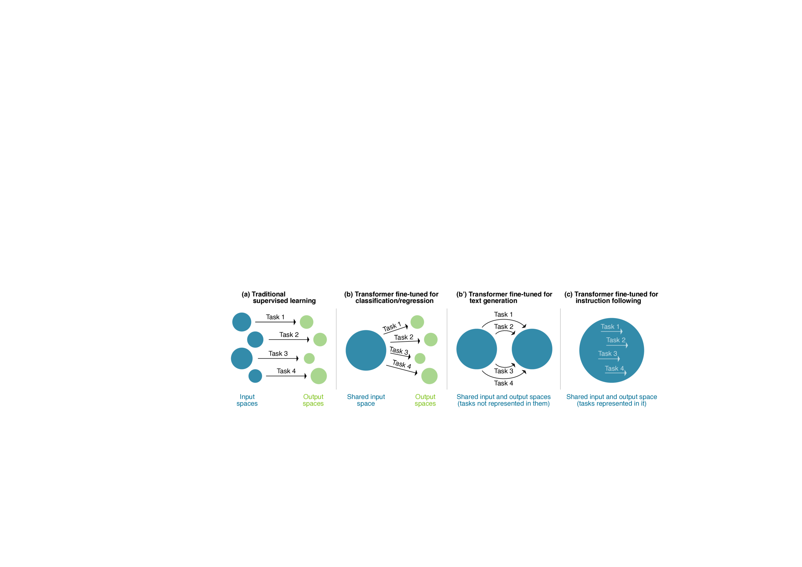

# 在当前遵循指令的大规模语言模型时代，针对论据质量评估的研究

发布时间：2024年03月24日

`LLM应用` `论证分析`

> Argument Quality Assessment in the Age of Instruction-Following Large Language Models

# 摘要

> 鉴于论证处理技术对诸如观点塑造、决策制定、写作教育等多个领域可能产生的深远影响，关于争议性问题的计算论证研究已在NLP领域引起了广泛的关注。其中，评估一个论证的质量是关键所在，但这同时也是个相当棘手的问题。本文从对论证质量研究的简短综述出发，指出质量概念的多样性和主观认知是制约论证质量评估取得突破的主要障碍。我们主张，能够跨情境运用知识的遵循指令的大规模语言模型（LLMs）有能力提供更为可靠的论证质量评估。为此，我们不应仅仅为了在评估任务排行榜上争先而对LLMs进行简单的微调优化，而应系统地引入论证理论、实际应用场景以及解决论证相关问题的方法对其进行指导。进一步，我们将探讨这一方法所开启的现实机遇以及随之产生的伦理议题。

> The computational treatment of arguments on controversial issues has been subject to extensive NLP research, due to its envisioned impact on opinion formation, decision making, writing education, and the like. A critical task in any such application is the assessment of an argument's quality - but it is also particularly challenging. In this position paper, we start from a brief survey of argument quality research, where we identify the diversity of quality notions and the subjectiveness of their perception as the main hurdles towards substantial progress on argument quality assessment. We argue that the capabilities of instruction-following large language models (LLMs) to leverage knowledge across contexts enable a much more reliable assessment. Rather than just fine-tuning LLMs towards leaderboard chasing on assessment tasks, they need to be instructed systematically with argumentation theories and scenarios as well as with ways to solve argument-related problems. We discuss the real-world opportunities and ethical issues emerging thereby.

[Arxiv](https://arxiv.org/abs/2403.16084)