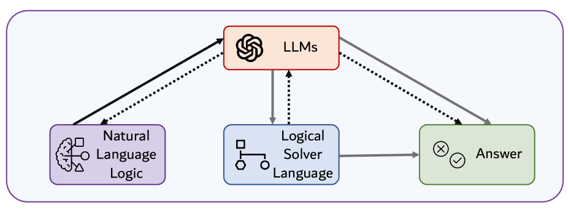
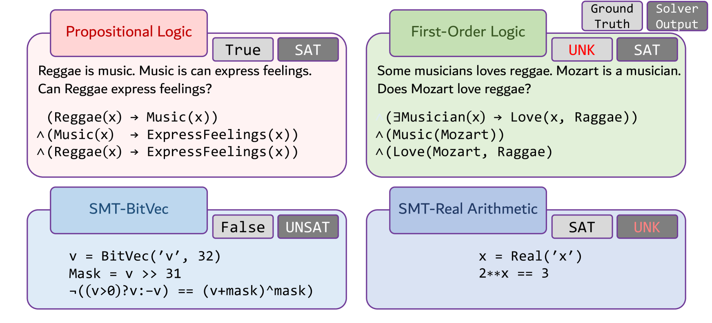
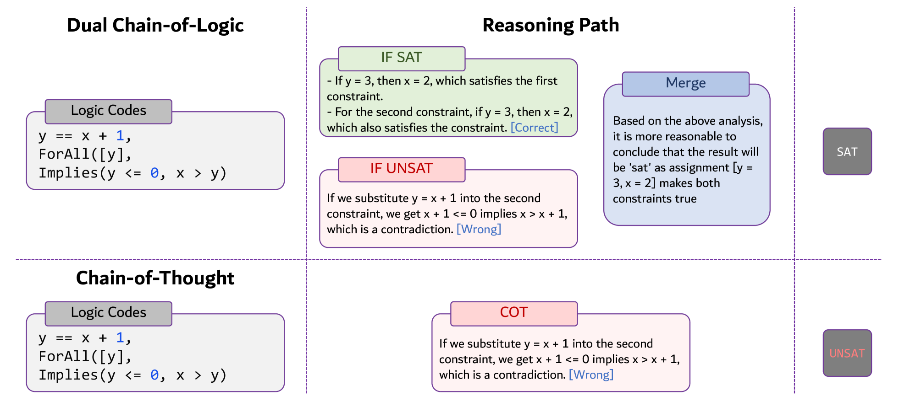
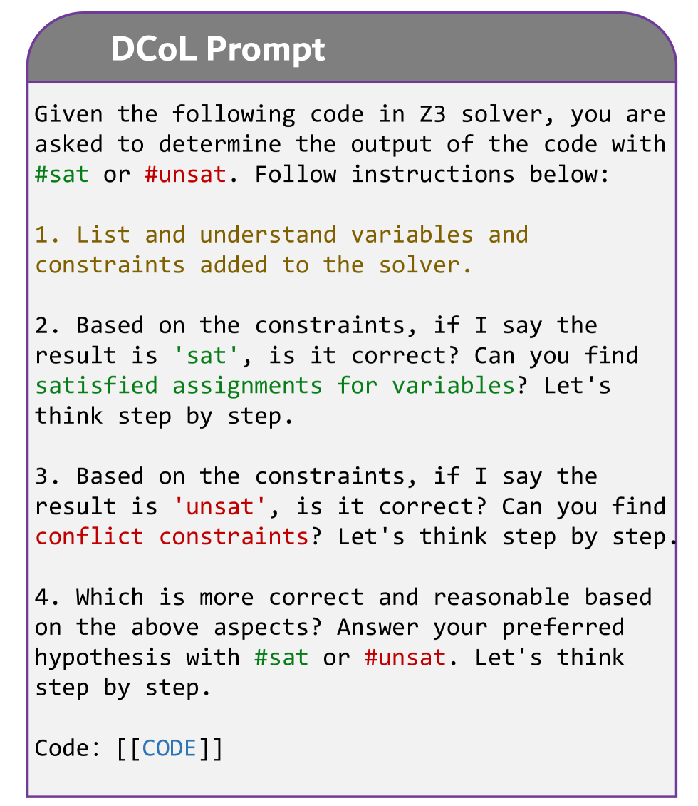
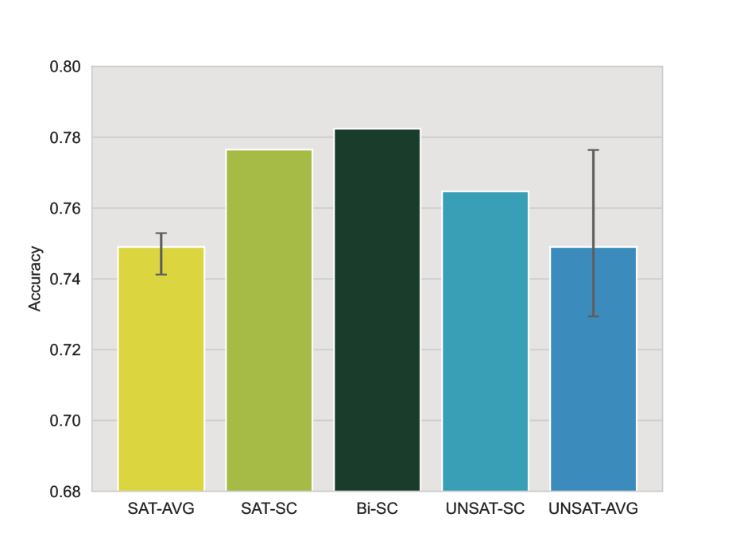
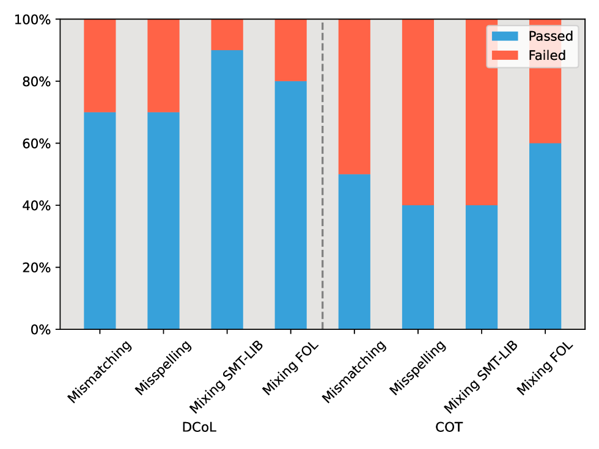
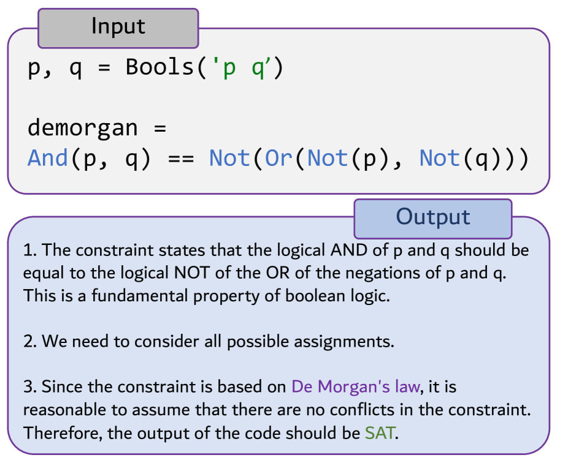
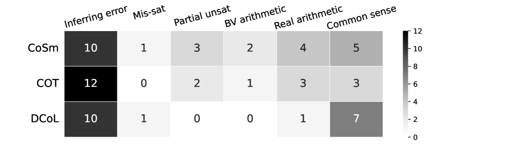

# 语言模型是否可以扮演解算器角色？此研究聚焦于LLMs如何模拟逻辑代码运行，并探索其在此领域的潜力。

发布时间：2024年03月24日

`LLM应用` `逻辑编程`

> Can Language Models Pretend Solvers? Logic Code Simulation with LLMs

> 近年来，Transformer架构的LLMs在处理逻辑问题上展现出了强大的潜能，众多研究借力LLMs的卓越代码处理能力，提出运用逻辑求解器进行逻辑推理的框架。尽管大部分研究聚焦于将LLMs用作自然语言逻辑处理器或翻译工具，但对于其扮演逻辑代码解释器和执行者的角色却相对忽视。本研究着眼于一项创新领域——逻辑代码模拟，让LLMs模仿逻辑求解器预测逻辑程序的结果。为了深入了解此新课题，我们提出了三个核心研究问题：LLMs能否高效模拟逻辑代码输出？逻辑代码模拟带来了哪些优势？又存在哪些挑战？为此，我们专门构建了三个全新的逻辑代码模拟任务数据集，并通过全面实验确立了LLMs在此类模拟任务中的基准性能。接下来，我们推出了一项名为“双逻辑链”(DCoL)的开创性LLM代码模拟技术。这项技术倡导采用双路径思维模式训练LLMs，相比其他LLM提示策略，已在GPT-4-Turbo上实现了高达7.06%的显著精度提升，居于行业领先地位。

> Transformer-based large language models (LLMs) have demonstrated significant potential in addressing logic problems. capitalizing on the great capabilities of LLMs for code-related activities, several frameworks leveraging logical solvers for logic reasoning have been proposed recently. While existing research predominantly focuses on viewing LLMs as natural language logic solvers or translators, their roles as logic code interpreters and executors have received limited attention. This study delves into a novel aspect, namely logic code simulation, which forces LLMs to emulate logical solvers in predicting the results of logical programs. To further investigate this novel task, we formulate our three research questions: Can LLMs efficiently simulate the outputs of logic codes? What strength arises along with logic code simulation? And what pitfalls? To address these inquiries, we curate three novel datasets tailored for the logic code simulation task and undertake thorough experiments to establish the baseline performance of LLMs in code simulation. Subsequently, we introduce a pioneering LLM-based code simulation technique, Dual Chains of Logic (DCoL). This technique advocates a dual-path thinking approach for LLMs, which has demonstrated state-of-the-art performance compared to other LLM prompt strategies, achieving a notable improvement in accuracy by 7.06% with GPT-4-Turbo.

[Arxiv](https://arxiv.org/abs/2403.16097)