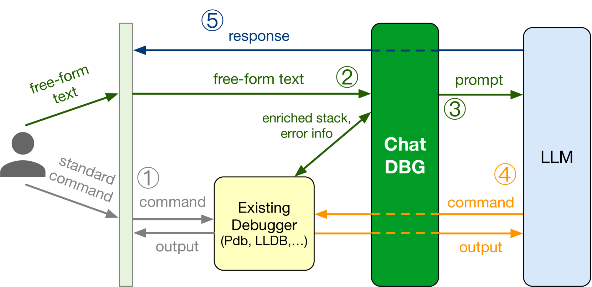
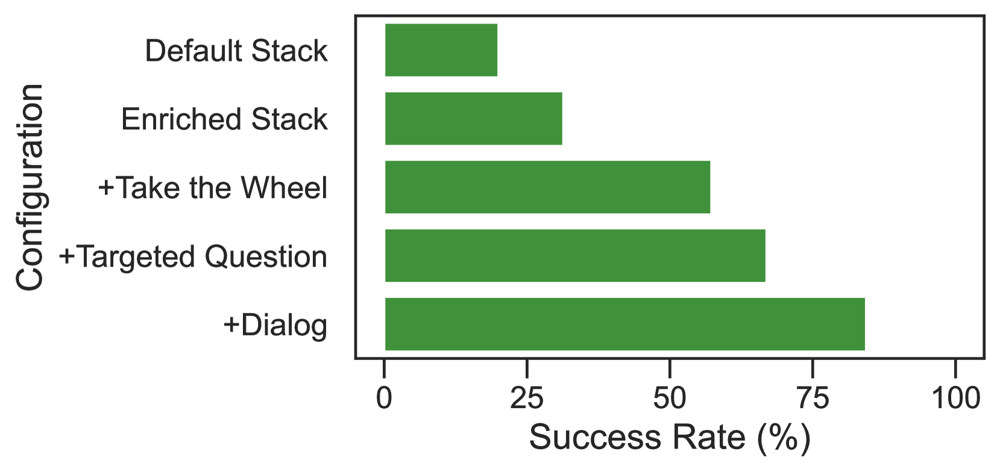
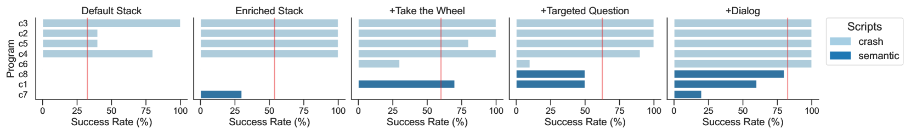
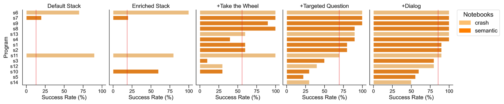
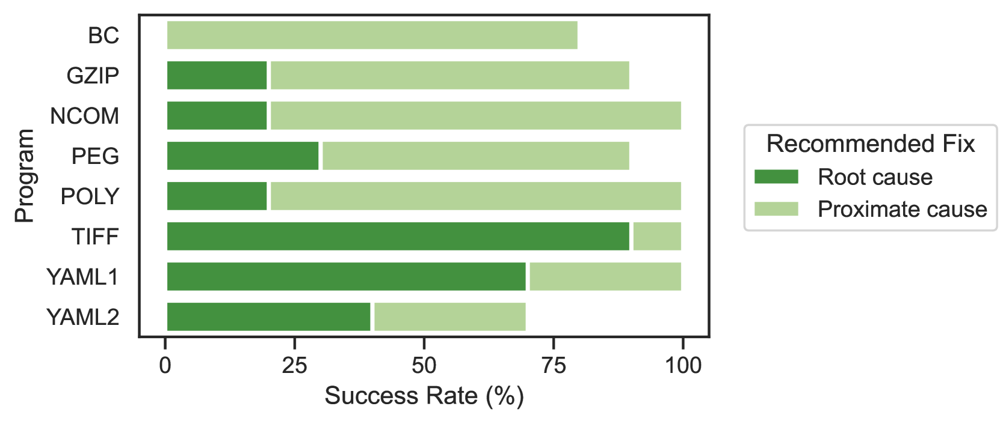

# ChatDBG 是一款集成了先进 AI 技术的智能调试助手。

发布时间：2024年03月24日

`Agent` `软件开发` `人工智能`

> ChatDBG: An AI-Powered Debugging Assistant

# 摘要

> 本文推出了首款搭载AI的调试助手ChatDBG，它巧妙融合了大型语言模型(LLMs)，大大增强了传统调试器的功能和交互性。ChatDBG让程序员能与调试器展开互动对话，针对程序状态抛出复杂问题，深入挖掘崩溃或断言失败的根本原因，甚至探究如“为何x为空”等开放性问题。面对这些挑战，ChatDBG授权LLM自主把控调试过程，通过发送指令在堆栈间导航并检查程序状态，进而反馈查找结果并交还控制权给程序员。目前，ChatDBG原型已经成功集成了适用于原生代码的LLDB、GDB、WinDBG以及Python的Pdb等标准调试器。在涵盖含已知缺陷的C/C++代码及包括独立脚本与Jupyter笔记本在内的一系列Python代码的广泛评估中，ChatDBG展现出了强大的能力，能有效分析各类真实场景下的错误根源、清晰解释bug，并精准生成对应的修复策略。在处理Python程序时，仅需一次查询就有67%的概率找到切实可行的修复方法；而经过一次额外的追问，这一成功率可提升至85%。ChatDBG备受青睐，已迅速获得近30,000次的下载量。

> This paper presents ChatDBG, the first AI-powered debugging assistant. ChatDBG integrates large language models (LLMs) to significantly enhance the capabilities and user-friendliness of conventional debuggers. ChatDBG lets programmers engage in a collaborative dialogue with the debugger, allowing them to pose complex questions about program state, perform root cause analysis for crashes or assertion failures, and explore open-ended queries like "why is x null?". To handle these queries, ChatDBG grants the LLM autonomy to take the wheel and drive debugging by issuing commands to navigate through stacks and inspect program state; it then reports its findings and yields back control to the programmer. Our ChatDBG prototype integrates with standard debuggers including LLDB, GDB, and WinDBG for native code and Pdb for Python. Our evaluation across a diverse set of code, including C/C++ code with known bugs and a suite of Python code including standalone scripts and Jupyter notebooks, demonstrates that ChatDBG can successfully analyze root causes, explain bugs, and generate accurate fixes for a wide range of real-world errors. For the Python programs, a single query led to an actionable bug fix 67% of the time; one additional follow-up query increased the success rate to 85%. ChatDBG has seen rapid uptake; it has already been downloaded nearly 30,000 times.

[Arxiv](https://arxiv.org/abs/2403.16354)