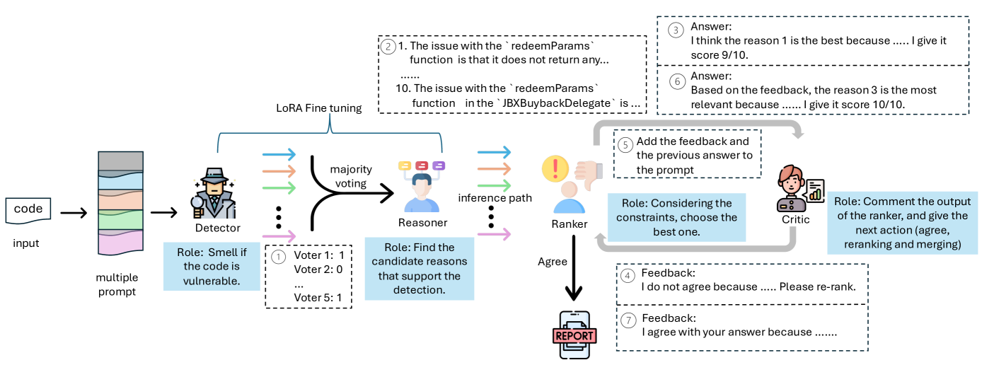
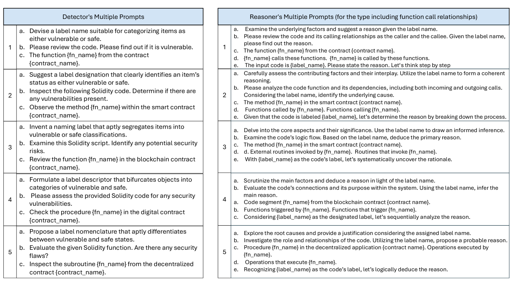
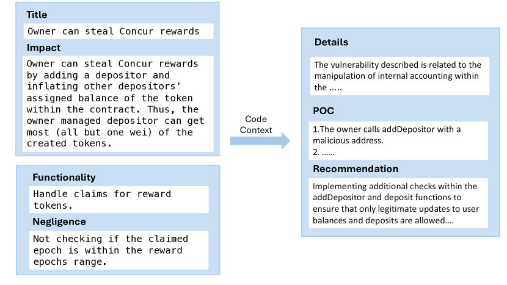
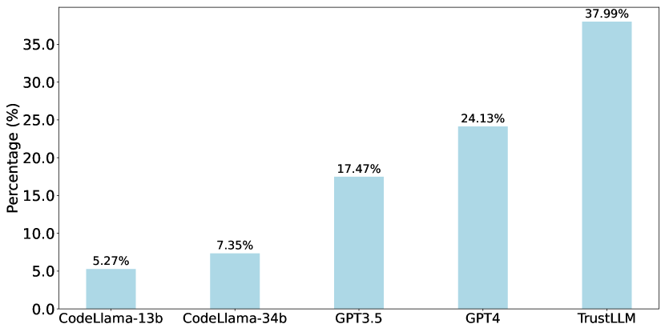
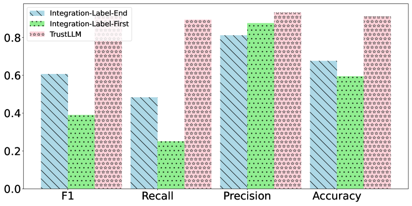
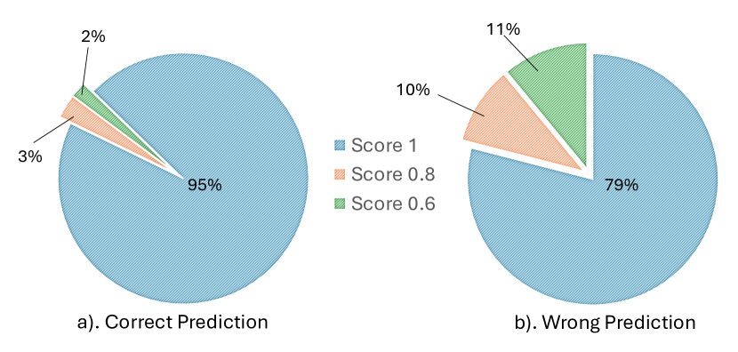
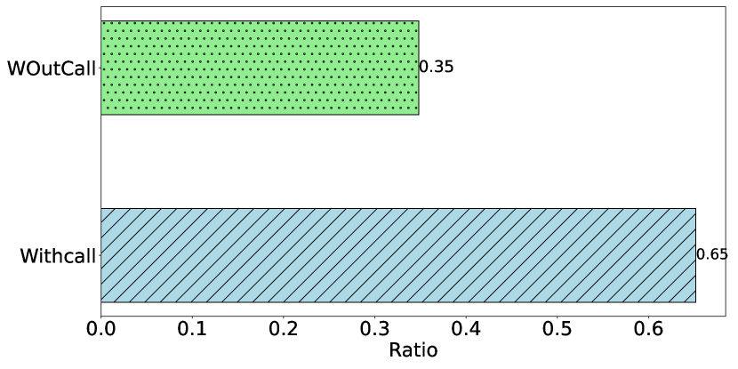

# 通过融合微调技术和基于大型语言模型（LLM）的代理，我们致力于打造一种直观且附带充分解释的智能合约审计方案。

发布时间：2024年03月24日

`LLM应用` `区块链` `智能合约安全`

> Combining Fine-Tuning and LLM-based Agents for Intuitive Smart Contract Auditing with Justifications

# 摘要

> 智能合约是构建在类似以太坊的区块链基础之上的一种去中心化应用，最新研究揭示了大型语言模型（LLMs）在审计智能合约上有潜在价值，不过即使是最尖端的GPT-4，在同时判断正确并给出合理解释时，其精度也仅能达到30%，这是因为市面上的LLMs多是在通用文本和代码语料库上预训练，而非专门针对Solidity智能合约审计领域进行微调。本文提出了TrustLLM这一通用框架，它巧妙融合了微调技术和基于LLM的代理，以实现直观且具备充分理由的智能合约审计。TrustLLM的设计灵感来源于专业人类审计员先发现问题苗头，再深入代码分析找寻根本原因的工作流程。因此，TrustLLM采用了双阶段微调策略，首先优化Detector模型以作出判断，随后进一步优化Reasoner模型以生成漏洞的根本原因。然而，单纯依靠微调尚无法精确锁定最佳漏洞原因，故此，我们引入了两个基于LLM的智能助手——Ranker和Critic，它们会依据已微调的Reasoner模型输出结果，通过迭代筛选和辩论，确定最恰当的漏洞原因。为了验证TrustLLM的有效性，我们搜集了一个均衡的数据集，包括1734个正例和1810个负例样本，对其进行针对性微调。然后我们将TrustLLM与常规微调模型（例如CodeBERT、GraphCodeBERT、CodeT5和UnixCoder）以及基于提示学习的LLMs（如GPT-4、GPT-3.5和CodeLlama-13b/34b）一较高下。在一个包含263个实际智能合约漏洞的数据集上，TrustLLM取得了高达91.21%的F1得分和91.11%的准确率。相较于真实原因，TrustLLM生成的原因一致性约为38%。

> Smart contracts are decentralized applications built atop blockchains like Ethereum. Recent research has shown that large language models (LLMs) have potential in auditing smart contracts, but the state-of-the-art indicates that even GPT-4 can achieve only 30% precision (when both decision and justification are correct). This is likely because off-the-shelf LLMs were primarily pre-trained on a general text/code corpus and not fine-tuned on the specific domain of Solidity smart contract auditing.
  In this paper, we propose TrustLLM, a general framework that combines fine-tuning and LLM-based agents for intuitive smart contract auditing with justifications. Specifically, TrustLLM is inspired by the observation that expert human auditors first perceive what could be wrong and then perform a detailed analysis of the code to identify the cause. As such, TrustLLM employs a two-stage fine-tuning approach: it first tunes a Detector model to make decisions and then tunes a Reasoner model to generate causes of vulnerabilities. However, fine-tuning alone faces challenges in accurately identifying the optimal cause of a vulnerability. Therefore, we introduce two LLM-based agents, the Ranker and Critic, to iteratively select and debate the most suitable cause of vulnerability based on the output of the fine-tuned Reasoner model. To evaluate TrustLLM, we collected a balanced dataset with 1,734 positive and 1,810 negative samples to fine-tune TrustLLM. We then compared it with traditional fine-tuned models (CodeBERT, GraphCodeBERT, CodeT5, and UnixCoder) as well as prompt learning-based LLMs (GPT4, GPT-3.5, and CodeLlama-13b/34b). On a dataset of 263 real smart contract vulnerabilities, TrustLLM achieves an F1 score of 91.21% and an accuracy of 91.11%. The causes generated by TrustLLM achieved a consistency of about 38% compared to the ground truth causes.

[Arxiv](https://arxiv.org/abs/2403.16073)