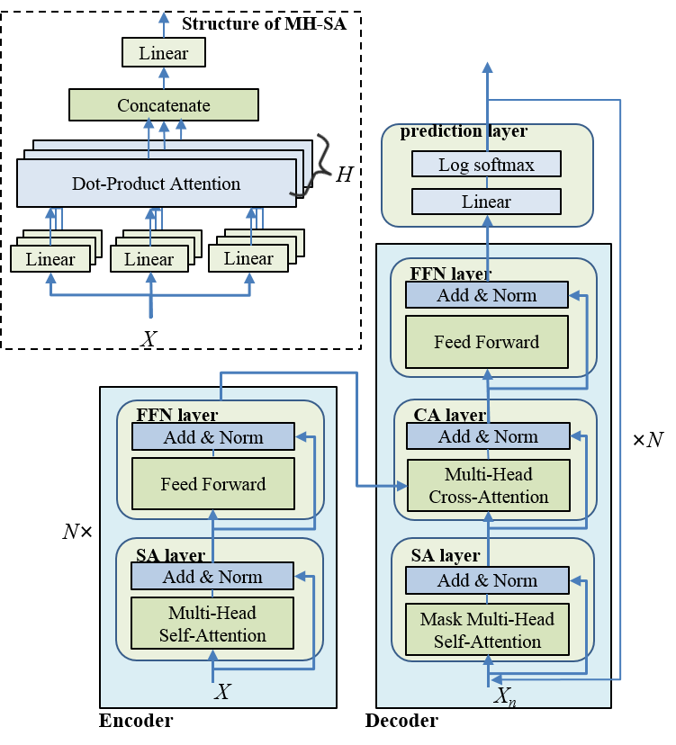
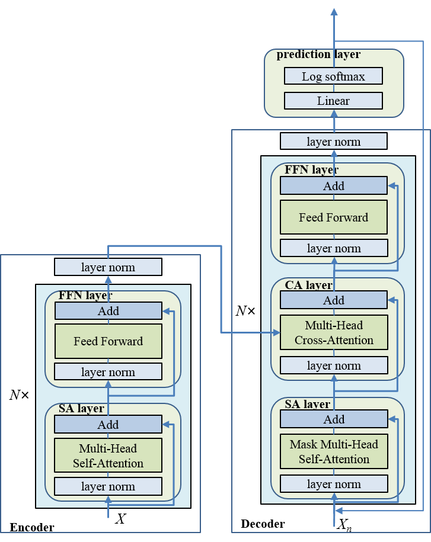
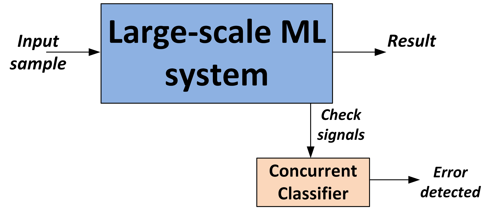
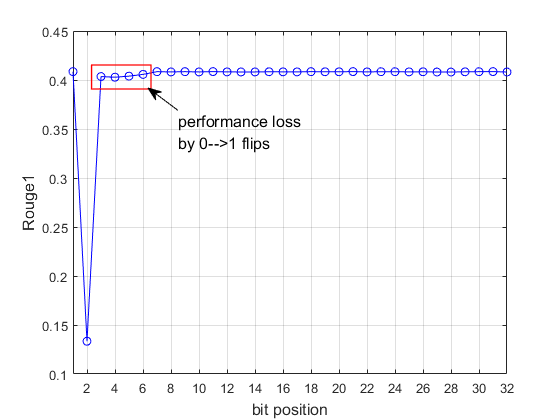
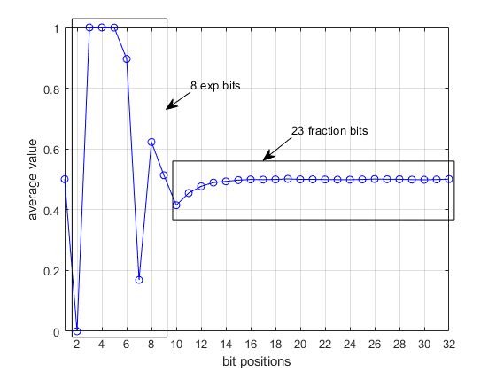
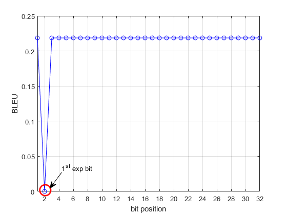
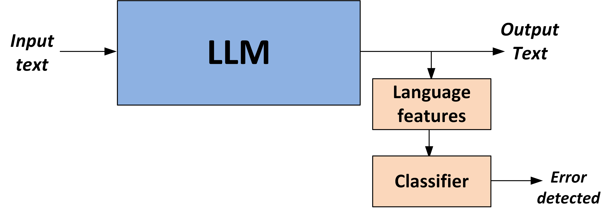
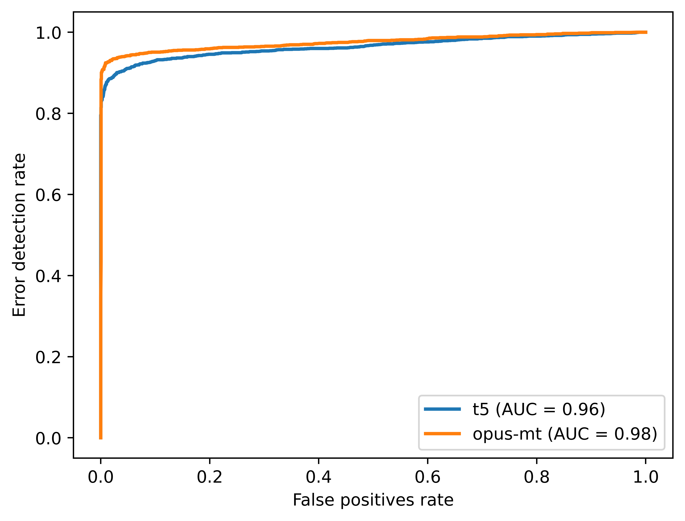

# CLED技术应用于大型语言模型，旨在实时检测并修正其中的语言错误。

发布时间：2024年03月24日

`LLM应用` `模型可靠性检测`

> Concurrent Linguistic Error Detection (CLED) for Large Language Models

> 随着LLMs广泛应用，其可靠性的保障变得至关重要。首要任务是发现并减少其对系统的潜在影响，因此，发展LLMs高效错误检测技术显得尤为关键。然而，在很多场景下，LLM被视作一个不透明的黑盒，无法探查其内部节点，这导致诸多依赖内部信息的错误检测策略难以实施。但值得注意的是，LLM在正确运作时产生的文本应具有有效性与规范性。因此，若生成的文本异常或偏离常态，则可能存在错误的可能性较大。基于这一洞察，我们提出了并发语言错误检测（CLED）方法，该方法提取LLM生成文本的部分语言特性，并通过一个并发分类器进行错误甄别。鉴于此检测机制仅需依据模型输出即可运作，故特别适用于无法触及内部节点的LLMs环境。我们在新闻摘要任务中采用的T5模型及翻译任务中运用的OPUS-MT模型上验证了CLED方案，均采用相同的一套语言特征以展示其在具体应用以外的普适性。实验证明，CLED能在较小资源消耗的基础上成功检测出大部分错误，并且通过调整并发分类器的工作方式，可灵活平衡错误检测效果与相应资源消耗，为设计者提供更多选择空间。

> The wide adoption of Large language models (LLMs) makes their dependability a pressing concern. Detection of errors is the first step to mitigating their impact on a system and thus, efficient error detection for LLMs is an important issue. In many settings, the LLM is considered as a black box with no access to the internal nodes; this prevents the use of many error detection schemes that need access to the model's internal nodes. An interesting observation is that the output of LLMs in error-free operation should be valid and normal text. Therefore, when the text is not valid or differs significantly from normal text, it is likely that there is an error. Based on this observation we propose to perform Concurrent Linguistic Error Detection (CLED); this scheme extracts some linguistic features of the text generated by the LLM and feeds them to a concurrent classifier that detects errors. Since the proposed error detection mechanism only relies on the outputs of the model, then it can be used on LLMs in which there is no access to the internal nodes. The proposed CLED scheme has been evaluated on the T5 model when used for news summarization and on the OPUS-MT model when used for translation. In both cases, the same set of linguistic features has been used for error detection to illustrate the applicability of the proposed scheme beyond a specific case. The results show that CLED can detect most of the errors at a low overhead penalty. The use of the concurrent classifier also enables a trade-off between error detection effectiveness and its associated overhead, so providing flexibility to a designer.

[Arxiv](https://arxiv.org/abs/2403.16393)