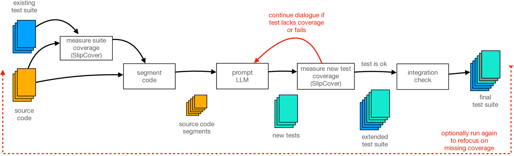
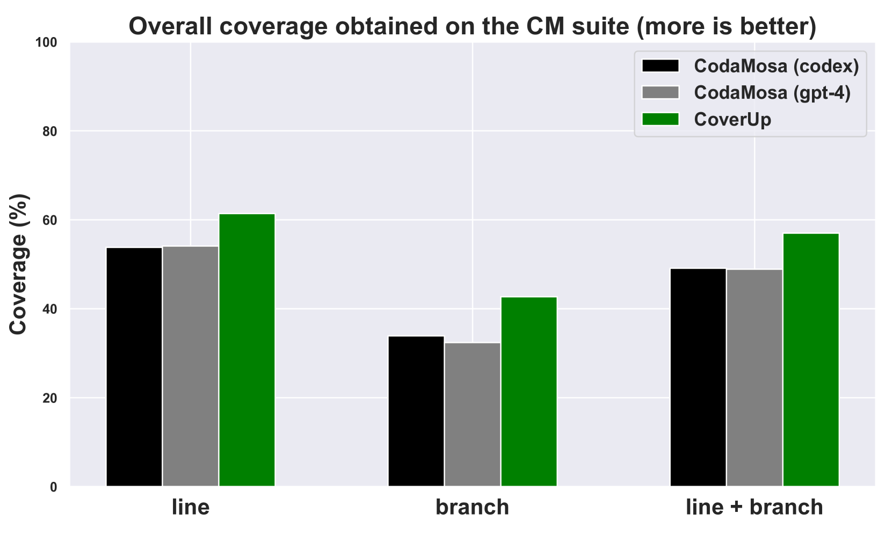
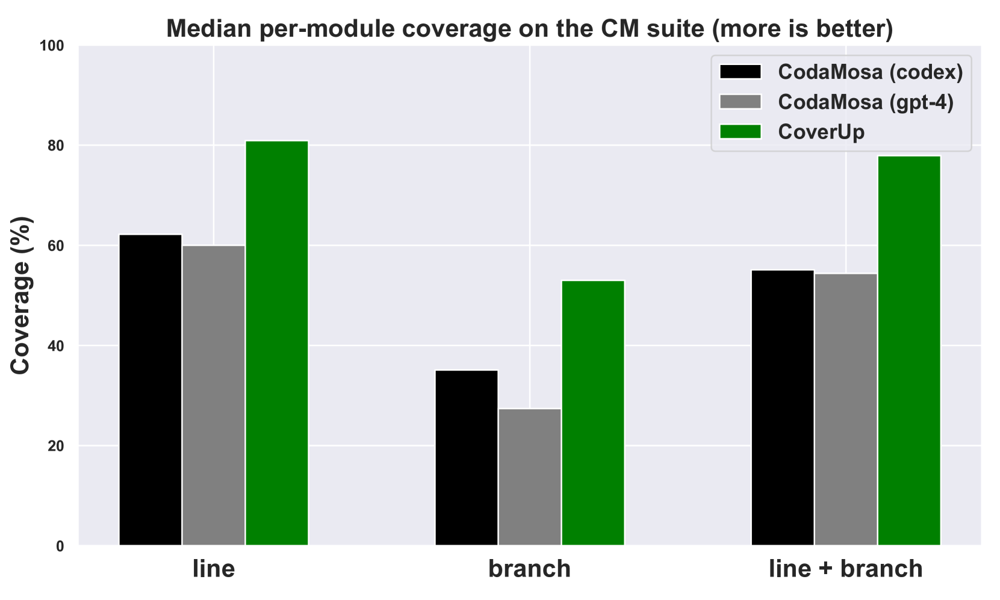
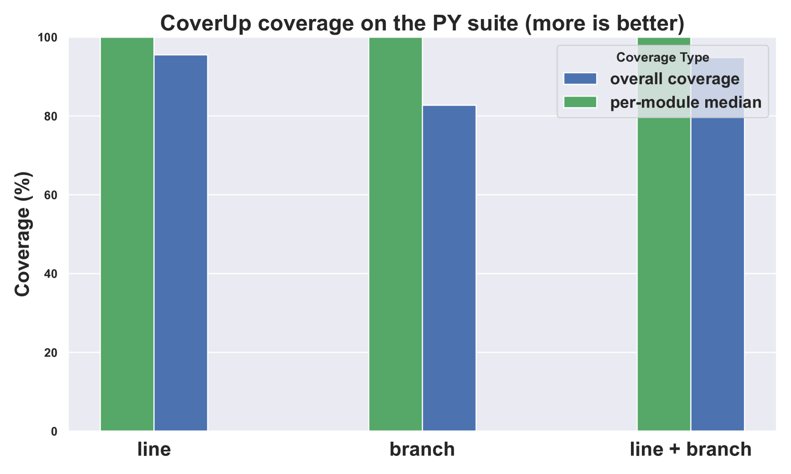
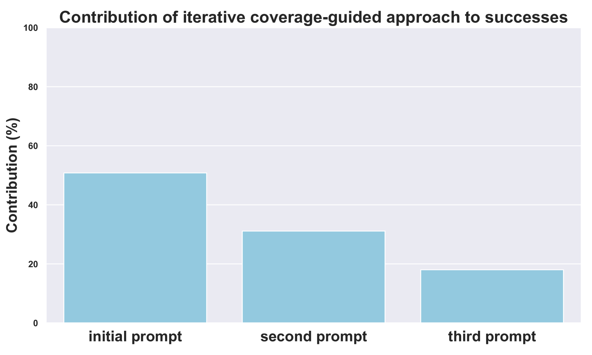
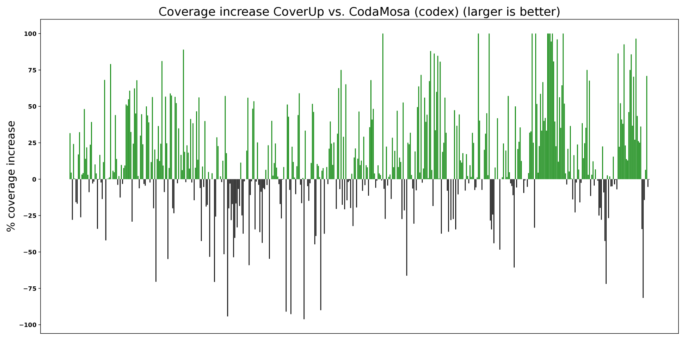

# CoverUp：一种以覆盖率为导向的大规模语言模型测试生成技术，旨在利用覆盖率信息引导LLM进行高效的测试用例生成。

发布时间：2024年03月24日

`Agent` `软件工程` `自动化测试`

> CoverUp: Coverage-Guided LLM-Based Test Generation

# 摘要

> 本文呈现了创新系统CoverUp，它巧妙融合了覆盖率分析和大型语言模型(LLMs)，推动生成高覆盖率的Python回归测试。CoverUp步步为营，通过与LLM交互式对话并穿插进行覆盖率分析，精准聚焦未覆盖的行和分支，从而显著提升现有技术的覆盖率。实验证明，相较于混合型LLM/CodaMosa搜索式测试系统，CoverUp在各方面均大幅度提高覆盖率，具体到每个模块，CoverUp的中位数行覆盖率高达81%，比CodaMosa高出近20个百分点；分支覆盖率达53%，比CodaMosa高出约18个百分点；行+分支覆盖率则达到78%，比CodaMosa高出23个百分点。进一步揭示，CoverUp的迭代性和以覆盖率为核心的策略是其高效运作的关键所在，几乎贡献了其成功率的一半。

> This paper presents CoverUp, a novel system that drives the generation of high-coverage Python regression tests via a combination of coverage analysis and large-language models (LLMs). CoverUp iteratively improves coverage, interleaving coverage analysis with dialogs with the LLM to focus its attention on as yet uncovered lines and branches. The resulting test suites significantly improve coverage over the current state of the art: compared to CodaMosa, a hybrid LLM / search-based software testing system, CoverUp substantially improves coverage across the board. On a per-module basis, CoverUp achieves median line coverage of 81% (vs. 62%), branch coverage of 53% (vs. 35%) and line+branch coverage of 78% (vs. 55%). We show that CoverUp's iterative, coverage-guided approach is crucial to its effectiveness, contributing to nearly half of its successes.

[Arxiv](https://arxiv.org/abs/2403.16218)