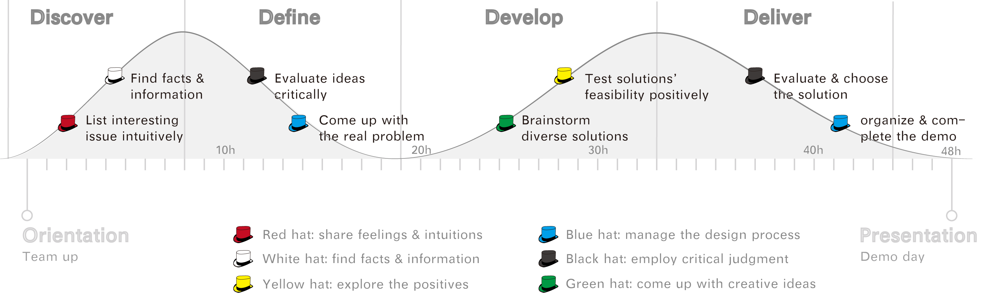
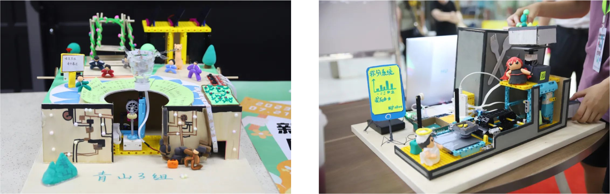
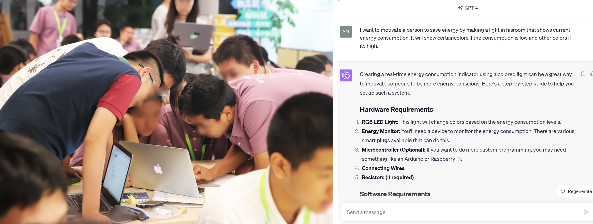
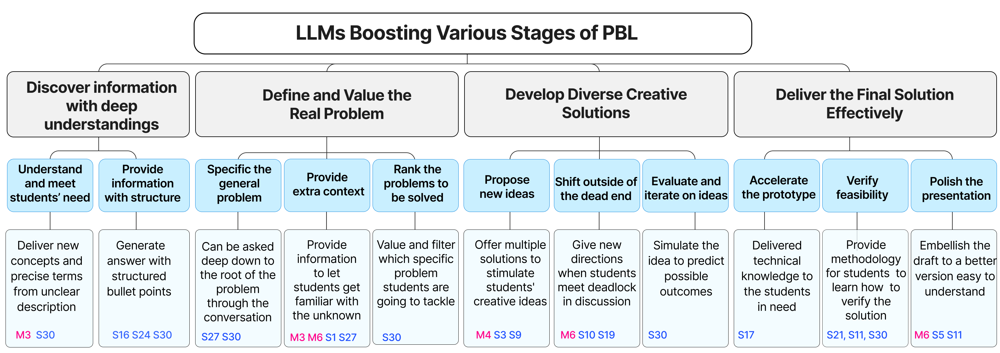
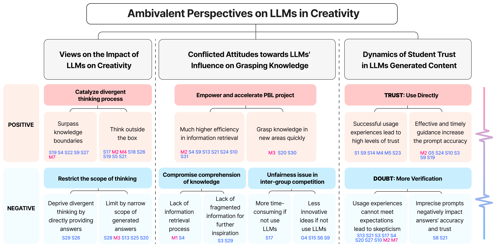
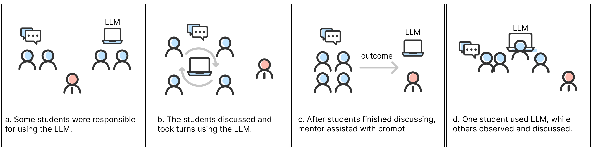
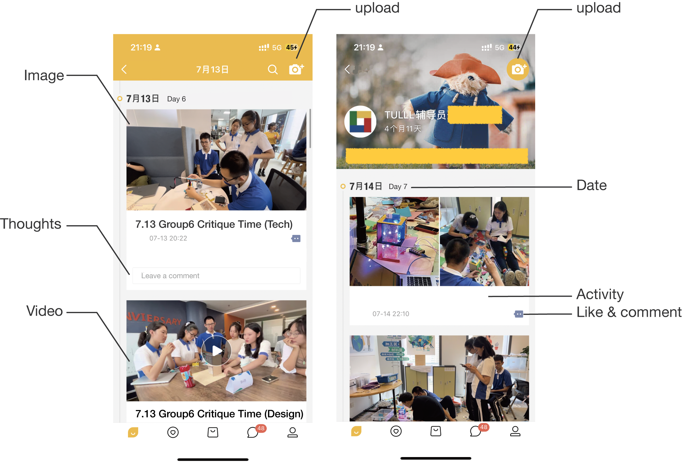
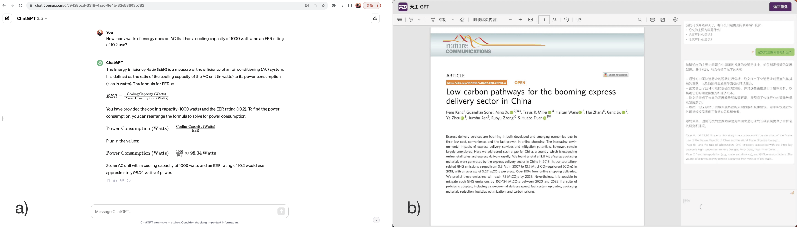
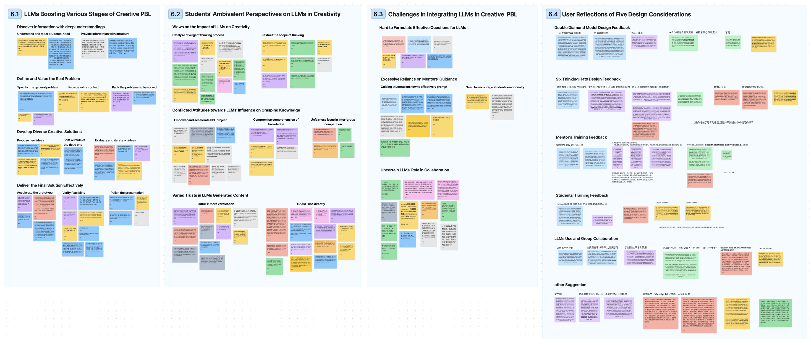

# 借鉴 LLW 强化创新项目实践教学的智慧，我们致力于设计更加注重儿童需求的人工智能学习环境。（注：此处将“LLM”误写为“LLW”，若原文是“LLM”，则应为“基于LLM强化的创新项目式学习带来的启示，我们专注于打造以孩子为核心的AI学习环境”。）

发布时间：2024年03月24日

`LLM应用` `人工智能`

> Designing Child-Centric AI Learning Environments: Insights from LLM-Enhanced Creative Project-Based Learning

> PBL作为一种教学方式，在激发学生创造力方面颇具成效，但需师生双方付出大量精力。虽然LLMs已在创造性任务上展现辅助作用，但在培养创新能力上的具体角色尚存争议。本研究聚焦LLMs在PBL环境下的运用潜力，特别是对创新能力的促进作用。初期研究中，我们与12名中学生展开探索性试验，并提炼出LLMs应用于PBL时应考虑的五个设计原则。基于此，我们打造了一个为期两天、由LLMs驱动的PBL课程，并针对31名中学生实施教学实验。结果显示，LLMs能够全面提升PBL各个环节的效果。同时，我们也揭示了学生与指导者在LLMs使用态度上的分歧。我们深入探讨了将LLMs整合至PBL中的难题及设计启示，并对此项目进行了深度反思。通过架起AI技术与教育实践之间的桥梁，我们的研究旨在启迪更多的对话与探索，研究如何在以孩子为中心的教育环境中有效利用AI的潜力。

> Project-based learning (PBL) is an instructional method that is very helpful in nurturing students' creativity, but it requires significant time and energy from both students and teachers. Large language models (LLMs) have been proven to assist in creative tasks, yet much controversy exists regarding their role in fostering creativity. This paper explores the potential of LLMs in PBL settings, with a special focus on fostering creativity. We began with an exploratory study involving 12 middle school students and identified five design considerations for LLM applications in PBL. Building on this, we developed an LLM-empowered, 48-hour PBL program and conducted an instructional experiment with 31 middle school students. Our results indicated that LLMs can enhance every stage of PBL. Additionally, we also discovered ambivalent perspectives among students and mentors toward LLM usage. Furthermore, we explored the challenge and design implications of integrating LLMs into PBL and reflected on the program. By bridging AI advancements into educational practice, our work aims to inspire further discourse and investigation into harnessing AI's potential in child-centric educational settings.

[Arxiv](https://arxiv.org/abs/2403.16159)