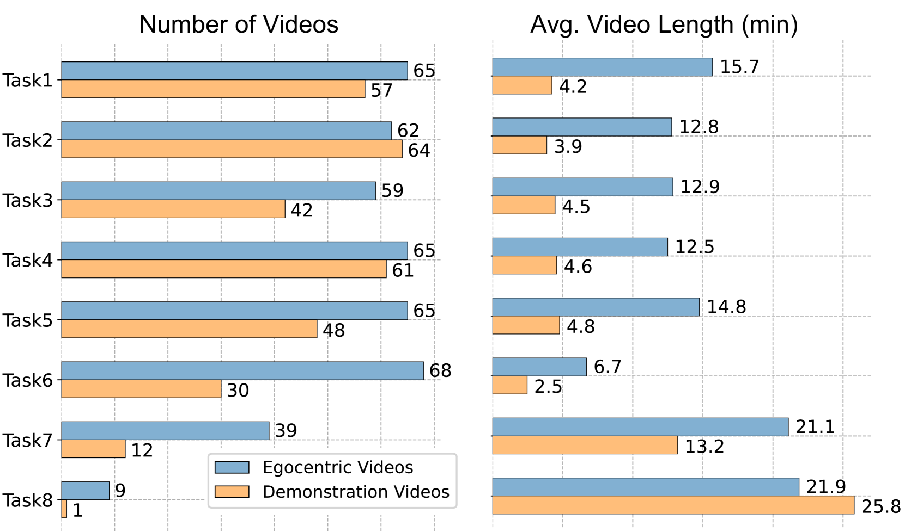
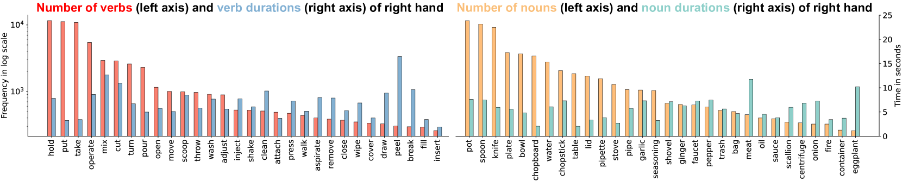
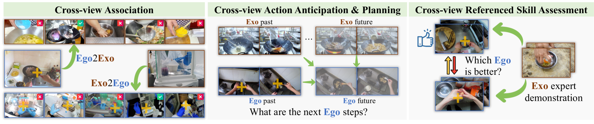

# EgoExoLearn 数据集致力于衔接现实世界中程序性活动的自我中心与外部中心两种异步视角，为研究两者间的关联提供支持。

发布时间：2024年03月24日

`Agent` `人工智能` `行为识别`

> EgoExoLearn: A Dataset for Bridging Asynchronous Ego- and Exo-centric View of Procedural Activities in Real World

> 自幼年起，人们就具备将他人行为转换为自己视角的关键能力。为了深入探究这一能力，我们推出了EgoExoLearn——一个模拟人类跟随演示过程的大规模数据集，参与者在观看演示视频指导下完成任务的同时录制第一人称视角视频。着眼日常帮助与专业支持的应用前景，EgoExoLearn囊括了源自日常生活环境及专业实验室的长达120小时的第一人称与演示视频资料。此外，我们还同步收集了高品质的眼动数据，并提供了详尽的多模态标注，构建了一片模拟人类如何跨越不同视角桥接异步操作过程的试验田。为了实现这一目标，我们设立了跨视角关联、跨视角动作规划及跨视角参照技能评估等多项基准任务，并进行了深度解析。我们期待EgoExoLearn能成为连接不同视角行为的核心资源，有力推动研发能在现实中通过观察人类而无缝学习的AI智能体。相关代码和数据可在GitHub上找到：https://github.com/OpenGVLab/EgoExoLearn。

> Being able to map the activities of others into one's own point of view is one fundamental human skill even from a very early age. Taking a step toward understanding this human ability, we introduce EgoExoLearn, a large-scale dataset that emulates the human demonstration following process, in which individuals record egocentric videos as they execute tasks guided by demonstration videos. Focusing on the potential applications in daily assistance and professional support, EgoExoLearn contains egocentric and demonstration video data spanning 120 hours captured in daily life scenarios and specialized laboratories. Along with the videos we record high-quality gaze data and provide detailed multimodal annotations, formulating a playground for modeling the human ability to bridge asynchronous procedural actions from different viewpoints. To this end, we present benchmarks such as cross-view association, cross-view action planning, and cross-view referenced skill assessment, along with detailed analysis. We expect EgoExoLearn can serve as an important resource for bridging the actions across views, thus paving the way for creating AI agents capable of seamlessly learning by observing humans in the real world. Code and data can be found at: https://github.com/OpenGVLab/EgoExoLearn

[Arxiv](https://arxiv.org/abs/2403.16182)